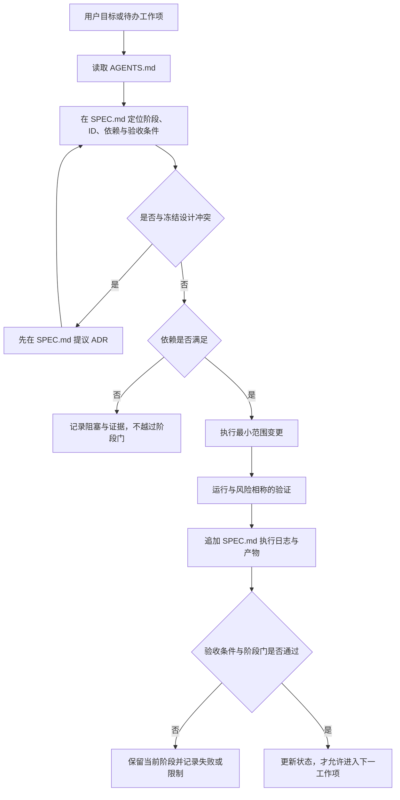

# AGENTS.md — RWKV-7 长 Agent 训练项目协作规范

本文件适用于仓库根目录及所有子目录。所有参与本项目的 Agent、脚本作者和实验执行者必须遵守。

## 协作与审计架构图

下图是本文约束的控制流；任何实现、下载或实验都必须经过同一条 `SPEC.md` 记录链。虚线只表示冲突升级，不表示允许绕过阶段门。



## 1. 开始工作前

按以下顺序读取：

1. `AGENTS.md`：工作约束；
2. `SPEC.md`：当前规格、阶段、决策与执行台账；
3. `rwkv7_agent_only_data_training_plan_zh.md`：原始研究设计。

开始任何工作前，在 `SPEC.md` 中确认：当前阶段、目标工作项 ID、依赖、验收条件和停止条件。若请求与原始设计冲突，不要静默折中；先在 `SPEC.md` 提议 ADR，并明确指出冲突。

## 2. 项目使命

本项目训练一个纯 RWKV-7、纯 Agent 数据的长程 Agent。同一套 RWKV-7 权重维护：

- `S_slow`：只接收已执行 action、真实 observation 和经允许的 memory write；
- `S_fast`：从 slow state 克隆，在当前决策内进行 latent recurrent steps；
- action：latent 结束后才调用 LM head 并向环境输出。

核心证据是真实可执行环境中的 single-trajectory 成功率、进度、回归和端到端计算成本，不是数学 benchmark、action exact match 或 best-of-N。

## 3. 强制边界

### 3.1 模型边界

- 只使用固定 revision 和文件哈希的 RWKV-7 G1x 基座；禁止浮动 `latest`。
- 以官方 `RWKV-v7/train_temp` 为实现基准，保留官方初始化、参数学习率分组、weight decay 范围、Pre-LN、DeepEmbed/变体配置和 CUDA 数值路径。
- 首版只实现 V0：`e_latent + e_depth(k)`；latent step 完整更新 fast state，跳过 LM head，不采样 token。
- `K=0` 是必须支持的 anchor 路径；不得通过 latent 改动破坏其语义。
- V0 通过 `SPEC.md` 的 G3 前，不实现 V1 continuous feedback、部分 block 循环、浅层 action decoder 或 chunk 优化。
- fast state 不得直接写回 slow state。所有 clone/restore 代码必须测试无别名污染。
- 正式训练必须支持 packed varlen；批次以 `cu_seqlens` 表达样本边界，并向 recurrent 热路径提供 `sequence_start_mask`。每个边界必须同时切断 WKV state、TimeMix previous-x、ChannelMix previous-x 和跨样本 causal target；只屏蔽 loss 不算支持 packed input。

### 3.2 数据边界

- 训练数据只能是 Agent 任务、动作、工具 observation、验证、失败与恢复轨迹；不加入数学 CoT 数据。
- 原始 trace 保持 immutable；规范化数据通过 content-addressed blob 引用原文。
- thinking、action、tool response 必须分字段；不得只保存拼接后的整段文本。
- canonical 数据由 `episodes`、`decisions`、`snapshots`、`forks` 四表组成，并有版本化机器 schema。
- RWKV state 不是 canonical 数据；缓存键必须包含 checkpoint、模型代码、tokenizer 和 prefix 的 hash。
- 数据 split 按 task/repo/issue/PR/base commit 分组；同一任务的教师变体、fork 或近重复不得跨 split。
- 未确认 source revision、数据许可和 repo-level license 的样本不得进入发布版训练集。
- 检测到 credential、个人敏感信息或 held-out 污染时，隔离样本并记录报告，不在日志中复述秘密内容。

### 3.3 训练与评测边界

- CE 只覆盖 assistant token；tool response、system 和 user token 必须 mask。action token 可配置更高权重。
- M2 中 latent position 不做 token loss；K 个 latent steps 完整反传，除非后续 ADR 明确修改。
- paired 对比必须来自同一个可执行 snapshot；不同 K 使用同等 action sampling 和工具预算。
- value 与 halting 标签必须优先来自环境 outcome、verifier、milestone、regression 和成本。
- 每次关键实验必须含 no-think、explicit think、fixed-K 或与阶段匹配的对照。
- 在 `SPEC.md` 阶段门通过前，禁止扩大到下一阶段；命中停止条件时先停训、保存证据并写诊断。

## 4. 工作与记录协议

### 4.1 每一步都写入 `SPEC.md`

每个可独立验证的动作都追加一条执行日志，至少包含：

```text
日期 / Step 编号 / 关联工作项 ID
目的与动作
输入、revision、配置或命令
关键证据与结果
创建或修改的产物
验证方式与通过/失败状态
下一步或阻塞项
```

计划、只读检查、实现、数据下载、数据转换、训练、评测、失败、回滚和重要用户决策都要记录。日志记录可审计事实、简短理由和结论，不记录或要求暴露私有逐 token 思维过程。

当实现状态变化时，同时更新对应工作项的状态：`待办`、`进行中`、`阻塞`、`完成` 或 `停止`。不得只改状态而没有证据日志。

### 4.2 变更顺序

1. 在 `SPEC.md` 定位工作项和验收条件；
2. 做最小范围变更；
3. 运行与风险相称的测试/验证；
4. 把命令、关键结果和产物写入执行日志；
5. 更新工作项状态；
6. 检查是否满足阶段门，未满足不得宣称阶段完成。

重大架构、数据口径、loss、评测和阶段门变化必须增加 ADR。修改阈值时记录修改发生在主实验之前还是之后；主实验之后的修改不得覆盖原阈值。

## 5. 推荐仓库布局

新文件按职责放置；不要把大模型、原始数据或运行产物提交到 Git。

```text
configs/                 数据、模型、训练、评测配置
schemas/                 Parquet、manifest、tool-call schema
src/
  data/                  adapters、canonicalize、split、quality
  model/                 RWKV 接入、state、latent、readout
  training/              losses、sampler、trainer、checkpoint
  evaluation/            harness、metrics、ablations
tests/
  fixtures/              小型合成/脱敏样本
scripts/                 可复用的薄入口
data/heldout/            版本化 held-out ID，不含大数据
reports/                 环境、数据质量与实验汇总
artifacts/               本地运行产物，默认 gitignored
```

路径若尚不存在，只在对应工作项开始时创建。脚本必须调用 `src/` 中的可测试逻辑，避免把核心实现堆在一次性 notebook 或 shell 中。

## 6. 实现质量要求

- 配置、manifest 和表结构必须有显式 schema 与版本号；未知字段或未知参数默认 fail closed。
- ID、split 和 cache key 的生成必须确定性；hash 算法和 canonical serialization 固定并测试。
- 随机流程显式记录 seed；分布式 rank 不得意外复用相同采样流。
- state 操作覆盖 shape、dtype、device、batch、clone、serialize、restore 和 checkpoint 兼容性测试。
- latent V0 覆盖 `K=0` 等价性、LM-head 未调用、depth 越界、梯度存在、slow state 未突变测试。
- tool-call grammar 覆盖 canonical JSON round-trip、无效输入拒绝、schema 变化和特殊字符。
- 数据 adapter 每个来源至少有 golden fixture；保留 source record ID，确保规范化结果能追溯原文。
- 训练至少先通过 tiny-batch smoke test 和 32/128 样本 overfit，再提交长作业。
- packed varlen 必须通过“打包前逐样本运行”与“打包后单流运行”的前向、反向、loss 数值一致性和跨样本扰动隔离测试；训练报告同时记录有效 token 利用率、对齐 token 数和相对 padded baseline 吞吐。
- 指标聚合保留分母、失败样本和分位数；不得只汇报最佳 checkpoint 或成功子集。

## 7. 可复现性与产物治理

每个数据 release 和训练 run 必须能回答：

- 用了哪个 source/checkpoint 文件及其 revision/hash？
- 用了哪个代码 commit、未提交 diff 和环境锁？
- 用了哪个 tokenizer、kernel、schema、adapter 和配置？
- 数据 split、随机种子、硬件和运行命令是什么？
- 产物经过哪些测试，失败了什么，是否跨过阶段门？

模型权重、原始数据、blob、容器层和大日志放入受控 artifact storage；Git 只保存 manifest、schema、配置、小 fixture、代码和报告。任何含用户数据、token、SSH key、环境变量秘密的内容不得提交或写入公开日志。

## 8. 当前执行优先级

当前处于 `SPEC.md` 的 P0 / Sprint 0。顺序如下：

1. 固定 RWKV checkpoint、RWKV-LM、tokenizer、kernel revision；
2. 盘点硬件与运行环境并建立依赖锁；
3. 冻结 held-out 和污染边界；
4. 建立 schema、synthetic fixture 和端到端最小链路；
5. 先产 A0，再跑 M0；
6. M0 证明 explicit thinking 有增益后，才生产规模化 paired snapshot 并训练 V0。

若多人或多个 Agent 并行工作，按 `SPEC.md` 的 P/D/M/T 工作项切分所有权；共享 schema、配置或接口变更先协调，避免覆盖其他人的未提交修改。

## 9. 完成定义

一个工作项只有同时满足以下条件才可标记完成：

- 产物存在且路径符合规格；
- 验收条件有自动测试或可复核证据；
- revision、配置和命令可追溯；
- `SPEC.md` 有对应执行日志，失败和限制没有被省略；
- 没有越过尚未满足的阶段门。

项目最终结论必须比较同一真实计算预算下的 RWKV-7 no-think、explicit CoT、fixed-K latent 和 adaptive-K latent，并报告 single-trajectory 环境结果与端到端成本。
