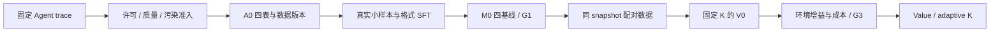

# RWKV-7 长程 Agent 训练研究

目标是在同一套纯 RWKV-7 权重上，把环境历史保存在 slow state，把当前决策的可变深度计算放在 fast state，最终用真实可执行任务验证 single-trajectory 成功率与端到端成本。

这还是研究工程项目，**尚未证明 latent thinking 有 Agent 收益**。当前正式训练为 No-Go；具体状态、失败记录和后续阶段门以 [SPEC.md](SPEC.md) 为准。



## 入口

- [协作规范](AGENTS.md)：先读工作约束与阶段门。
- [规格与执行台账](SPEC.md)：工作项、ADR、命令、结果和阻塞。
- [原始研究设计](rwkv7_agent_only_data_training_plan_zh.md)：冻结的研究动机与实验路线。
- [项目审查](reports/project_progress_review_2026-09-05.md)：工程证据与研究假设的边界。
- [模型架构与源码图集](reports/rwkv7_architecture_assessment.md)：slow/fast、V0 与 packed-varlen。

## 可复现的本机环境

Python 3.11.15，PyTorch 2.11.0+cu130；CUDA toolkit、上游 revision 与模型 SHA 见 [基座配置](configs/base_model.yaml) 和 [环境报告](reports/environment.md)。依赖使用 [带 distribution hash 的锁文件](configs/requirements-runtime-cu130.lock)。

```bash
uv venv --python 3.11.15 /home/yueyulin/data/long_long_agent/envs/train-rebuild-cu130
uv pip sync \
  --python /home/yueyulin/data/long_long_agent/envs/train-rebuild-cu130/bin/python \
  --require-hashes --index-strategy unsafe-best-match \
  --extra-index-url https://download.pytorch.org/whl/cu130 \
  configs/requirements-runtime-cu130.lock
```

下载和构建前先按 [storage.yaml](configs/storage.yaml) 设置 data root；`UV_CACHE_DIR` 也应指向该目录内。模型、原始数据、CAS blob、OCI 层与实验日志不进 Git。上面的命令不是远程三卡环境验收；SM89/DDP/NCCL 尚待验证。

## 数据 release

`scripts/build_canonical.py` 仅允许显式有限 preview。正式 A0 必须按以下顺序运行，并为每次审计选择新的输出路径：

```text
build_contamination_index.py
  → build_a0_release.py audit
  → build_a0_release.py build
  → build_a0_release.py verify
```

[A0 配置](configs/a0_release.yaml) 要求 1,000 episodes / 10,000 decisions，train/dev/test=900/50/50，两个教师在每个 split 内各半。审计失败不得构建；输入或相关实现 hash 改变必须重新审计。已有 release 和失败产物不会被覆盖。

`prepare_a0_overfit_inputs.py` 只准备训练集内、不同任务和不同目标的32/128输入，不执行训练。生成/parity/resume门未通过不得启动长作业。

## 实验边界

- K=0 是 anchor；latent step 不采样 token、不调用 LM head，fast 不直接写回 slow。
- packed 边界同时重置三类 recurrent state 并切断跨样本 target/gradient。
- `validate_generation_parity.py` 是事前登记的数值验收；`diagnose_generation_math.py` 只是原因隔离，不能替代前者。
- `verify_environment_fixture.py` 验证一个离线 dev 任务的 buggy/gold verifier，不运行 Agent，也不计作 M0。
- 只有 G1 通过才能扩大 paired 数据并训练 V0；G3 之前不进入 V1 或 adaptive-K 规模化。

测试：`python -m pytest -q`；静态检查：`ruff check .`、`ruff format --check .`。实际运行的解释器和依赖锁应一并记录。
