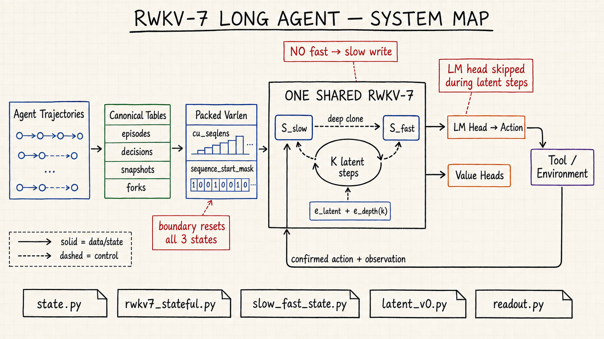
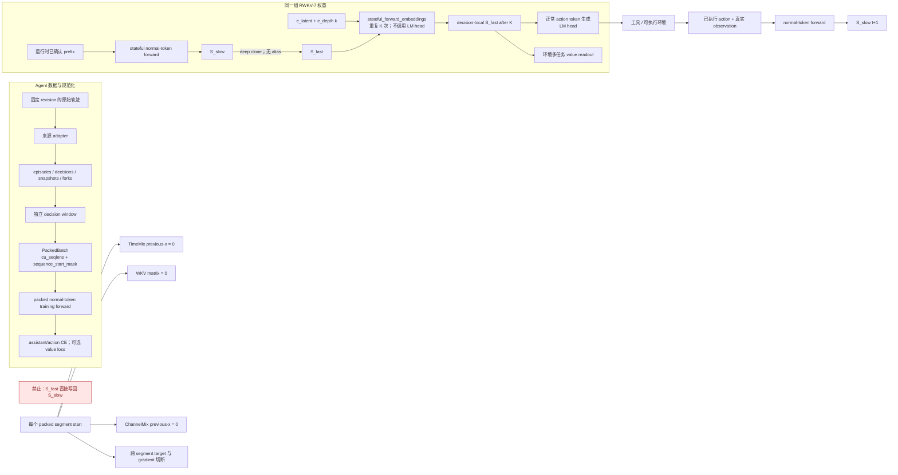

# RWKV-7 长 Agent 训练项目规格与执行台账

> 状态：P0 准备阶段 / A0 v1 已验收、BF16 数值原因已隔离、ADR-019 已接受 / M-02 独立确认待通过，正式训练 No-Go<br>
> 规格版本：0.11.1<br>
> 创建日期：2026-09-04  
> 设计依据：[`rwkv7_agent_only_data_training_plan_zh.md`](./rwkv7_agent_only_data_training_plan_zh.md)

## 架构图（审计基准）



手绘图用于快速建立整体认知；下列 Mermaid 图与第 3～4 节文字才是精确、可审计的规范。`S_fast` 只存在于当前 decision，确认后的 action/observation 必须经正常 token 路径产生新的 `S_slow`。



## 1. 文档职责

本文档同时承担三项职责：

1. 定义可实现、可验收的项目规格；
2. 维护数据、模型、训练三个工作流的阶段计划；
3. 按时间顺序记录每一步执行、决策、证据和结果。

任何影响数据口径、模型结构、训练方法、评测、依赖版本或阶段门的变更，都必须先更新本文档。原始研究设计保持只读；实现细节和执行状态以本文档为准。

## 2. 项目目标与边界

### 2.1 目标

训练一个仅依赖 Agent 轨迹进行后训练的 RWKV-7 长程 Agent，使同一组模型权重同时支持：

- `S_slow`：跨工具调用、环境反馈和任务进度持续的长期状态；
- `S_fast`：每次动作前进行若干次不输出文本的 latent recurrent reasoning；
- 固定深度 `K`，并在 value/halting 信号可靠后支持 adaptive `K`；
- 在单轨迹、同计算预算条件下，提高真实可执行 Agent 任务的成功率和效率。

首个可证伪目标是证明：困难 Agent 决策中，latent depth 增加带来稳定的环境 outcome 改善，并恢复 explicit long-think 相对 no-think 的主要增益，同时减少 wall-clock。

### 2.2 非目标

- 不引入数学 CoT 数据或数学 benchmark；
- 不引入 Qwen/Transformer sidecar 或 soft-token 注入方案；
- 不以 action exact match、隐藏态范数或 best-of-N 作为核心成功证据；
- V0 不同时引入 continuous feedback、部分 block 循环、浅层 decoder 等优化；
- 在阶段门通过前，不下载 AgentTrove 全量、不启动大规模 RL、不扩大到目标规模训练。

## 3. 不可破坏的设计约束

1. 基座只使用已固定 revision 的 RWKV-7 G1x checkpoint；禁止使用浮动的 `latest`。
2. 官方 `RWKV-v7/train_temp` 是实现基准；参数初始化、学习率分组、weight decay 范围、Pre-LN、DeepEmbed 变体及 CUDA 数值路径不得无证据偏离。
3. slow state 只消费已执行 action、真实 tool response 和可选结构化 memory write；fast state 的假设不得直接写回 slow state。
4. V0 latent step 使用 `e_latent + e_depth(k)`，完整运行 recurrent step，跳过 LM head 且不产生 token。
5. `K=0` 必须保留；latent position 不计算 LM token loss；首版 K 个 latent step 完整反传。
6. 数据按 episode 保序，同时拆分为 decision point；canonical 数据不能存 checkpoint 相关的 RWKV state。
7. train/dev/test 必须按 task、repo、issue/PR 和 base commit 分组隔离，并先冻结 held-out 污染边界。
8. 训练 loss 只覆盖 assistant token；action token 可高权重，tool observation 和用户 token 不参与 CE。
9. reward/value/halting 标签优先来自真实环境、verifier、milestone 与 regression，不由教师文本相似度替代。
10. 核心结果必须来自 single-trajectory；所有基线在相同 snapshot、工具配置和真实计算预算下比较。
11. 正式训练必须原生支持 packed varlen；序列边界同时重置 WKV、TimeMix previous-x 与 ChannelMix previous-x，并切断跨样本 causal label/gradient。逐样本 padding 只能作为 parity baseline，不得作为正式长轨迹训练路径。

## 4. 系统规格

### 4.1 状态与推理

```text
S_slow(t)
  └─ clone → S_fast(t, 0)
                └─ latent step × K → action generation
                                         └─ execute in environment
                                                └─ action + observation → S_slow(t+1)
```

首版支持：

- `serialize/clone/restore` RWKV-7 state；
- 明确区分 slow/fast state 的容器；
- `K ∈ {0,1,2,4,8}`，评测可扩展到 16；
- latent step 跳过词表投影；
- action 使用完整 RWKV-7 正常 token 生成；
- state cache key 为 `checkpoint_hash + code_hash + tokenizer_hash + prefix_hash`。

### 4.2 数据产物

Canonical 数据版本必须包含：

```text
data/releases/<version>/
├── manifest.json
├── episodes.parquet
├── decisions.parquet
├── snapshots.parquet
├── forks.parquet              # 没有 fork 数据时允许只有 schema
├── splits/
│   ├── train.txt
│   ├── dev.txt
│   └── test.txt
├── reports/
│   ├── quality.json
│   ├── contamination.json
│   └── licenses.json
└── blobs/                     # 或指向外部 CAS 的只读引用
```

每个 release 必须可追溯到 source revision、adapter version、schema version、去重配置和 split policy。四张表的字段基线沿用原始设计第 3 节；正式实现前要生成机器可校验 schema。

大文件存储根目录固定为本机和远程同构路径：

```text
/home/yueyulin/data/long_long_agent/
├── raw/                       # 按 source/revision 保存 immutable 下载
├── hf_cache/                  # Hugging Face 下载缓存
├── models/                    # checkpoint 与 tokenizer，按 revision/hash 分层
├── releases/                  # 生成的 canonical Parquet release
├── blobs/                     # content-addressed 原始 trace / 大日志
├── artifacts/                 # checkpoint、评测与 profile 大产物
└── tmp/                       # 可清理的断点下载和临时转换文件
```

仓库内只保存 schema、source manifest、下载脚本、配置、小型脱敏 fixture 与报告。所有本机/远程路径通过配置解析，不在处理逻辑中散落硬编码。

### 4.3 模型产物

```text
artifacts/models/<run_id>/
├── manifest.json
├── resolved_config.yaml
├── checkpoints/
├── metrics.jsonl
├── eval/
└── environment-lock/
```

`manifest.json` 至少记录：base model repo/file/revision、文件哈希、RWKV-LM commit、tokenizer 哈希、CUDA kernel revision、数据 release、代码 commit、超参数、硬件、随机种子和父 checkpoint。

### 4.4 工具调用协议

- 对外格式统一为 `<tool_call>{...}</tool_call>` 与 `<tool_response>...</tool_response>`；
- tool call arguments 必须解析后 canonicalize；
- schema 不完整、JSON 无法解析、缺失 action/observation 对应关系的样本不得进入训练；
- 原始 trace 必须保存为 immutable blob，规范化记录只保存引用。

### 4.5 Packed varlen 批次协议

- 公共批次契约包含扁平 token、target、loss weight、`cu_seqlens:int32[n_seq+1]`、`sequence_start_mask:bool[T]`、有效 token mask 和 sample/episode ID；`cu_seqlens[0]=0` 且末项等于有效 token 数。
- CUDA 热路径使用已物化的 `sequence_start_mask`，避免每层/每 token 搜索 `cu_seqlens`；两者必须互相校验并由同一 collator 生成。
- 对每个 `sequence_start_mask[t]=true`，TimeMix 和 ChannelMix 的 previous-x 视为零，WKV 更新前的矩阵 state 视为零；反向传播不得越过该边界。
- target 在每条原始序列内部构造后再拼接，禁止对拼接后的全局 token 流直接 shift；assistant/action loss mask 继续独立生效。
- kernel 的 `T % CHUNK_LEN == 0` 只允许在整个 packed stream 尾部补至 16 的倍数，最多增加 15 个无 loss token；这不是逐样本 padding。尾部 dummy segment 必须有独立 reset 且不导出 state。
- 首版每个 pack row 内只包含互相独立、从零状态开始的训练序列。需要跨 window 延续 slow state 的 episode 不能与此语义混用，后续由显式 initial/final state 与 segment ownership 单独支持。
- 16K 冷启动 SFT 使用 decision-point window：只监督当前 assistant；保护 system/developer、初始用户任务、最近用户消息、当前 observation 及产生它的工具交互。旧历史按完整交互组移除，禁止孤立 tool response；缺失于消息的 task_text 以零 loss 任务契约补回。最小受保护上下文仍超限时拒绝并统计，不得退化为无条件答案监督（ADR-017）。
- state-passing ABI 允许首段从非零 `s0` 延续；任一 start mask 会在当前 token 更新前清零 state 并切断梯度。`sT` 只代表每个 pack row 的最后 segment，普通独立 packing 不得把它错误归属给前面的 sample。

## 5. 评测与阶段门

### G0：可复现性门

- 基座 checkpoint、代码、tokenizer、kernel 均有不可变 revision/hash；
- 环境可重建，最小前向结果可复现；
- state clone/restore 数值一致；
- packed varlen 与逐样本执行的 forward/backward/loss 一致，且跨样本扰动不改变其他 segment；
- held-out 清单已冻结并通过污染扫描。

### G1：Agent baseline 门

在同一 held-out 集完成 no-think、explicit short-think、explicit long-think、未训练 fixed-K 四个基线。必须记录 action 语法/执行有效率、进度、终局成功率、turn、loop/regression、模型和工具耗时。只有 explicit long-think 在困难决策或 episode 指标上存在可重复增益，才进入 latentization 主实验。

依据 ADR-018，M0 先在开发集做基座格式/执行 pilot；必要时允许使用合格 A0 做受限格式 SFT，再比较同一 checkpoint 的各思考模式。G1 的主指标、困难样本定义、预算、统计单位、阈值、样本量和停止规则须在独立确认实验前冻结；pilot 结果不得充当确认结果。M2 和 paired 规模化继续以 G1 通过为前提。

### G2：Agent SFT 门

- 5K～10K decisions 小样本训练可稳定过拟合；
- tool-call parser validity 与 execution validity 达到预先登记阈值；
- held-out 任务上的验证/finish 行为不劣于基座；
- 通用语言/代码能力回归在登记容差内。

具体数值阈值在首次 baseline 后登记，禁止看到 latent 实验结果后倒推阈值。

### G3：Latent 可行性门

- 困难决策的环境 `score(K)` 对 K 呈稳定正趋势；
- fixed-K latent 恢复 explicit long-think 增益的主要部分；
- 简单动作的 `K=0/1` 不明显退化；
- latent wall-clock 低于 explicit CoT；
- 改善来自单轨迹，不依赖候选搜索。

通过后才能大规模生产 counterfactual fork。

### G4：Value 与 adaptive-K 门

- value head 能预测真实进度、回归、短/中期 milestone 和终局结果；
- calibration 在 held-out snapshot 上达标；
- adaptive-K 相比 fixed `Kmax` 显著减少平均计算，且成功率保持在预登记容差内；
- underthinking、overthinking 和 halting regret 均有独立报告。

### G5：Slow-state 门

- correct state 显著优于 reset/shuffled state；
- slow state only、ledger only、slow state + ledger 消融完整；
- checkpoint resume、history dropout、无关 observation 与工具失败扰动下可恢复；
- 早期约束保留率和长 episode 成功率随课程长度可解释变化。

未通过任一门时，先诊断或停止，不扩大数据与算力。

## 6. 准备阶段总计划

### P0：事实冻结与仓库骨架

目标：把研究计划变成可执行、可复现的工程输入。

| ID | 任务 | 产物 | 验收条件 | 状态 |
|---|---|---|---|---|
| P0-00 | 恢复有效 Git worktree | 可用的 Git metadata | 代码 commit 与 dirty diff 可追溯 | 完成：基线 bd97830 已推送 yynil/long_long_agent 私有仓库 |
| P0-01 | 固定 checkpoint 与代码 revision | `configs/base_model.yaml` | 所有 revision 非浮动且文件 hash 可复算 | 完成：代码/tokenizer/kernel/checkpoint 均已落盘复核 |
| P0-02 | 盘点 GPU/CUDA/磁盘/网络/调度器 | `reports/environment.md` | 能估算 M0/M1 所需资源 | 完成 |
| P0-03 | 建立 Python/CUDA 依赖锁 | lockfile + 容器定义 | 新环境可完成最小前向 | 进行中：66包distribution hash锁、新环境重建/105项测试/全新CUDA cache前向通过；远程环境待建 |
| P0-04 | 冻结 held-out 边界 | `data/heldout/*.txt` | 分组规则与污染测试就绪 | 完成：五来源 42,982 group 的 repo/task 90/5/5 hash split、列表校验与 canonical v1.1 接入通过 |
| P0-05 | 固化数据、训练、评测配置 schema | `schemas/` | CI 可校验所有配置 | 进行中：source registry 与四表 schema 已建立 |
| P0-06 | 建立跨文档架构图审计基线 | 全部 Markdown 文档；`docs/diagrams/*.png` | 每份文档有精确 Mermaid 图；模型有从系统到源码符号的手绘图并完成链接/图像校验 | 完成：15 份文档各含可解析 Mermaid；5 张 ImageGen 手绘图完成视觉、链接、尺寸与 hash 校验 |

#### 已确认的资源分工

| 环境 | 资源 | 职责 | 首批候选规模 |
|---|---|---|---|
| 本机开发节点 | 1 × RTX 3090 Ti 24,564 MiB；57 GiB RAM；约 3.3 TiB 可用磁盘 | schema/adapter、合成链路、单测、CUDA/state/latent 原型、tiny overfit、单卡 profile | 0.4B smoke，1.5B V0/M0 |
| `gpuserver0` 正式训练节点 | 3 × RTX 4090，每卡 24,564 MiB；220 GiB RAM；约 4.0 TiB 可用磁盘 | 三卡分布式 profile、正式 SFT/fixed-K、较大模型与长 episode 实验 | 先 profile 1.5B/2.9B；2.9B 全参或 7.2B PEFT 为候选 |

两端 compute capability 分别为 8.6/8.9，CUDA 工具链分别为 13.0 与远程 12.1/12.4/12.8；不得复制已编译 CUDA extension 作为通用产物。代码、schema 和配置通过同一 Git commit 同步，模型/数据通过带 hash 的 artifact manifest 同步。远程三卡没有 NVLink、GPU 间链路为 `SYS`，正式训练前必须通过 NCCL 和 NUMA profile。

### D：数据准备

| ID | 任务 | 依赖 | 产物/检查 | 状态 |
|---|---|---|---|---|
| D-01 | 核验四个首发数据源的 revision、license、字段与体量 | P0-04 | source registry；逐 repo license 报告 | 进行中：五个固定下载项的版本/结构/体量已审计，逐 repo license provenance 待完成 |
| D-02 | 定义四表机器 schema、版本和迁移策略 | P0-05 | schema fixture 与正反例测试 | 完成：v1.1.0 四表 schema 与版本化 split-group 语义通过真实预览 |
| D-03 | 定义 blob CAS、hash、压缩和引用完整性 | D-02 | blob round-trip 测试 | 完成：确定性 gzip SHA-256 CAS 已测试 |
| D-04 | 实现通用 canonicalizer 与 tool grammar | D-02 | JSON round-trip；thinking/action 分离测试 | 完成：稳定 ID、原文引用与 decision 提取已测试 |
| D-05 | 实现 OpenThoughts-Agent adapter | D-01,D-04 | source→episode/decision golden test | 完成：真实 10 episode 预览与 golden test 通过 |
| D-06 | 实现 Open-SWE-Traces adapter | D-01,D-04 | thinking/no-thinking 与 outcome 保真 | 完成：35 shard 审计与两组真实预览通过 |
| D-07 | 实现 Orchard adapter | D-01,D-04 | success/failure/recovery 标签保真 | 完成：19 shard 审计与真实预览通过 |
| D-08 | 实现 Nebius adapters | D-01,D-04 | test log、resolved 与 patch outcome 保真 | 完成：两个子源审计、ID 修正与真实预览通过 |
| D-09 | 去重、污染、PII/secret 与质量检查 | D-05..08 | 报告可复现；泄漏样本隔离 | 完成（A0 范围）：五来源432,695行内容索引；6,236候选审计后1,000条准入；其他来源内容质量不据此获准 |
| D-10 | 产出 A0：1K episodes / 10K decisions | D-09 | manifest、四表、splits、报告齐全 | 完成：a0-v1 四表、900/50/50 split、质量/污染/许可报告及CAS独立验收通过（Step 068） |
| D-11 | 生成同 snapshot paired teacher 数据 | G1,D-10 | long/short/no-think/recovery 可执行对照 | 阻塞于 G1 |
| D-12 | 产出 A1 50K 与 latent A2 20K curated 子集 | G1,D-11 | 配比和 failure taxonomy 达标 | 阻塞于 G1 |

D-09 本轮完成范围是 Step 057 冻结的 Open-SWE 两教师 A0 候选准入；五来源索引只扩大污染比对范围，不代表全量 PII/secret/许可检查通过。任何后续来源或 release 都必须重新通过同一准入链，D-01 的其余 repo 许可审计仍未完成。

首批 A1 目标配比：15% simple no-think、25% normal tool use、25% explicit long-think success、15% verification/finish、15% failure/recovery、5% long-term constraint recall。A2 目标配比：35% think-beats-no-think、20% teacher disagreement、20% recovery/replan、15% verification/finish、10% long-memory dependency。

### M：模型准备

| ID | 任务 | 依赖 | 产物/检查 | 状态 |
|---|---|---|---|---|
| M-01 | 镜像官方 RWKV-7 训练实现并记录差异 | P0-01 | upstream pin + patch series | 完成：upstream pin、兼容性报告与三份 patch 已验证 |
| M-02 | 复现基座 tokenizer、前向与生成 | M-01,P0-03 | golden logits/generation；显存报告 | 进行中：BF16精度原因已确认、ADR-019按用户条件授权接受；原门失败保留，准备独立双层验收；正式训练仍阻塞 |
| M-03 | 实现 state tree 的 serialize/clone/restore | M-02 | dtype/device/shape 校验；数值 round-trip | 完成：完整三类层状态、可微 continuation、真实 0.4B 与序列化验证通过 |
| M-04 | 实现 slow/fast 双状态容器 | M-03 | fast mutation 不污染 slow 的单测 | 完成：决策级所有权、无别名 clone 与真实 0.4B 推进验证通过 |
| M-05 | 实现 V0 latent control/depth embedding | M-04 | latent step 无 LM-head call；K=0 等价 | 完成：短窗可微 recurrence 与真实 0.4B K=0/K=4 验证通过 |
| M-06 | 实现 action 与多任务 value readout | M-05 | shape、mask、loss 和梯度测试 | 完成：复用 LM head、九任务 value、masked loss 与真实 0.4B 梯度通过 |
| M-07 | 实现 state cache 与不可变 cache key | M-03 | hash 任一分量变化即 miss | 待办 |
| M-08 | 数值、吞吐与显存基准 | M-05 | K=0/1/2/4/8 的 profile | 待办 |
| M-09 | 实现 packed-varlen RWKV-7 路径 | M-01,M-02 | WKV/TMix/CMix 边界 reset；packed/unpacked 前反向 parity；无跨段串扰 | 进行中：本机 kernel/state-passing parity 与 0.4B 全参数 packed trainer 已通过；SM89/DDP 待验证 |

V1 continuous feedback 只有在 G3 通过后单独立项；不得混入 V0 可行性验证。

### T：训练准备

| ID | 任务 | 依赖 | 产物/检查 | 状态 |
|---|---|---|---|---|
| T-01 | 定义只覆盖 assistant/action 的 label mask | D-04,M-02 | token 级 mask golden test | 完成：角色/action 权重、source mask、跨 region token 和边界 target golden test 通过 |
| T-02 | 复刻官方参数分组、初始化和 decay 规则 | M-01 | 参数名覆盖率 100%，未知参数 fail closed | 完成：0.4B/1.5B base + latent + value 804/804 覆盖；实际 LR/decay 待 tiny overfit 选择 |
| T-03 | 建立小样本 overfit harness | T-01,T-02,T-10 | 32/128 样本 loss 可预期下降 | 完成（合成机制）：固定0.4B/FP32-master/packed loss稳定下降；真实32/128不同任务输入已准备，尚未训练（Step 069） |
| T-04 | 建立 M0 四基线评测 harness | D-10,M-02 | 同 snapshot、seed、预算、工具版本 | 进行中：离线真实dev任务的buggy/gold verifier及sandbox预算通过；Agent loop/四基线未验收，阻塞于M-02 |
| T-05 | 建立 M1 Agent SFT 配置 | D-10,T-03 | 配比、loss weight、resume 可复现 | 进行中：真实train-only四strata输入及机器计划就绪；训练配方/真实GPU恢复未验收，M-02阻塞 |
| T-06 | 建立 M2 fixed-K curriculum 与 loss | D-12,M-05,T-03 | K sampling、KD/exit/anchor 测试 | 阻塞于 G1 |
| T-07 | 建立指标、checkpoint 与 run registry | P0-05 | run 可追到代码/数据/模型/hardware | 进行中：单进程 model/FP32-master/optimizer/RNG/sampler 恢复测试通过；真实 run registry 待验收 |
| T-08 | 建立失败检测与 stop rules | T-04,T-07 | NaN、OOM、漂移、回归自动中止 | 待办 |
| T-09 | 预登记 G1/G2/G3 阈值 | M0 开发 pilot | G1 阈值早于独立确认实验，G2/G3 早于各自主实验 | 进行中：用户接受 ADR-018，等待 pilot |
| T-10 | 实现 episode-aware packed collator | D-10,T-01,M-09 | `cu_seqlens`/start/loss mask 一致；尾部对齐≤15；token 利用率报告 | 完成：decision→sampler→collator→0.4B trainer 闭环与真实来源利用率画像通过；A0 全量 profile 转入 D-10/M-08 |

## 7. 推荐执行顺序与近期冲刺

### Sprint 0：准备就绪（优先级最高）

并行推进 `P0-01..05`，但以下依赖顺序不可颠倒：

```text
冻结 held-out → 读取/转换训练数据
固定 upstream/checkpoint → 模型修改与 state cache
schema → adapter / run manifest
最小前向 → latent V0
```

Sprint 0 结束定义：G0 全部满足，且能够用一个极小的 synthetic Agent fixture 跑通 `trace → decision → tokenize → forward → action parse → metrics`。

### Sprint 1：A0 + M0 + 小样本 SFT

1. 先实现 OpenThoughts-Agent 与一个含失败样本的数据源 adapter；
2. 产出 A0，不为凑量牺牲 license 或污染检查；
3. 跑开发集基座 pilot；格式能力不足时允许受限 A0 SFT 后复测；
4. 在各自主实验前登记 G1/G2/G3 数值门槛；独立确认集完成 M0 四基线；
5. 完成 5K～10K decisions SFT 和格式验证，按对应门验收。

### Sprint 2：paired snapshots + V0 fixed-K

1. 生成严格同 snapshot 的 long/short/no-think/recovery 候选；
2. 执行候选并用真实 outcome 筛出 A2；
3. 训练 V0，比较 `K={0,1,2,4,8}`；
4. 只在 G3 通过后开始 `K=16` fork、value 和 adaptive halting。

## 8. 实验记录最低要求

每个 run 至少写入：

- 决策级：syntax valid、execution valid、new information、one-step progress、regression；
- episode 级：single-trajectory success、partial verifier、milestones、turns、recovery、loop、premature finish；
- 计算级：显式 CoT tokens、latent steps、LM-head calls、GPU time、tool time、wall-clock、peak memory、state size；
- 状态级：resume、reset/shuffle ablation、history dropout、constraint retention、slow/fast contamination；
- 统计信息：样本数、均值/分位数、置信区间、随机种子和失败明细。

## 9. 风险与缓解

| 风险 | 早期信号 | 缓解/停止动作 |
|---|---|---|
| explicit CoT 对 Agent 无增益 | G1 指标持平 | 停止 latentization，先修数据/任务难度 |
| latent depth 无环境增益 | `score(K)` 无趋势 | 检查 paired 数据和 loss；不扩 fork |
| fast 污染 slow | clone 前后 slow hash/行为变化 | fail-fast；禁止 checkpoint 发布 |
| 数据污染或 license 不清 | repo/task 交叉或缺 license | 隔离数据，不进入 release |
| 学会固定深思 | easy 样本 K 增大或延迟异常 | 保留 K=0/1 与随机 K；增加 compute cost |
| value 只拟合教师 | action agreement 高、环境校准差 | 改用真实 rollout 标签；停止 adaptive-K |
| 长 episode 梯度/显存失控 | OOM 或吞吐崩溃 | episode curriculum、边界 detach、activation checkpoint |
| packed input 跨 episode 串扰 | packed/unpacked parity 失败或扰动另一 segment 后 logits 变化 | 同时 reset WKV/TMix/CMix，切断边界 target/gradient；失败即禁止训练 |
| 格式能力提升但通用能力回归 | anchor eval 下降 | 降学习率/LoRA、增加 K=0 anchor |

## 10. 待确认事实

以下项目在执行前必须通过本地检查或上游原始来源确认，不能凭计划中的名称推定：

- 实际采用的 RWKV-7 G1x checkpoint 文件、上下文/状态配置与 SHA-256；
- Hugging Face revision 和 RWKV-LM commit；
- tokenizer 与 CUDA kernel 的精确来源和兼容矩阵；
- 各数据源当前 revision、配置、字段、总量、license 与 repo-level license 可获得性；
- 本机/远程 PyTorch 与 CUDA kernel 兼容矩阵、NCCL 性能及正式训练的内存上限；
- Agent harness、容器运行权限、网络与可复现实验的 sandbox 边界；
- M0/G1 的 held-out 任务数量、统计功效和预登记阈值。

## 11. 决策记录

| ID | 日期 | 决策 | 原因 | 状态 |
|---|---|---|---|---|
| ADR-001 | 2026-09-04 | 原始训练计划保持只读，`SPEC.md` 管实现与状态 | 避免研究设计和执行记录互相覆盖 | 已接受 |
| ADR-002 | 2026-09-04 | 首版只实现 V0 fixed latent-control | 隔离 latent 可行性变量，降低联合改动风险 | 已接受 |
| ADR-003 | 2026-09-04 | 先 G1 后 paired 数据规模化和 M2 | explicit CoT 必须先证明有真实 Agent 增益 | 已接受 |
| ADR-004 | 2026-09-04 | 阶段阈值在对应主实验前预登记 | 防止按结果移动目标 | 已接受 |
| ADR-005 | 2026-09-04 | 当前阶段只规划与建立治理文档 | 未确认硬件、revision、license 前不下载大数据或训练 | 已接受 |
| ADR-006 | 2026-09-04 | 本机单卡负责原型，`gpuserver0` 三卡负责正式训练 | 减少远程调试成本，同时为 2.9B/7.2B 候选保留多卡资源 | 已接受 |
| ADR-007 | 2026-09-04 | 本机与远程大文件统一放在 `/home/yueyulin/data/long_long_agent` | 满足用户存储约束，使下载、处理和训练配置同构 | 已接受 |
| ADR-008 | 2026-09-04 | packed varlen 是正式训练前强制能力，采用 `cu_seqlens` + `sequence_start_mask` 双表示 | 消除长短 Agent 轨迹逐样本 padding，同时显式阻断 recurrent state 与 causal target 的跨样本泄漏 | 已接受 |
| ADR-009 | 2026-09-04 | 冷启动 SFT 使用独立 reset 的 bounded decision window；完整长 episode continuation 由 M-03 显式 state ownership 实现 | 真实 episode 多数远超 16K；静默 token 截断会破坏消息/工具语法，而把 continuation 当独立 packed segment 会丢失 slow state 语义 | 已接受 |
| ADR-010 | 2026-09-04 | V0 的非 16 对齐短 latent window 使用同公式可微 PyTorch recurrence，16 的倍数继续使用 CUDA state-passing | `K={1,2,4,8}` 不能用会改变最终 state 的 dummy padding；先建立正确性 backend，再由 M-08 决定是否实现 fused short-window kernel | 已接受 |
| ADR-011 | 2026-09-04 | V0 value readout 先使用顶层 hidden 的轻量线性多任务 head，action 复用预训练 LM head | 隔离 state/latent 可行性并避免 flatten WKV；更丰富的 hidden-delta/action/depth/slow compact critic 输入等待同 snapshot value 数据后评估 | 已接受 |
| ADR-012 | 2026-09-04 | 独立 decision SFT 使用 seeded bucketed best-fit token-budget sampler；DDP 先生成一致全局 row plan，再等步数分片并显式记录尾部丢弃 | 减少 pack row 与对齐浪费，保证 epoch 可复现、rank 间无重复且 DDP step 数一致；有状态 continuation 保持独立所有权路径 | 已接受 |
| ADR-013 | 2026-09-04 | BF16 RWKV 全参数训练必须使用 FP32 master weights 与 FP32 optimizer moments；裸 parameter-dtype AdamW 仅允许诊断且不得进入正式训练 | 真实 0.4B 的裸 BF16 AdamW 在两种 epsilon 下均出现 loss 尖峰；FP32-master 在预登记稳定性门下通过 32/128 overfit | 已接受 |
| ADR-014 | 2026-09-04 | held-out 使用 repo 优先、task 回退的规范 identity，并以固定 salt SHA-256 bucket 做 90/5/5 split；同 repo 不跨 split | 五来源 repo/task 写法不一且 1,738 个 group 跨来源出现；保守 repo 隔离降低共享代码/补丁泄漏，固定 hash 使新增轨迹仍可复算 | 已接受 |
| ADR-015 | 2026-09-05 | 架构文档采用“ImageGen 手绘认知图 + Mermaid 精确规范图”双层表达；若二者有歧义，以 Mermaid、源码与正文契约为准 | 生成式图片适合整体认知但可能产生文字或连线漂移；可解析 Mermaid 可精确锁定状态所有权、packed 边界和源码关系 | 已接受 |
| ADR-016 | 2026-09-05 | 对 ADR-001 的只读原则作窄范围例外：允许在原始训练计划顶部追加非规范架构图，但不得改写任何既有设计正文 | 用户明确要求每份文档都有图；图只提供导航且已声明实现状态以 SPEC 为准，因而不改变研究设计口径 | 已接受 |
| ADR-017 | 2026-09-05 | 收紧 ADR-009：decision window 必须保留任务契约、当前必要 observation 和成对工具交互；最小充分上下文超限时拒绝并计数 | Step 053 复现现有裁剪可删除全部任务/observation、仍监督 assistant；这会损坏 action 的条件信息，须在 A0 前解决 | 已接受：用户要求按审查建议完成步骤 1～4 |
| ADR-018 | 2026-09-05 | M0 分为开发集基座诊断与独立确认实验；必要时在 G1 前做受限的 Agent 格式 SFT，再用同一 SFT checkpoint 比较 no/short/long-think；G1 数值门槛必须早于确认实验冻结 | 避免把格式失败误判为 thinking 无效，以及用确认结果反推 G1 阈值 | 已接受：用户要求按审查建议完成步骤 1～4；G1 仍是 paired 规模化与 M2 的前置门 |
| ADR-019 | 2026-09-05 | 将 M-02 验收分为“同矩阵形状的严格 recurrence 等价”和“原生部署形状的数值漂移/行为验收”，在独立提示集与长窗上重新事前冻结后者阈值；训练保留官方路径，部署默认不做矩阵行填充 | Step061～063同形状逐值等价；Step074精度对照确认已观察到的BF16形状/reduction舍入差异。原失败与阈值保留，不把诊断充作独立确认 | 已接受：用户明确“如果是bf16的原因，可以继续推进不需要确认”；依Step074触发条件。新独立验收尚未通过，M0/长训练不自动放行 |

## 12. 执行日志

日志规则：每次工作至少记录时间、步骤、输入/命令、关键证据、产物、验证结果和下一步。失败与回滚同样保留；只追加修正，不删除历史。

### 2026-09-04 / Step 001：仓库盘点

- 动作：扫描项目级 `AGENTS.md`、`SPEC.md`、README、依赖与脚本。
- 结果：仓库当前仅发现 `rwkv7_agent_only_data_training_plan_zh.md`；没有既有工程约束或实现文件。
- 影响：从研究设计建立首版项目治理和准备计划，不假设任何训练环境已存在。
- 状态：完成。

### 2026-09-04 / Step 002：完整读取设计

- 动作：逐段读取 963 行原始设计，提取目标、非目标、数据协议、D0～D6、M0～M8、指标、阶段门和停止条件。
- 证据：原始设计明确要求纯 RWKV-7、纯 Agent 数据、slow/fast 双状态、V0→V1、环境 verifier 和 single-trajectory 评测。
- 结果：形成本文第 2～9 节可执行规格。
- 状态：完成。

### 2026-09-04 / Step 003：建立执行规格和台账

- 动作：创建 `SPEC.md`；定义不可破坏约束、产物契约、G0～G5、P/D/M/T 工作项、依赖、风险和近期冲刺。
- 结果：项目已有可追踪的准备 backlog；所有实际下载/训练任务仍受事实冻结和阶段门约束。
- 状态：完成。

### 2026-09-04 / Step 004：生成项目级 Agent 协作规范

- 关联工作：项目治理。
- 动作：根据原始设计与本文规格创建根目录 `AGENTS.md`。
- 结果：固化模型、数据、训练/评测边界；规定每一步追加 `SPEC.md` 日志；定义实现质量、可复现性、产物治理、当前优先级与完成标准。
- 关键约束：日志只记录可审计事实和简短决策理由，不要求记录私有逐 token 思维；禁止未过阶段门扩大数据或训练。
- 产物：`AGENTS.md`。
- 状态：完成，待一致性检查。

### 2026-09-04 / Step 005：只读盘点本机准备环境

- 关联工作：P0-00、P0-02。
- 动作：检查 OS、CPU、RAM、磁盘、Python、训练依赖、Git、PCI GPU、内核驱动、CUDA 与 cuDNN。
- 关键证据：RTX 3090 Ti 被 PCI 与 `/proc/driver/nvidia` 识别；driver 595.84 和 CUDA 13.0/V13.0.88 存在；工作卷可用约 3.3 TiB。
- 阻塞：`/dev/nvidia*` 不存在且 `nvidia-smi` 失败；系统 Python 3.14 未安装 torch/pyarrow/datasets/deepspeed；`.git` 为空且目录不是有效 worktree。
- 产物：`reports/environment.md`。
- 验证结果：P0-02 不能完成，训练不可启动；候选上先以 0.4B 做 smoke、1.5B 做 V0 主实验，最终选择等待 CUDA profile。
- 状态：完成盘点，阻塞项已登记。

### 2026-09-04 / Step 006：核验上游模型与数据入口

- 关联工作：P0-01、D-01。
- 动作：查阅 RWKV 官方 GitHub 与 Hugging Face 模型/数据卡，确认当前可见模型文件、规模、字段、许可和版本变化。
- 关键证据：`RWKV-v7/train_temp` 仍是官方训练参考；模型库已出现 2026-08-31 G1j ctx16384 系列；首发五个数据入口均可访问。
- 重要差异：OpenThoughts-Agent-SFT-100K viewer 显示 94,334 行；Open-SWE-Traces 当前 main 已是多版本、约 511,668 行/42.6 GB；TaskTrove 的 canonical artifact 是版本化子目录且包含本项目必须排除的数学/科学 source。
- 产物：`reports/upstream_inventory.md`。
- 验证结果：原始数据分工仍成立，但任何 `main` 都不能直接作为训练 pin；P0-01/D-01 保持进行中。
- 状态：完成网页级初筛。

### 2026-09-04 / Step 007：跨文档一致性检查

- 动作：按标题与约束清单对照原始设计、`SPEC.md` 和 `AGENTS.md`。
- 覆盖结果：已覆盖模型双状态、V0/V1 顺序、四表协议、D0～D6、M0～M8 的阶段依赖、数据规模/配比、指标、工程任务和停止条件。
- 新增但不冲突的治理项：预登记阶段阈值、source/schema/run manifest、secret/PII 隔离、Git/revision 可追溯、tiny overfit 与 fail-closed 测试。
- 发现并处理：TaskTrove 的当前集合包含数学/科学任务，因此在 allowlist 层明确排除；这保持“纯 Agent 且无数学数据”的项目边界。
- 状态：通过。

### 2026-09-04 / Step 008：交付完整性校验

- 动作：检查四个新建 Markdown 产物非空，检索 Agent 记录规则、P/D/M/T 计划、Sprint、环境阻塞和上游清单等关键章节。
- 结果：`AGENTS.md` 156 行、`SPEC.md` 367 行、`reports/environment.md` 93 行、`reports/upstream_inventory.md` 62 行；关键章节全部可定位，文件非空检查通过。
- 限制：当前目录不是有效 Git worktree，无法提供 `git diff` 或 commit 级校验；已由 P0-00 登记。
- 状态：通过。

### 2026-09-04 / Step 009：纠正本机 GPU 环境判断

- 关联工作：P0-02。
- 输入：用户提供的宿主 `nvidia-smi` 输出，以及获准在沙箱外执行的只读查询。
- 证据：本机 RTX 3090 Ti 为 24,564 MiB、driver 595.84、compute capability 8.6；查询时 0 MiB、约 2% util。
- 结论：Step 005 的 `/dev/nvidia*` 缺失仅发生在 Codex 默认文件沙箱，不是本机驱动故障。本机可用于 GPU 原型；后续 GPU 命令需宿主权限。
- 产物：更新 `reports/environment.md`，保留 Step 005 作为原始探测记录。
- 状态：完成。

### 2026-09-04 / Step 010：确认远程三卡训练环境

- 关联工作：P0-02。
- 动作：通过 SSH BatchMode 对 `yueyulin@192.168.1.39` 做只读环境检查；主机名为 `gpuserver0`。
- GPU：3 × RTX 4090，每卡 24,564 MiB、compute capability 8.9、driver 575.51.03；检查时无训练进程。
- 拓扑：三卡间均为 `SYS`，没有 NVLink；GPU 分别邻近 NUMA 3、1、0，存在跨 NUMA 通信成本。
- 主机：AMD EPYC 7262（8C/16T）、220 GiB RAM、约 4.0 TiB 可用磁盘。
- 软件：Python 3.10.12 尚无 torch/pyarrow/datasets/deepspeed；CUDA 12.1/12.4/12.8 toolkit 存在但未进入 PATH；Docker 29.6.1 已注册 NVIDIA runtime；未发现 Slurm 或 Ninja。
- 部署状态：`/home/yueyulin/github` 存在，远程尚无 `long_long_agent` 目录；本步骤未创建或修改远程文件。
- 验证结果：SSH、GPU 与容量满足正式训练准备；P0-02 完成，软件环境建设归入 P0-03。
- 状态：完成。

### 2026-09-04 / Step 011：确定两级资源策略

- 关联工作：P0-02、P0-03、M-02、M-08。
- 决策：本机承担 0.4B/1.5B 原型、单测和 tiny overfit；远程三卡先 profile 1.5B/2.9B，再在 2.9B 全参与 7.2B PEFT 候选中选择首轮正式规模。
- 约束：7.2B 全参与 13.3B 不作首轮承诺；远程无 NVLink，未通过 NCCL/P2P/NUMA profile 前不得给出吞吐承诺；本地/远程 CUDA extension 分别构建。
- 决策记录：ADR-006。
- 产物：更新本文资源分工及 `reports/environment.md`。
- 状态：完成。

### 2026-09-04 / Step 012：确认数据存储约束与中断状态

- 关联工作：P0-00、P0-03、D-01。
- 用户约束：本机和远程下载数据均保存在 `/home/yueyulin/data` 下。
- 动作：检查中断残留进程、本机/远程目标根目录、磁盘和项目目录。
- 结果：无下载/clone 残留；本机 `/home/yueyulin/data` 尚不存在；远程该目录存在且约 4.0 TiB 可用；远程项目代码目录尚不存在；当前本机 `.git` 不存在。
- 决策：采用 `/home/yueyulin/data/long_long_agent` 同构布局，数据、模型和大产物均不进入 Git；登记 ADR-007。
- 下一步：创建目录与 Git worktree，随后生成不可变 source manifest 和可恢复下载脚本。
- 状态：完成。

### 2026-09-04 / Step 013：建立存储目录、工程骨架与 Git worktree

- 关联工作：P0-00、P0-03、P0-05。
- 动作：在本机和远程创建 `/home/yueyulin/data/long_long_agent/{raw,hf_cache,models,releases,blobs,artifacts,tmp}`；在仓库创建 `configs/schemas/src/tests/scripts/external` 骨架；初始化 Git `main`。
- 远程影响：仅创建用户指定的数据目录，未部署代码、未下载文件、未启动任务。
- 产物：有效 `.git`、`.gitignore`、`external/.gitkeep` 和同构大文件目录。
- 验证：目录创建命令与 `git init -b main` 均返回成功；后续仍需首个 commit 才能提供稳定代码 revision。
- 状态：完成。

### 下一条日志

下载完成后逐源验证真实 shard、文件清单、行数与 schema fingerprint；随后验证两个 checkpoint 的 SHA-256。

### 2026-09-04 / Step 014：固定模型、代码与首批数据 revision

- 关联工作：P0-01、D-01。
- 动作：通过官方 Git/Hugging Face API 将 RWKV-LM、RWKV-CUDA、模型仓和五个数据下载项固定到完整 commit；记录所选 LFS 文件尺寸和模型 SHA-256。
- 数据选择：OpenThoughts 全量；Open-SWE 仅同一 OpenHands harness 的 MiniMax-M2.5 thinking 与 Qwen3.5-122B non-thinking；Orchard 仅 SWE；Nebius SWE-agent 与 OpenHands 全量。未纳入 GUI、数学/科学和后期 TaskTrove/AgentTrove。
- 预计下载量：数据 20,697,516,312 bytes；首批 0.4B/1.5B 权重 3,957,221,354 bytes，另含少量 README/metadata。
- 产物：`configs/base_model.yaml`、`configs/sources.yaml`、`schemas/source_registry.schema.json`。
- 验证：所有 revision 均为 40 位 commit；预检从固定 revision 取得 85 个所选文件及预期 LFS 字节数；配置通过 JSON Schema。
- 状态：固定完成，落盘 hash 验证仍在进行。

### 2026-09-04 / Step 015：建立可恢复下载与数据开发环境

- 关联工作：P0-03、P0-05、D-01。
- 动作：用 `uv` 建立 Python 3.11.15 环境和 lockfile；实现固定 revision 预检、allowlist 下载、续传、落盘尺寸检查、模型 SHA-256 检查与 download manifest。
- 环境：`huggingface-hub==1.30.0`、`pyarrow==23.0.1`、`PyYAML==6.0.3`、`jsonschema==4.26.0`、`pytest==9.1.1`、`ruff==0.16.6`。
- 产物：`pyproject.toml`、`uv.lock`、`scripts/download_assets.py`、`scripts/inspect_parquet.py`、`configs/storage.yaml`。
- 存储：所有本地下载写入 `/home/yueyulin/data/long_long_agent`；远程同一路径已准备但本步骤不重复下载。
- 验证：`--inspect-only --all-data --models` 对五个数据项和两份权重的 revision/文件/尺寸预检通过。
- 状态：数据侧环境完成；PyTorch/CUDA 训练环境仍属于 P0-03 后续工作。

### 2026-09-04 / Step 016：获取并校验 RWKV 上游源代码

- 关联工作：P0-01、M-01。
- 动作：实现 pin-only fetch 脚本，并将两个官方仓库 clone 到 gitignored 的 `external/`。
- 固定结果：RWKV-LM HEAD 为 `9a75f9f037afa4418ee6283b584b92b1adb89ca1`；RWKV-CUDA HEAD 为 `9b17d5d80a0e9d2cbf090590725672464daa3aee`；origin URL 均与配置一致。
- 产物：`scripts/fetch_rwkv_upstream.py`、`external/RWKV-LM`、`external/RWKV-CUDA`；`configs/base_model.yaml` 增加 state-passing upstream。
- 验证：脚本重复执行仍 checkout 到相同 detached commit；Ruff 检查通过。
- 状态：完成。

### 2026-09-04 / Step 017：实现按真实来源分流的数据处理程序

- 关联工作：D-02～D-08。
- 动作：实现版本化四表 PyArrow schema、确定性 gzip/SHA-256 blob CAS、稳定 ID、通用 canonicalizer，以及 OpenThoughts、Open-SWE、Orchard、Nebius SWE-agent/OpenHands 五种格式 adapter。
- 格式差异：分别支持 `conversations` + Terminus JSON、OpenAI `messages/reasoning_content/tool_calls`、JSON 字符串 metadata/tools、SWE-agent `trajectory.text` + fenced action、OpenHands 结构化 trajectory/tools。
- 安全边界：正式转换在缺少冻结的 `data/heldout/manifest.yaml` 时 fail closed；当前只允许带 `--preview --limit` 的 adapter 开发输出。
- 产物：`src/data/`、`scripts/build_canonical.py`、`tests/test_adapters.py`、`tests/test_canonical.py`。
- 验证：Ruff check/format 通过，7 项单元测试通过；覆盖 thinking/action 分离、outcome、blob 回读和未完成 Terminus action 不误标 termination。
- 状态：通用层、OpenThoughts adapter 完成；其他 adapter 等真实 shard 再关闭 D-06～D-08。

### 2026-09-04 / Step 018：启动本机固定版本下载

- 关联工作：P0-01、D-01。
- 命令：`.venv/bin/python -u scripts/download_assets.py --all-data --models --workers 8`。
- 结果：OpenThoughts 11/11 个所选文件下载完成并生成 `raw/openthoughts_agent_sft_100k/45fb28.../download_manifest.json`；Open-SWE 正在续传下载。Orchard、Nebius 和权重将由同一进程顺序执行。
- 恢复性：目标路径包含 source ID 和完整 revision；中断后复用 Hugging Face cache 和已完成文件，不启动重复 downloader。
- 状态：进行中；完成后追加逐项文件数、字节数、manifest 和模型 hash 结果。

### 2026-09-04 / Step 019：真实 OpenThoughts 预览转换与失败修正

- 关联工作：D-02～D-05。
- 首次结果：入口脚本因直接执行时仓库根目录不在 `sys.path`，报 `ModuleNotFoundError: src`；失败已保留，不产生正式 release。
- 修正：入口显式加入可解析的 repo root；随后发现并修正空 `<think>` 检测、Terminus tool schema 和 `task_complete=false` 被误判 termination 的启发式。
- 复验命令：`scripts/build_canonical.py --source openthoughts_agent_sft_100k --release-id dev-preview-002 --preview --limit 10`。
- 结果：10 episodes、232 decisions；`episodes/decisions/snapshots/forks` 行数为 10/232/0/0，四张表均与 schema v1.0.0 精确匹配。decision 标签计数为 information_gathering 89、editing 79、verification 60、mechanical_action 57、termination 11；同一 episode 可出现多次 `task_complete=true`，因此标签不是 episode 终止次数。
- 产物：`/home/yueyulin/data/long_long_agent/releases/dev-preview-002/openthoughts_agent_sft_100k`。这是开发预览，不得作为正式训练 release。
- 状态：完成。

### 2026-09-04 / Step 020：评估 RWKV-7 结构与训练适配方案

- 关联工作：M-01、M-02、M-03、T-01、T-02。
- 动作：对照官方 full-sequence trainer、逐 token RNN demo 和可微 state-passing CUDA kernel，评估 slow/fast state、latent head bypass、masked CE 和 episode trainer 的实现缺口。
- 关键证据：`train_temp` 只接受 binidx/dense target 且 forward 不接收/返回 state；RNN demo 的每层持久状态为两类 previous-x 加 float32 WKV matrix，但运行于 `no_grad`；RWKV-CUDA state-passing kernel 对 WKV 初/终态可反传，但要求 `T % CHUNK_LEN == 0` 且不覆盖完整 block state。
- 结论：继续保留官方 RWKV-7 TimeMix/ChannelMix 数学、初始化和参数分组；增加版本化完整 state container、embedding-level stateful forward、独立 LM head、masked loss 和 episode-aware trainer。V1/跳层/浅 head/chunk 优化继续禁止。
- 规模判断：本机以 0.4B 做兼容层与 tiny overfit，1.5B 先作推理/受控 profile；远程先 profile 1.5B 再判断 2.9B，7.2B 首轮只作为 PEFT 候选。
- 产物：`reports/rwkv7_architecture_assessment.md`。
- 验证：两个 upstream commit 已复核；报告给出 R0～R5 验收顺序和逐项 Go/No-Go。
- 状态：完成评估；当前允许继续数据准备和模型兼容层，正式训练仍被 G0/A0/M0 阻塞。

### 2026-09-04 / Step 021：建立无内容泄露的源数据审计并复核 OpenThoughts

- 关联工作：D-01、D-05、D-09。
- 动作：实现只读取 Parquet metadata 和每文件一条 adapter sample 的审计脚本；输出文件数、落盘字节数、行数、row groups 和序列化 Arrow schema SHA-256，不输出轨迹正文。
- OpenThoughts 结果：10 个 Parquet、1,749,498,856 bytes、94,334 rows、单一 schema fingerprint `eb80dfbea22574afb3d03adb8da563c50ef60093bcaab02c6014e1e41b84712b`；10/10 文件的首条记录均通过 adapter，共含 156 条 assistant message。
- 差异解释：仓库名称中的 100K 不是固定 revision 的精确行数；本项目以落盘固定版本的 94,334 rows 为准。
- 产物：`scripts/audit_downloaded_source.py` 和固定 revision 目录内的 `source_audit.json`。
- 验证：脚本 Ruff 检查通过；累计 Parquet bytes 与 source registry 的 expected LFS bytes 完全一致。
- 状态：OpenThoughts 源级结构审计完成；内容质量、去重、license/污染仍属于 D-09。

### 2026-09-04 / Step 022：用真实 Open-SWE shard 修正教师 provenance

- 关联工作：D-01、D-06。
- 发现：两个所选组的行内 `hf_dataset_name` 都表示任务集 `nebius/SWE-rebench-V2`，不能用来识别 teacher；teacher 与 harness 编码在下载文件路径中。
- 修正：转换器向 adapter 注入固定 revision 下的相对 `source_file`；Open-SWE 从 `data/openhands/minimax_m25` 和 `data/openhands/qwen35_122b` 映射为 `MiniMax-M2.5` 与 `Qwen3.5-122B`，并在原文 blob metadata 中保留 source path。其他 adapter 同样保留 source path。
- 真实样本证据：MiniMax 样本 57/57 assistant message 有 reasoning 且 57/57 有 action；Qwen 样本 0/100 有 reasoning 且 100/100 有 action，验证所选 thinking/non-thinking 对照方向。样本 outcome 分别含 unknown 与 false，后续不得把 `resolved=-1` 强转为失败。
- 产物：更新 `scripts/build_canonical.py`、审计脚本、五类 adapter 和 golden test；生成 `dev-preview-003` 验证 source path 传递。
- 验证：Ruff 通过，7 项单测通过；两个真实 shard 均可规范化且 teacher/harness 标签正确。
- 状态：完成修正；Open-SWE 全量下载结束后再做 35 个 Parquet 的完整 metadata/adapter 审计。

### 2026-09-04 / Step 023：解析本机/远程训练环境候选

- 关联工作：P0-03、M-02。
- 动作：对照 PyTorch 官方安装矩阵和两台节点的 toolkit/driver，对本机 cu130 与远程 cu128 执行 `uv pip install --dry-run`，未实际安装包。
- 选择：候选统一 Python 3.11.15、PyTorch 2.11.0 API；本机使用 `torch==2.11.0+cu130` 对齐 CUDA toolkit 13.0，远程使用 `torch==2.11.0+cu128` 对齐 `/usr/local/cuda-12.8`。
- 结果：两侧均解析成功，各为 26 个待安装包；本机候选含 CUDA runtime 13.0/cuDNN 9.19/NCCL 2.28.9，远程候选含 CUDA runtime 12.8/cuDNN 9.19/NCCL 2.28.9。
- 限制：resolver 成功不代表 kernel、Lightning 或 DeepSpeed 兼容；未跑真实 smoke 前不更新为环境锁定。
- 产物：`configs/training_environment_candidates.yaml`，并补充架构评估报告。
- 状态：候选解析完成；实际安装、CUDA extension build、前向/反向与分布式 single-step 待办。

### 2026-09-04 / Step 024：完成 Open-SWE 全量结构审计与双组预览

- 关联工作：D-01、D-06。
- 下载审计：35 个 Parquet、7,518,472,984 bytes、84,066 rows、单一 schema fingerprint `914f1b90c94b155c42f5eb2599ba420e88099e6387f6fcb568660ac26c9aa7a4`；35/35 文件首条记录通过 adapter。
- 分组：MiniMax-M2.5 thinking 为 18 files/43,603 rows/3,723,860,074 bytes；Qwen3.5-122B non-thinking 为 17 files/40,463 rows/3,794,612,910 bytes。
- 工具改进：`build_canonical.py` 增加仅限 `--preview` 的 `--input-pattern`，正式 release 不能用该参数静默缩小 registry allowlist。
- 真实预览：MiniMax 2 episodes/104 decisions，104/104 decision 含 think；Qwen 2 episodes/180 decisions，0/180 decision 含 think。两组 teacher/harness 均与路径映射一致，`resolved=-1` 继续映射 unknown。
- 产物：固定 revision 下 `source_audit.json`；`dev-open-swe-minimax-001` 和 `dev-open-swe-qwen-001` 开发预览。
- 验证：Ruff、7 项单测、四表写入和 teacher/think 计数通过；Parquet bytes 与 registry 完全一致。
- 状态：D-06 完成；内容级去重、同 task 真正 paired 可用率、license 与污染归 D-09。

### 2026-09-04 / Step 025：修复多工具 observation 丢失风险

- 关联工作：D-04。
- 发现：通用 canonicalizer 原先只保留 assistant action 后的第一条非 assistant message；若一次 action 含多个 tool call，会丢失后续 tool result。
- 修正：只在下一个 assistant 边界停止，收集连续 user/tool observation；单条保持原文本，多条使用含 `role/tool_call_id/content` 的 canonical JSON 数组。当前 observation 使用相同边界规则，并排除 system prompt。
- 产物：更新 `src/data/canonical.py` 与多工具 golden test。
- 验证：Ruff 通过，测试增至 8 项并全部通过；两个 tool_call_id 和内容顺序均 round-trip。
- 状态：完成。

### 2026-09-04 / Step 026：完成 Orchard SWE 结构审计与真实预览

- 关联工作：D-01、D-07。
- 下载审计：19 个 Parquet、9,715,673,417 bytes、107,185 rows、单一 schema fingerprint `cb1f618fb8e0eb9bc942652bdc8c1fbbc0f65f62b433323c20a18ff515da280c`；19/19 文件首条记录通过 adapter。
- 真实格式：`tools` 与 `metadata` 是 JSON 字符串，`messages` 是结构化 list；metadata 提供 instance/sample/source/model/repo/verify_status/token/turn 信息。
- 真实预览：3 episodes/154 decisions，teacher 均为 MiniMax-M2.5、harness 为 mini-swe-agent、3/3 resolved，154/154 decision 含 think；thinking/action/tool result 已分离。
- 产物：固定 revision 下 `source_audit.json` 和 `dev-orchard-001` 开发预览。
- 验证：Parquet bytes 与 registry 完全一致；四表转换成功。
- 状态：D-07 完成；全量 resolved/unresolved、recovery 和重复分布继续归 D-09。

### 2026-09-04 / Step 027：完成 Nebius SWE-agent 审计并修复 rollout ID 冲突

- 关联工作：D-01、D-08、D-09。
- 下载审计：12 个 Parquet、1,114,367,701 bytes、80,036 rows、单一 schema fingerprint `40cfb66cb4adcbe0d8d20f1dc059bc47763d79dace4baceefe14aab4aaf3a507`；12/12 文件首条记录通过 adapter。
- 发现：全量只有 4,219 个 `(instance_id, model_name)` 组合，旧 source ID 会产生 75,817 个冲突；这是同任务/模型的多次 rollout，不能当成同一 source record。
- 修正：source ID 增加 trajectory、target、exit_status、generated_patch 的 canonical SHA-256；完全相同内容仍可自然去重。
- 全量验证：新键在 80,036 行中得到 80,036 个唯一 source ID，exact duplicate excess 为 0；目标分布为 13,389 true / 66,647 false，`target` 与 `exit_status` 保持独立字段。
- 真实预览：修正后 3 episodes/100 decisions，source/episode ID 均唯一；assistant reasoning、fenced action 和原始 loss mask 保真。
- 产物：更新 Nebius adapter/golden tests；`dev-nebius-swe-agent-002` 开发预览。
- 验证：Ruff 通过，测试增至 9 项并全部通过；full-column streaming uniqueness scan 通过。
- 状态：SWE-agent 子源完成；D-08 等 OpenHands 子源审计后关闭。

### 2026-09-04 / Step 028：完成 Nebius OpenHands 审计并修复原文/推理保真

- 关联工作：D-03、D-04、D-08。
- 下载审计：1 个 Parquet、2,079,503,354 bytes、67,074 rows、schema fingerprint `adf30175bed58ec5fe4058266fc55e2718d7e22f381a84604fb64e64c42f3be3`；adapter sample 通过。
- 真实格式：OpenAI 风格结构化 trajectory、5 个嵌套 function tools、唯一 trajectory ID、model patch、exit status、resolved 和生成测试指标；数据卡固定 teacher 为 Qwen3-Coder-480B-A35B-Instruct、OpenHands 0.54.0。
- 发现与修正 1：带 tool call 的 assistant `content` 包含 reasoning，原处理会只在 raw blob 中留下它而使 `teacher_think_raw` 为空；现统一将此类 content 移入 reasoning，final-only content 保持可见输出。
- 发现与修正 2：旧 `raw_trace_ref` 只保存规范化消息而非完整 source row；现 blob schema v1 同时保存未经 adapter 改写的 `raw_record` 和派生 `normalized.messages`，内部注入的 source path 单独记录，prefix fragment 显式指向 normalized 分支。
- 工具参数：function `arguments` 从 JSON string 严格解析为 object 后再 canonicalize；无法解析或非 object 时 fail closed，并增加负例测试。
- 真实预览：3 episodes/205 decisions，其中 148 decision 有显式 reasoning；teacher、完整 185-message raw/normalized 数量和 dict 类型 arguments 均验证通过。
- 产物：`dev-nebius-openhands-002`；更新通用 OpenAI normalizer、所有 adapter、blob 内容结构和测试。
- 验证：三个结构化 tool-call 来源的真实 sample 审计重跑通过；Ruff 通过，测试增至 11 项并全部通过。
- 状态：D-08 完成；旧 dev preview 明确保留为历史开发产物，不进入 release。

### 2026-09-04 / Step 029：完成所有本地数据与首批权重下载

- 关联工作：P0-01、D-01。
- 数据结果：五个固定项全部生成 verified download manifest；LFS 合计 20,697,516,312 bytes。各项为 OpenThoughts 1,749,498,856、Open-SWE 7,518,472,984、Orchard 9,715,673,417、Nebius SWE-agent 1,114,367,701、Nebius OpenHands 2,079,503,354 bytes。
- 权重结果：0.4B 文件 901,776,749 bytes，SHA-256 `947cb9b8013224e06b112b72204256bec65096cc935a7767ce63d8e3ddef83bb`；1.5B 文件 3,055,444,605 bytes，SHA-256 `c43176881caf85fe22ad654ab02e7519260d560f3d20420ab590adb0c823860f`。本地 SHA 与官方 LFS SHA 完全一致。
- tokenizer/template：固定 RWKV-LM checkout 内文件复算 SHA 分别为 `e6dee3d4e31b4d5c40ac99508ac6c701ceef4bed681bf2167ce9a908552bca89` 和 `21dd0a38bc907c1d070742c19a8f83fcc57eec462f62dfabb84569851256d441`。
- 存储：raw 约 21 GiB、models 约 3.7 GiB；数据卷仍约 3.2 TiB 可用。所有文件位于 `/home/yueyulin/data/long_long_agent`，未进入 Git。
- 状态：下载与完整性校验完成；远程目录已建但未重复下载，待代码形成稳定 commit 后选择 manifest 同步或远程续传。

### 2026-09-04 / Step 030：安装本机隔离训练环境并检查 checkpoint 结构

- 关联工作：P0-03、M-02。
- 环境：创建 gitignored `.venv-train`，安装 PyTorch 2.11.0+cu130、NumPy 2.4.6、Ninja 1.13.2、PyYAML 6.0.3、Lightning 1.9.5 和 DeepSpeed 0.19.6；后两者 import 通过。
- GPU smoke：PyTorch 识别单张 RTX 3090 Ti/SM86、CUDA 13.0、cuDNN 9.19；BF16 1024×1024 matmul 成功。
- checkpoint：0.4B 为 450,834,432 params，1.5B 为 1,527,668,736 params；两者均 798 个 BF16 tensor、L24、vocab 65,536、head size 64、无 DeepEmbed。
- 低秩结构：0.4B decay/AAA/value/gate rank 为 64/64/32/128；1.5B 为 96/96/64/256。所有 24 层形状一致。
- 产物：`scripts/inspect_rwkv_checkpoints.py`、模型目录内 `checkpoint_inventory.json`，并更新 `configs/base_model.yaml`。
- 验证：结构脚本严格核对 manifest SHA、required keys、连续 block、embedding/head、所有低秩矩阵和配置预期。
- 状态：本机结构检查完成；远程训练环境仍待部署。

### 2026-09-04 / Step 031：验证 state-passing kernel 与定位 SM86/SM89 兼容问题

- 关联工作：M-01、M-02、M-03。
- state-passing：官方 RWKV-CUDA kernel 在 CUDA 13.0/SM86 下原样编译；N=16 BF16 与 PyTorch 参考的 output/state/7 组梯度相对 RMS 误差约 0.0026～0.0046；真实 head size N=64、B8/T4096/C4096 benchmark forward/backward 最短 9.64/42.10 ms。
- 失败 1：首次命令使用错误相对 Python 路径；改为绝对路径后发现未激活 venv 导致 Ninja 不在 PATH；显式使用已验证 CUDA/venv PATH 后通过。失败均未修改数据/权重。
- 失败 2：完整 `train_temp` 编译到 Cmix 时，`atomicAdd(float2*)` 在 SM86 不可用。相同问题覆盖三个 fused helper，远程 SM89 也需要 fallback。
- 修正：建立 patch，在 SM90+ 保留 float2 atomic，在 SM80/89 使用两次 scalar float atomic；完整相关 fused kernel 随后编译通过。
- 产物：`patches/rwkv-lm-sm80-float2-atomic-fallback.patch`。
- 状态：本机通过；远程 SM89 必须独立编译/复验。

### 2026-09-04 / Step 032：定位 checkpoint rank 与 non-JIT 错配并完成前后向 smoke

- 关联工作：M-01、M-02、T-02。
- 失败 1：按 `train_temp` 默认经验公式构造模型时，两份最新 checkpoint 均 strict load shape mismatch；实际低秩 rank 与构造器默认值不同。
- 修正 1：patch 允许显式 decay/AAA/value/gate rank，同时保持从零训练的默认公式；rank 由已验证 checkpoint inventory 提供，未知 shape fail closed。
- 失败 2：`RWKV_JIT_ON=0` 时五个 wrapper 由于复用全局 `_forward_op` 发生 Python late binding，首个 7 参数 wrapper 调到最后一个 4 参数函数。官方 stage 3 会主动关闭 JIT，因此该问题影响远程大模型候选。
- 修正 2：non-JIT wrapper 用默认参数绑定定义当时的 op；JIT on/off 的 0.4B 16-token forward 均 finite，输出 shape `[1,16,65536]` 且 mean 一致。
- 模型 smoke：0.4B/1.5B strict load 均无 missing/unexpected key，16-token forward 全 finite，峰值 allocation 约 0.92/3.07 GB；0.4B fused CE backward loss 3.0774，795 个 gradient tensor 全 finite，峰值约 2.16 GB。
- 产物：`patches/rwkv-lm-configurable-lora-ranks.patch`、`patches/rwkv-lm-nonjit-op-binding.patch`，更新环境候选配置与架构报告。
- 清洁性：验证结束后 `external/RWKV-LM` 恢复到无修改的固定 commit；三份 patch 均通过 `git apply --check`。
- 状态：M-01 完成；这些短序列 smoke 不代替 full/RNN/state parity、masked loss、optimizer 或长 context profile，M-02 仍进行中。

### 2026-09-04 / Step 033：全量列级数据 profile 与 source ID 最终修正

- 关联工作：D-01、D-04、D-09。
- 动作：不读取/输出正文，仅扫描身份、outcome、teacher、license、language、exit 和测试指标列；对存在键冲突的来源再做完整原始行 canonical SHA-256 streaming scan。
- OpenThoughts：94,334 行仅 91,073 个 `(run,trial,episode)`；加入完整原始行 hash 后 94,334/94,334 唯一，无 exact duplicate。`result` 为 60,296 null、32,764 AgentTimeoutError 及 1,274 其他错误；null 暂保守标 unknown，不当 verifier success。teacher 规范为数据卡声明的 GLM-4.7-AWQ。
- Orchard：107,185 行仅 81,558 个 `(instance,sample)`，加入 source/model 仍为 107,131；完整原始行 hash 后 107,185/107,185 唯一，无 exact duplicate。
- Open-SWE paired 候选：MiniMax 19,022 tasks、Qwen 18,451 tasks、交集 16,372；交集尚未完成 base snapshot join，不宣称已经 paired。
- 其他 outcome：Orchard resolved/unresolved 74,649/32,536；Nebius OpenHands 32,161/34,913；Nebius SWE-agent 13,389/66,647。
- 产物：更新 OpenThoughts/Orchard ID 和 teacher metadata；生成当前代码下的新预览；新增 `reports/data_format_assessment.md`。
- 验证：两个完整原始行 hash scan 均覆盖全量且无碰撞；Ruff 通过，11 项测试通过；新预览 source/episode ID 唯一。
- 状态：结构与基本 profile 完成；跨源近重复、snapshot、license join、secret/PII 和全量 grammar 属于 D-09。

### 2026-09-04 / Step 034：完成本轮全局校验并冻结训练前结论

- 关联工作：P0-00、P0-01、D-03、D-04、M-01。
- 回归增强：新增 source-row digest 测试，确认 adapter 注入的 `__source_file__` 不改变内容身份、真实轨迹内容变化会生成不同 hash；blob round-trip 同时断言 schema version 1。
- 代码校验：`.venv/bin/ruff check .`、`.venv/bin/ruff format --check .` 和 `.venv/bin/pytest -q` 全部通过，共 12 项测试。
- 上游校验：RWKV-LM/RWKV-CUDA checkout 均无工作区改动，HEAD 分别为 `9a75f9...9ca1` 与 `9b17d5...a3aee`；三份兼容 patch 在干净 RWKV-LM pin 上均通过 `git apply --check`。
- 落盘校验：五个数据源均存在 download manifest 与 source audit；模型目录存在 download manifest 与 checkpoint inventory；数据卷约 3.2 TiB 可用。
- Git 限制：项目已初始化 `main`，但尚无基线 commit，且本仓库未配置 `user.name/user.email`；在形成可追溯 commit 前不部署代码到远程训练机。
- 决策：本机下载、格式处理原型、checkpoint 结构检查和架构评估完成；正式数据 release 与训练继续 No-Go。下一顺序为 P0-04/D-09 → A0，及 M-02/R1 parity → M-03/R2 state 接口；远程环境与 NCCL profile 在稳定 commit 后执行。
- 状态：本轮用户要求完成；未启动训练，未下载 2.9B/7.2B，未在远程复制大文件。

### 2026-09-04 / Step 035：将 packed varlen 提升为训练前强制能力

- 关联工作：M-09、T-01、T-03、T-10；决策 ADR-008。
- 用户补充：正式训练必须支持将多个不等长输入打包为一条输入，避免逐样本 padding。
- 结构核对：上游不仅 WKV recurrence 无边界 mask，TimeMix 和 fused ChannelMix 也直接读取 `x[t-1]`；只给 CE 加 mask 会产生跨 episode state、特征和 gradient 泄漏。
- 规格：采用 `cu_seqlens` 作为批次/审计契约，预计算 `sequence_start_mask` 作为 CUDA 热路径 ABI；target 在样本内部 shift，整个 pack row 只允许为 `CHUNK_LEN=16` 增加最多 15 个尾部 dummy token。
- 实现：新增框架无关 `CausalSequence/PackedBatch/pack_sequences()`、4 项 packer 单测及 PyTorch shift/WKV reference parity 脚本。
- 验证：测试总数从 12 增至 16；CPU/CUDA reference 的 packed/unpacked forward 与梯度一致，CUDA reference 最大 shift 参数梯度绝对误差 `2.38e-7`。
- 状态：批次契约与数学语义完成，进入原生 CUDA 实现。

### 2026-09-04 / Step 036：实现并验证 RWKV-LM packed-varlen CUDA 原型

- 关联工作：M-01、M-02、M-09、T-10。
- 实现：第四份 patch 将 uint8 start mask 贯穿 RWKV-LM `train_temp` 模型、TimeMix、ChannelMix 和 WKV full-sequence 前反向；增加 `patches/series` 固定四份 patch 的应用顺序。
- backward 细节：内部 reset 破坏官方每 16 token checkpoint 的逆递推。初版只清零 state 后，WKV `r/w/a` 梯度 relative RMS 约 0.89～1.00，验证失败；修正为 reset 点从 chunk checkpoint 最多重放 15 token、恢复前一 segment 真实末态并转置到 backward 布局。
- 最终正确性：TimeMix/ChannelMix/WKV packed/unpacked forward relative RMS 均为 0；最大参数梯度 relative RMS 为 0.003245；0.4B 24 层 full model hidden parity 和跨 segment 扰动隔离误差均为 0；JIT on/off 都通过。
- 独立复验：patch SHA-256 为 `429209f46a40afec69881695bb4322ec689056de4740a54eda3dfc1707aa59e7`；四份 series 在第二个干净 fixed-revision worktree 上顺序应用、重新编译并复现结果；主 `external/RWKV-LM` 保持干净。
- 效率 smoke：4 pack rows、长度 `{16,32,64,128}`，packed/padded 计算 token 为 960/2,048；0.4B forward 20.33/30.55 ms，前后向 78.98/142.29 ms，峰值 2.63/4.59 GiB，即约 1.50×/1.80× 加速和 42.6% 峰值下降。
- 限制：这是合成长度分布；WKV backward 有 register spill；state-passing、正式 tokenizer/collator、A0 真实长度、远程 SM89/三卡和 `@rwkv3` 路径仍待验证，因此 M-09/T-10 保持进行中。
- 产物：`patches/rwkv-lm-packed-varlen-reset-mask.patch`、`patches/series`、`src/training/packing.py`、两份验证脚本和 `reports/packed_varlen_assessment.md`。
- 状态：本机 full-sequence packed-varlen 原型完成；正式训练仍为 No-Go。

### 2026-09-04 / Step 037：为 RWKV-CUDA state-passing 增加 packed reset 语义

- 关联工作：M-03、M-09；决策 ADR-008。
- 语义：API 增加 uint8 `[B,T]` start mask；首段可继承非零 `s0`，内部边界在当前 token 更新前清零 state；`sT` 表示最后 segment，`ds0`/`dsT` 不得越过 reset。
- 实现：state-passing backward 保存 `s0`；内部 reset 破坏逆递推时，从 `s0` 或前一 chunk checkpoint 最多重放 15 token，恢复 reset 前 state 并转置回 backward 布局。上游 FP32/BF16 benchmark wrapper 同步新 ABI。
- 验证：RTX 3090 Ti/SM86 上 FP32 N=16 的 forward/final-state/最大梯度 relative RMS 为 `1.84e-7/1.78e-7/4.59e-7`；BF16 N=16 为 `0.001680/2.07e-7/0.002485`；目标 N=64 BF16 为 `0.001645/1.66e-7/0.002326`。起点 reset 的 `ds0`、最后 reset 前的纯 `dsT` 梯度和末段扰动泄漏均为 0。
- 独立复验：补丁 SHA-256 为 `d0fbdc3e7c8060f1555155af25e1257980e5353bb2135ed32c623b2b72e77fa5`；在第二个全新 RWKV-CUDA fixed-revision worktree 应用后重新编译 FP32/BF16 并复现，主 `external/RWKV-CUDA` 未修改。
- 失败记录：首次误用不含 torch 的 `.venv`，随后未设置 `CUDA_HOME`；改用 `.venv-train` 并显式固定 CUDA 13.0 后通过。上游 benchmark 初次把 t=0 全部 reset，导致零 `s0` 梯度的相对误差分母为 0；改为只放内部 reset 后完成验证。
- 产物：`patches/rwkv-cuda-state-passing-packed-varlen.patch`、`patches/rwkv-cuda-series`、`scripts/validate_rwkv_state_passing_varlen.py`。
- 状态：本机所选 N=64 state-passing 路径通过；远程 SM89 仍待独立编译。

### 2026-09-04 / Step 038：实现 RWKV tokenizer、assistant-only loss 与 packed collator

- 关联工作：M-02、T-01、T-10。
- tokenizer：用 `ast.literal_eval` 安全读取固定 RWKV byte vocabulary，执行 greedy longest-byte match；真实中英/工具标签及全部 256 byte round-trip 通过。文件定义 ID `1..65529`，模型 vocab 为 65,536；ID 0 固定为 EOD，`65530..65535` 不由词表定义。
- 序列化：G1 role 模板加统一 `<tool_call>`/`<tool_response>`；system/user/tool/assistant prefix 权重 0，reasoning/final 权重 1，action 权重 2，原始 `loss_mask=false` 优先关闭监督。对跨 loss region 的合并 token 保守置零，防止用户或工具 byte 泄漏进 CE。
- collator：每条样本内部添加 EOD 并 shift target，再生成 `cu_seqlens:int32`、`sequence_start_mask:uint8`、valid mask、segment ID 和最多 15 个全局尾部 token；PyTorch tensor 物化 smoke 的全部 token 维度一致。
- 验证：新增 tokenizer/collator/decision golden test 后全套测试为 26 passed；Ruff check/format 通过。两条真实 tokenizer 小样本打包为 62 real/64 aligned token，tensor dtype 和 shape 契约通过。
- 产物：`src/training/tokenizer.py`、`src/training/episode_collator.py`、两组测试与 `configs/training_data.yaml`。
- 状态：T-01 完成；T-10 的 tokenizer/loss/tensor contract 完成，sampler 与 trainer 接入待办。

### 2026-09-04 / Step 039：用真实数据确定 16K decision-window 策略

- 关联工作：D-10、M-03、T-10；决策 ADR-009。
- 初次画像：五来源各取 8 个整 episode；40 个中仅 5 个不超过 16K，OpenHands 最大 106,420 token，证明整 episode independent-reset SFT 不可行。
- 策略：每个可监督 assistant 形成独立 decision sample，只对当前 assistant 计算 loss；过长历史从左侧按完整消息边界移除，保留 system/developer 与当前 assistant。当前 assistant 单独仍超限时 fail closed。完整 episode 的跨 window slow state 另由 M-03 的显式 state ownership 负责。
- 固定画像：五来源各取 4 个 episode、每个按早/中/晚抽 3 个 decision，共 20 episodes/60 decisions；60/60 可放入 16K，30/60 需要移除历史。整 episode 有 18/20 超限。
- packing（当时基线）：60 decisions 形成 52 个 next-fit row，共 663,245 real token、419 alignment token，存储有效率 99.94%；相对 row 内逐样本 padding 的 733,787 token 减少 70,123。该结果已在 Step 045 被 token-budget sampler 取代，但保留为历史基线。
- 产物：decision tokenizer API、`scripts/profile_packed_episodes.py`、`reports/packed_data_profile.md`，并更新 packed 评估报告。
- 验证：真实数据只输出聚合计数，不泄露正文；所有 source adapter、tokenizer、窗口和 pack 校验均通过。
- 状态：接受 ADR-009；不把 bounded decision SFT 误称为长期状态训练，正式训练仍为 No-Go。

### 2026-09-04 / Step 040：实现完整 RWKV-7 state tree 并验证可微分窗

- 关联工作：M-02、M-03、M-09。
- 状态定义：每层持久化 TimeMix previous-x `[B,C]`、FP32 WKV matrix `[B,H,64,64]` 和 ChannelMix previous-x `[B,C]`；`v_first` 仅在一次多层 forward 内使用，不跨 window 持久化。
- 实现：新增 version 1 `RWKVStateSpec/RWKVLayerState/RWKVState`，提供严格文件字段、shape、dtype、device、batch/layer 校验，默认保留计算图的深 clone、显式 detach、save/load 和字节统计；新增基于 reset-aware state-passing CUDA op 的完整 embedding/token stateful forward。
- 初次验证：真实 0.4B BF16 模型在统一 2% continuation 阈值下失败；官方 full vs stateful full hidden 为 0，但整段 vs 16+16 hidden 为 1.901%、内部 reset vs 独立段为 2.675%、输入梯度为 4.347%。该失败保留，未用后续阈值覆盖。
- 诊断：增加底层 WKV 32-token vs 16+16 composition 测试，output、final state 和全部七组梯度 relative RMS 均为 0，证明 state ABI 和跨窗 autograd 精确组合；完整模型差异来自 BF16 GEMM 在 `T=32` 与两次 `T=16` 下的舍入路径累积。
- 梯度与所有权：full-BPTT 的第一窗梯度 RMS 为 197.172806；显式 detached state 后第一窗最大绝对梯度为 0。state clone 无 storage alias，serialize/load 最大误差为 0。
- 阈值治理：诊断脚本在观察结果后将完整 24 层模型容差放宽为 6% 并通过，但此值只用于当前兼容性诊断，不是预登记训练质量门；正式 M-08 回归阈值须在多 seed/长度/dtype/1.5B profile 前登记。
- State 内存：BF16 previous-x 下每 batch item，0.4B/1.5B/2.9B/7.2B 分别约 6.094/12.188/20.313/32.500 MiB；full-BPTT 的 autograd 图与 checkpoint 另计。
- 产物：`src/model/state.py`、`src/model/rwkv7_stateful.py`、`tests/test_state.py`、`scripts/validate_rwkv_stateful_windows.py`、`reports/rwkv7_stateful_assessment.md`，并更新 `configs/base_model.yaml`。
- 验证命令：固定 CUDA 13.0 和 extension cache 运行真实 checkpoint 脚本，最终 `status=passed`；随后 `.venv/bin/ruff check .`、`.venv/bin/ruff format --check .` 与带 `.venv-train` site-packages 的全套 pytest 通过，共 31 passed。
- 状态：M-03 完成；本机 SM86/0.4B 接受。下一步进入 M-04 slow/fast 双状态容器；远程 SM89、1.5B、activation checkpoint 与 trainer 热路径仍未完成，正式训练保持 No-Go。

### 2026-09-04 / Step 041：实现并验证 slow/fast 双状态所有权

- 关联工作：M-04、M-05。
- 契约：每个 decision 用 `begin_decision()` 从 slow 深 clone 出 fast；`with_fast()` 只替换当前决策的 fast 并累计 latent step；`advance_slow()` 只接受不同 storage、同 spec 且声明消费了至少一个 confirmed token 的 normal-forward state，然后递增 slow revision、丢弃旧 fast 并重新 clone。
- 防污染：容器构造时检查全部层/字段的底层 storage，而不只比较 tensor 起始指针；slow/fast 任一 storage 重叠即 fail closed。接口故意不提供 fast-to-slow commit。
- 单元验证：覆盖默认保留梯度、显式 detach、fast mutation、slow revision、decision ID、fast depth、spec mismatch、部分 storage alias、零 confirmed token 和直接 fast commit 拒绝；state/ownership 测试 10 passed，全仓测试 36 passed。
- 真实模型验证：在固定 0.4B checkpoint 的最终 recurrent state 上开始 decision，初始 storage alias=false；修改 fast 后 slow contamination relative RMS=0；normal-token forward 推进 slow 后，下一 decision 的 fast 与 slow 数值误差=0 且 storage 独立；直接提交当前 fast 被拒绝。完整 stateful 验证 `status=passed`。
- Provenance 限制：Python 容器无法证明一个任意新 tensor 是否真的来自环境确认的 action/observation；当前用 `confirmed_token_count` 和禁止别名作为 fail-closed 边界。正式 trainer 必须把 slow 更新与可审计环境事件/segment ownership 绑定，不能仅信任调用方字符串。
- 产物：`src/model/slow_fast_state.py`、`tests/test_slow_fast_state.py`，更新 `src/model/state.py`、`src/model/__init__.py`、真实验证脚本、`configs/base_model.yaml` 与 stateful 评估报告。
- 验证命令：`.venv/bin/ruff check .`、`.venv/bin/ruff format --check .`、带训练环境 torch 的 `.venv/bin/python -m pytest -q`，以及固定 CUDA/worktree/checkpoint 的 `scripts/validate_rwkv_stateful_windows.py`；全部通过。
- 状态：M-04 完成；下一步为 M-05 V0 latent control/depth embedding。正式训练仍受 G0、A0、M0、trainer 和远程验证阻塞。

### 2026-09-04 / Step 042：实现 V0 latent control 与短窗可微 recurrence

- 关联工作：M-05、M-08；决策 ADR-010。
- 约束发现：RWKV-CUDA state-passing 要求 `T % 16 == 0`，但 V0 主训练深度为 1/2/4/8；尾部 dummy latent 会继续改变三类 recurrent state，不能用普通对齐 padding 获得正确 `S_fast(K)`。
- 实现：增加与固定 RWKV-CUDA benchmark 同公式的可微 PyTorch WKV recurrence，非 CUDA或非 16 对齐 window 自动使用该路径，16 对齐 CUDA 路径不变；支持 FP32 WKV state、start reset 和跨短窗 full-BPTT。
- V0：新增 `e_latent + e_depth(k)` 控制模块和 decision-local rollout；支持分段继续 depth index、最大 K=16、`K=0` 原样 anchor；latent 调用 embedding-level完整 24 层 forward，API 中没有 LM-head 调用或 inner detach。
- 数值验证：BF16 `B1/T16/H2/N64` 的 CUDA vs 短窗参考 output/state/最大梯度 relative RMS 为 `0 / 3.7370e-7 / 2.7668e-4`；CPU 整段/分窗 output、state、gradient 精确一致，reset 后跨边界梯度为 0。
- 真实 0.4B：`K=0` 保持同一 decision 且 hidden 长度 0；`K=4` 记录 4 steps，latent/action LM-head hook 计数为 0/1；latent/depth 已用参数 gradient RMS 为 125.8258/46.1479，未用 depth rows 最大梯度为 0；fast/slow 无 storage alias，slow contamination 为 0。
- 初始化：原型将 `e_latent` 初始化为固定 checkpoint token embedding 的逐维均值，`e_depth` 为零；这是兼容性 smoke 选择，T-02 仍须在训练前固定新参数的初始化、LR scale、decay 和 checkpoint 规则。
- 产物：`src/model/latent_v0.py`、`tests/test_latent_v0.py`、`tests/test_stateful_reference.py`、`reports/rwkv7_latent_v0_assessment.md`，并更新 stateful 实现/验证、配置和报告。
- 验证：`.venv/bin/ruff check .`、format check、带训练环境 torch 的全套 pytest 为 42 passed；固定 CUDA/worktree/checkpoint 的真实验证最终 `status=passed`。
- 状态：M-05 完成模型正确性验收；这不代表 latent 已训练或产生环境收益。下一步优先 T-02 参数分组、M-06 readout 和 T-03 tiny overfit，正式 latent 实验继续阻塞于 G1/M0。

### 2026-09-04 / Step 043：复刻官方 optimizer 参数规则并审计真实 checkpoint

- 关联工作：T-02、M-05。
- 官方规则：严格复刻固定 RWKV-LM revision 的三分法——`att.w0` 为 2× LR/no-decay；启用 decay 时，squeeze 后至少二维且名称含 `.weight` 的矩阵为 1× LR/configured-decay；其余已知参数为 1× LR/no-decay。
- Fail-closed：为当前 G1x 无 DeepEmbed 结构生成精确参数名集合；未知、缺失、重复参数名均拒绝。冻结参数仍计入 coverage 但不送入 optimizer；同一 trainable parameter 重复进入组也拒绝。
- 新参数：`latent_control.latent_embedding/depth_embedding` 不依赖名称启发式，显式进入独立 1× LR/no-decay 组；base 严格加载 checkpoint 而不重新初始化，latent 初始化沿用 M-05 原型。
- 真实审计：0.4B 与 1.5B 均覆盖 798 个 base + 2 个 latent 参数。两者分组 tensor 数均为 matrix-decay 146、base-1× 628、`att.w0`-2× 24、latent 2；trainable latent numel 分别为 17,408 与 34,816。
- 配置治理：新增 schema version 1 optimizer policy；官方 Adam `beta=(0.9,0.99)`、epsilon `1e-18`、bias correction 和 AMSGrad 语义已记录，但 Agent post-training 的 LR/warmup/decay/clip 保持 null，等待 tiny overfit，不直接套用从零预训练默认值。
- 产物：`src/training/parameter_groups.py`、`tests/test_parameter_groups.py`、`scripts/audit_rwkv_parameter_policy.py`、`configs/training_optimizer.yaml`、`schemas/training_optimizer.schema.json`、`reports/optimizer_policy_assessment.md`。
- 验证：首次 Ruff 发现审计脚本无 executable bit 与 `Iterable` 导入位置问题，修正后 7 项 policy 单测、JSON Schema 和两份真实 checkpoint audit 全部通过。
- 状态：T-02 保持进行中，原因是 M-06 尚未定义 value/readout 新参数；接入后必须再次做到 100% 覆盖。正式训练仍为 No-Go。

### 2026-09-04 / Step 044：实现 action 与环境多任务 value readout

- 关联工作：M-06、T-01、T-02；决策 ADR-011。
- 结构：action 直接复用 checkpoint 的 `network.head`；value 从顶层 hidden 通过两个轻量线性层输出 8 个环境概率任务与 `log1p(remaining_turns)`，不 flatten WKV state、不引入 V1 或 critic MLP。
- 初始化：value weight 使用 gain 0.01 的 orthogonal initialization，bias 为零；初始概率接近 0.5，同时允许第一步 value loss 向 hidden/latent 参数回传。
- Loss：action 使用按正 loss weight 归一化的 FP32 CE；binary value 按任务 masked BCE，remaining turns 使用 log1p target Smooth L1；每个 active task 内先归一化再聚合。masked NaN 不进入算子，零有效标签、非法 target/shape/dtype 和未知 task-weight 集合均拒绝。
- 单元证据：action weighted CE 与手算一致且屏蔽位置梯度为 0；value masked sample hidden 梯度为 0，active hidden 与两个 value head 梯度非零。配置及两个新 JSON Schema 通过校验；该步骤后续补强测试计入 Step 045 的全仓结果。
- 真实 0.4B：K=4 hidden 上 value loss 0.734844；value/latent/used-depth gradient RMS 为 0.323592/0.302607/0.126910，unused depth 最大梯度 0。真实 65,536 vocab action CE 为 6.483753、effective token=1，latent/action LM-head call 为 0/1；综合验证 `status=passed`。
- 参数审计：四个 value tensor 显式进入 1× LR/no-decay。0.4B/1.5B 的 value numel 为 9,225/18,441，总 trainable latent+value 为 26,633/53,257；两模型均完成 804/804 名称覆盖，T-02 验收完成。
- 标签限制：canonical forks v1 已有八个 outcome 字段，但没有 `remaining_turns`；真实训练前需要版本化 schema migration，不能用零填充冒充已知标签。公开 trace 的其他缺失 outcome 也必须显式 mask。
- 产物：`src/model/readout.py`、`src/training/losses.py`、`tests/test_readout_losses.py`、`configs/value_readout.yaml`、`schemas/value_readout.schema.json`、`reports/rwkv7_readout_assessment.md`，并更新 optimizer policy/audit、真实模型验证和相关报告。
- 状态：M-06、T-02 完成；未开始 value 校准或 latent 训练。T-03 仍依赖 D-10/T-10，正式训练保持 No-Go。

### 2026-09-04 / Step 045：实现可复现 token-budget sampler 并预演三 rank 分片

- 关联工作：T-10、M-09；决策 ADR-012。
- 契约：输入全局唯一 `sample_id` 与已知 token 长度；每 epoch 用稳定 SHA-256 派生 seed，先 shuffle，再在 bucket 内按长度 best-fit decreasing 组 row。每 row 的 aligned token 不超过 16K，独立 decision 只出现一次。
- DDP：所有 rank 由相同 seed 得到同一全局 row plan，先显式截去不能整除 world size 的尾部 row，再按 rank 交错分配，因此 step 数一致且 rank 间无 sample 重复；plan 暴露 dropped row/sample 供 run registry 审计。stateful continuation 明确不复用此 sampler。
- 真实画像：固定 20 episodes / 60 decisions、seed 20260904、bucket 2048 后形成 42 row，共 663,245 real token、323 alignment token，存储有效率 99.9513%。相对 Step 039 的 next-fit 基线减少 10 row（19.2%）与 96 alignment token（22.9%）。
- 三 rank 预演：每 rank 14 row，real/aligned token 分别为 `223860/223968`、`224464/224576`、`214921/215024`；零 dropped row/sample、零跨 rank 重复，real-token 极差 9,543（均值的 4.32%）。这不是远程 NCCL 吞吐验证。
- 产物：`src/training/token_budget_sampler.py`、`tests/test_token_budget_sampler.py`、`schemas/training_data.schema.json`；更新 training data config、profile 脚本和两份 packed 报告。
- 验证：8 项 sampler 单测通过；真实 profile 的 60/60 decision 构造和所有 source adapter 再次通过；Ruff check/format、三份配置 JSON Schema 和公开 sampler 导出通过；普通环境为 42 passed / 5 skipped，带 torch 的训练依赖环境为 63 passed。
- 状态：T-10 的 deterministic sampler 完成；正式 trainer 接入、A0 全量 profile 和远程 SM89 三卡性能仍待办，正式训练保持 No-Go。

### 2026-09-04 / Step 046：打通 packed SFT trainer 并完成 0.4B 全参数 32/128 overfit

- 关联工作：T-02、T-03、T-10、M-09；决策 ADR-013。
- 接口审计与修正：sampler 产出已裁成单一监督 turn 的 tokenized decision；原 collator 只接受整 episode，若直接接线会重新编码并错误监督多个 assistant。新增 `pack_tokenized()/collate_tokenized()`，保持 sampler row 到 causal sequence 的一一对应。
- Trainer：新增严格 packed tensor batch 校验、device move、optimizer counter 与失败不推进语义。LM head 只投影正 loss-weight token，并按 32/128 token chunk 计算 FP32 CE；单测与全 logits weighted CE 对齐，避免物化 16K×65,536 logits。
- 合成 backend：32/128 样本的 final/initial loss 为 0.03297/0.03341，sample presentation 计数精确匹配；固定 0.4B head-only 接线诊断为 `3.9723→4.78e-6` / `3.9748→0`，峰值约 1.49 GiB。
- 环境失败：第一次真实命令误写 `CUDA_HOME=/usr/local/cuda-13.0` 且 PATH 无 Ninja，在模型导入前失败、未训练；修正为 `/home/yueyulin/software/cuda-13.0` 并把 `.venv-train/bin` 加入 PATH 后通过。失败命令未覆盖任何模型/数据。
- 全参数失败证据：裸 PyTorch fused AdamW 的 BF16 `exp_avg/exp_avg_sq` 已被最小张量确认。LR `3e-4, eps=1e-18` 的 128 样本首 epoch `3.97→14.71`；在运行前新增 1.25× epoch 稳定性门后，LR `3e-5` 的 eps `1e-18/1e-8` 两组仍出现最大 1,158/360×（32）和 2.24/2.31×（128）尖峰，均判 failed，未用最终饱和零 loss 掩盖。
- FP32-master 通过：预登记 LR `3e-6`、`beta=(0.9,0.99)`、eps `1e-18`、clip 1、8 epochs。0.4B 的 798/798 base tensors、450,834,432 参数全部训练；32/128 loss 为 `3.9723→2.51e-5` / `3.9748→0`，最大 epoch/前值 0.7291/0.7086，最大 clip 前 gradient norm 1,336/1,352，峰值 8.46/8.44 GiB，optimizer state 仅 FP32。
- 精度治理：optimizer policy/schema 升级到 v2，full-parameter 明确要求 FP32 master/moments，禁止裸 BF16 AdamW；本地包装器只用于单卡验证，远程 DeepSpeed 等价语义仍须实测。合成 smoke 的 LR 不写入正式 M1 超参数。
- 产物：`src/training/sft_trainer.py`、扩展后的 collator/loss/parameter policy、三组测试、两个 overfit 脚本、版本化配置/schema、`reports/tiny_overfit_assessment.md`；聚合 artifact 位于 `/home/yueyulin/data/long_long_agent/artifacts/tiny_overfit/`，未保存训练后权重。
- 全仓验证：Ruff check/format、所有 optimizer/data/value/overfit schema 通过；普通环境 45 passed / 8 skipped，训练依赖环境 72 passed。真实 checkpoint、tokenizer SHA 和 worktree revision 在每次 0.4B 运行前复核。
- 状态：T-03、T-10 完成；M-09 继续进行中。正式训练仍受 P0-04/D-09/A0、T-07 resume/run registry、远程 SM89/DDP/NCCL 与 M0 阶段门阻塞。

### 2026-09-04 / Step 047：冻结 held-out 边界并升级 canonical split-group 语义

- 关联工作：P0-04、P0-05、D-02、D-09；决策 ADR-014。
- 风险发现：五来源同时存在 `owner/repo`、`owner__repo`、`owner__repo-issue` 与 OpenThoughts `_copyNNNN`，原始 `episode.repo or task_id` 会把同一 repo/task 的教师变体分到不同 split。
- 策略：新增 `repo_else_task_v1` identity；repo 优先并统一 URL、`.git`、斜杠/双下划线，无 repo 时从 SWE instance 推导 repo，否则使用去 copy 后缀的 task。固定 salt SHA-256 10,000 bucket，test/dev/train 为 `0..499/500..999/1000..9999`；列表只保存 group hash。
- 全量 dry-run：只读五个固定 source 的身份列，共 432,695 episodes、42,982 normalized groups、1,738 cross-source groups、0 invalid identity。group train/dev/test 为 38,520/2,268/2,194；episode 为 382,251/21,191/29,253，repo 大小导致 episode 比例偏离严格 90/5/5但不破坏 group 隔离。
- 冻结产物：`data/heldout/manifest.yaml` 与 dev/test hash lists；列表 SHA 为 `a53ca87e...af336` / `ea2415d0...06e2a`，manifest SHA 为 `a93ace21...9f4b`。生成器拒绝覆盖现有目录；五个 source revision 均由 loader 复核。
- Canonical migration：schema v1.0.0 → v1.1.0，字段布局不变，`split_group` 改为版本化 `repo:`/`task:` identity。非 preview conversion 现在校验 manifest 内容、列表 checksum 和 source revision，而非只检查文件存在，并记录 split counts/heldout manifest hash。
- 真实 preview：固定 OpenThoughts 新建 1 episode / 16 decisions；manifest 和 Parquet metadata 均为 v1.1.0，split namespace 为 task，deterministic split 可复算。产物位于 `/home/yueyulin/data/long_long_agent/releases/dev-heldout-v11-preview-001/`。
- 验证：identity/policy 7 项测试通过；held-out JSON Schema、Ruff 与 migration preview 通过；最终全仓普通环境 49 passed / 8 skipped，训练依赖环境 76 passed。未读取或输出轨迹正文。
- 状态：P0-04 完成，D-02 迁移完成；D-09 现在可开始。正式训练仍受 D-09/A0、可执行 M0、T-07 与远程验证阻塞。

### 2026-09-05 / Step 048：冻结跨文档架构图范围

- 关联工作：P0-06；用户要求在继续 D-09 前，为每份文档补充精确架构图，并重点提供从模型总览到源码子框图的 ImageGen 手绘图。
- 输入与盘点：读取 `AGENTS.md`、本文、原始训练计划、12 份项目报告，以及 `src/model/`、`src/training/`、`src/data/` 的当前实现符号和调用关系。`rg --files -g '*.md'` 得到 15 份项目 Markdown；`external/` 中固定上游镜像文档不属于本项目并保持不改。
- 图纸策略：依据 ADR-015，每份项目文档至少加入一张 Mermaid 精确图；模型图集按“系统总览 → block/state → V0 latent → packed-varlen → 概念/源码符号”下钻。
- 状态：范围冻结完成；数据治理保持暂停，未执行 D-09 扫描或数据变换。

### 2026-09-05 / Step 049：用 ImageGen 生成并审查模型手绘图

- 关联工作：P0-06、M-03..06、M-09；使用 `imagegen` 技能的 built-in 模式，图像类型为 `scientific-educational`，统一使用暖白网格纸、黑色手绘工程线与有限状态色。
- 最终 prompt 集：① 长 Agent 系统状态/数据/环境总览；② RWKV-7 Pre-LN block 计算和三状态契约；③ V0 latent 内部调用链及精确 K=0 返回；④ packed-varlen target/offset/start/reset 契约；⑤ 模型概念到当前源码符号的无依赖箭头卡片映射。
- 审查与修正：系统图首次把环境回流落到 packed 区域，编辑后改为只落到 `S_slow`；V0 图首次把 K=0 画成可直接 readout，编辑为 `unchanged decision + empty hidden [B,0,C]`。两版含错误 `S_fast→S_slow` 线的决策图、一个带渲染伪影的泳道图、两版错误依赖箭头源码图均被淘汰，未复制到仓库。
- 最终产物与 SHA-256：`system-overview-handdrawn.png`=`d6e2bb4f...10a1c14`；`rwkv7-block-state-contract-handdrawn.png`=`41157a96...4ec76`；`v0-latent-call-path-handdrawn.png`=`4c8bb8f6...ff2d`；`packed-varlen-boundary-contract-handdrawn.png`=`290baeaf...61b`；`model-code-symbols-handdrawn.png`=`51f86cd3...9d0d`，均位于 `docs/diagrams/`。
- 验证：五张最终图逐张视觉检查；`file` 确认为 1672×941、8-bit RGB PNG；复制后的 SHA-256 已复算。状态：完成。

### 2026-09-05 / Step 050：为全部项目文档接入精确架构图

- 关联工作：P0-06；修改 15 份 Markdown，每份加入一个与文档职责匹配的 Mermaid 图，共 15 个 Mermaid block、10 处手绘 PNG 引用。
- 根文档：`AGENTS.md` 增加工作/记录/阶段门控制流；依据 ADR-016，仅在原始计划顶部追加非规范的 D0～D6 与 M0～M8 依赖图、未改既有设计正文；本文增加训练数据流与运行时 slow/fast 状态流分离的系统规范图。
- 报告：分别覆盖五源 adapter→canonical、两级 GPU/存储、held-out identity/hash split、官方参数组→FP32 master、tokenize/sampler/pack、packed 边界 reset、模型源码依赖、V0 latent、action/value readout、完整 recurrent state、tiny-overfit、上游 pin/download/audit。
- 一致性修正：SPEC 图不再把独立 packed 训练流误画成运行时 `S_slow` 来源；stateful 图把 `RWKVState` 明确分发到 TimeMix previous-x、WKV matrix、ChannelMix previous-x；所有模型图保持 fast 不写 slow、latent 跳过 LM head 与 packed 边界同时 reset 三状态。
- 状态：文档接线完成，未修改模型、训练或数据处理代码。

### 2026-09-05 / Step 051：图像、链接、符号与 Mermaid 解析验证

- 关联工作：P0-06；第一条链接脚本调用系统不存在的 `python`，未执行；改用 `python3` 后第一次 `Path.rglob()` 把 `external/` 上游镜像的 32 份文档计入，触发 47≠15 的范围断言。最终检查改用遵守 ignore 规则的 `rg --files`，明确只验证 15 份项目文档。
- 链接/围栏结果：15 Markdown、15 Mermaid block、10 图片引用；所有文档至少一图、代码围栏成对、图片存在且解析后仍在 workspace，结果 PASS。`rg` 同时复核图中 `RWKVState*`、stateful、slow/fast、latent、readout、packing、collator、trainer 与 FP32 optimizer 符号在源码中存在。
- Mermaid 工具过程：系统无 `mmdc`；初次 `npx` 被无效大小写代理 URL 阻断。仅在命令环境取消代理，将官方 `mermaid@11.12.2`、jsdom 与 parser 安装到 `/tmp/long-agent-mermaid-validate`，没有修改 `package.json`、`uv.lock` 或项目环境。纯 Node 首次因缺 DOM 停在 `DOMPurify.addHook`，补临时 jsdom 后进入实际语法解析。
- Mermaid 结果：首轮 13/15 通过；`environment.md` 与 `upstream_inventory.md` 的 `/home/...` 节点因未加引号触发 lexical error。给五个绝对路径标签加引号后复跑，15/15 PASS。
- 结论：P0-06 验收条件满足。正式训练仍为 No-Go；下一业务步骤在用户完成图纸审计后恢复 D-09 数据治理。

### 2026-09-05 / Step 052：复核项目进展与研究路线

- 关联工作：P0-00、P0-03、D-09、D-10、M-02、M-08、T-03、T-04、T-07、T-09；用户请求 review 项目目标、亮点、进度、路线问题及下一步计划。
- 输入：依次完整读取 `AGENTS.md`、本文和原始设计，检查源码/脚本/测试清单，重点核对 canonical builder、held-out policy、decision tokenizer、stateful/V0、packed trainer、FP32 optimizer 与现有报告。
- 只读证据：`git status --short --branch` 显示 `No commits yet on main`，`git log -3 --oneline` 因无 commit 返回 128；本地 release manifest 清单均为开发预览，artifact 中发现六份 tiny-overfit JSON；没有发现 A0 或 M0 环境评测产物。
- 产物复核：FP32-master JSON 记录 0.4B 的 798 个 base tensor 全参训练、32/128 样本 loss 下降、峰值 8.46/8.44 GiB；但 fixture 只有 8 种重复请求，目标均为 `acknowledged`，该证据只覆盖训练机制。既有 GPU 结果本轮仅核对日志与产物，未重新运行 CUDA 或远程作业。
- 审查结论：模型结构和本机训练原型进展属实；G0 尚未整体通过，G1/G3/G5 没有正式实验支持。内部 held-out hash split 不等于可执行任务集，数据许可/内容污染/质量门尚未落实到非 preview 转换入口。
- 外部核对：查阅 RWKV-7 原始论文 `https://arxiv.org/abs/2503.14456` 与 Coconut 原始论文 `https://arxiv.org/abs/2412.06769`；前者支持 recurrent state 的架构动机，后者使用 hidden feedback，与当前固定输入 V0 不同，不能直接外推本项目 Agent 收益或声称已证明新颖性。
- 状态：审查完成；保留现有工作项状态和所有阶段门。

### 2026-09-05 / Step 053：复跑现有校验并验证上下文裁剪缺口

- 关联工作：T-01、T-03、T-10、D-09、M-03、M-05。
- 命令与结果：`.venv/bin/ruff check .` 通过；`.venv/bin/ruff format --check .` 报 72 files already formatted；`.venv/bin/pytest -q -ra` 为 49 passed / 8 skipped，跳过项均缺少 torch。使用 `env PYTHONPATH=/home/yueyulin/github/long_long_agent/.venv-train/lib/python3.11/site-packages .venv/bin/python -m pytest -q -ra` 后 76 passed，耗时 1.54 s。
- 独立诊断：通过 `runpy.run_path("tests/test_episode_collator.py")` 复用合成 `example_episode` 和 byte tokenizer，按现有裁剪测试的 `minimal token length + 8` 上限调用 `tokenize_decision`；只输出布尔值和计数。
- 复现结果：`dropped_messages=3`、`task_preserved=false`、`initial_user_preserved=false`、`current_observation_preserved=false`、`assistant_target_preserved=true`。源码仅保护 system/developer/当前 assistant，且 `task_text` 不会自动补回 rendered context；此诊断证明边界情形可发生，不代表已统计真实 A0 中的发生率。
- 其他证据边界：已有 stateful 诊断曾从 2% 放宽到 6%，不能作为新的正式行为阈值；K=1/2/4/8 的当前 recurrence 走 PyTorch reference，真实生成延迟和 16K 训练峰值仍待 profile；本地 FP32 optimizer 尚无 checkpoint/resume API。
- 状态：现有回归测试通过；发现规格与验收覆盖缺口，未修改代码或追加持久测试。

### 2026-09-05 / Step 054：登记路线修订提议和后续验收计划

- 关联工作：D-09、D-10、M-02、M-08、T-04、T-05、T-07、T-09；决策提议 ADR-017/018。
- 动作：编写 `reports/project_progress_review_2026-09-05.md`，区分已实现机制、已运行实验和待验证研究假设；将上下文保护及 M0 诊断/确认分离登记为提议，未改写冻结约束、阶段状态或原始设计。
- 计划：先形成可追溯代码基线及 A0 质量准入；在 A0 前准备最小可执行 harness 的契约与 fixture，正式 M0 仍遵守 D-10/M-02 依赖；补 generation parity、run/resume 和真实 32/128 Agent overfit；用开发 pilot 确定功效和阈值，再运行独立确认实验；G1 通过后才生产 paired 数据并进入 V0。
- 方法要求：相同 checkpoint、snapshot、action sampling 与预算比较 thinking 模式；按 task/repo 聚合统计，不把 decision 或 seed 当独立任务；明确同工具预算与同端到端预算两种分析；KL 必须定义同词表 teacher 分布的可获得来源，公开异词表轨迹本身不提供直接 KL 标签。
- 停止条件：缺质量准入不得发布 A0；generation/parity/resume 未通过不得开长作业；pilot 无格式能力时按明确后的 SFT 退路诊断；G1 无稳定收益则不扩大 latent；G3 未通过不进入 value/adaptive-K 规模化。
- 验证：复用已有 `/tmp/long-agent-mermaid-validate` 的 Mermaid/jsdom 解析器，报告与本文各 1 个 Mermaid block 通过解析，4 个本地链接目标均存在；报告与 ADR 只记录建议，不执行下载、训练、远程部署或 Git commit。
- 状态：本轮 review 完成；工程和科研门均未因本次审查自动升级。

### 2026-09-05 / Step 055：接受四步实施计划并启动数据/上下文修订

- 关联工作：P0-00/P0-03、D-09/D-10、M-02/M-08、T-04/T-05/T-07/T-09；用户明确要求按审查建议完成步骤 1、2、3、4。
- 决策：ADR-017/018 转为已接受，规格升级 0.11.0；依次完成输入准入与 A0、可执行闭环、M0/G1、G1 后的 paired/V0。门未通过时保存诊断，禁止宣称后续实验完成或跳门。
- 输入检查：Git 仍无 commit；`git var GIT_AUTHOR_IDENT` 返回 128，因未配置作者姓名/邮箱，已异步请求身份，其他工作继续。原始 Open-SWE/Orchard/Nebius 样本字段均不含 base_commit；需要任务来源 join 和固定版本许可证据。
- 本阶段验收：保护上下文的正反例测试；D-09 绑定内容 hash 的审计和准入；A0 四表/split/报告；所有下载与大产物仍落入指定 `/home/yueyulin/data/long_long_agent`。
- 停止条件：许可/污染/质量未通过不发布；GPU parity/resume 未通过不开长作业；G1 不通过不生产规模 paired 或训练 M2。
- 状态：进行中，先实施上下文保护和数据准入。

### 2026-09-05 / Step 056：恢复中断并建立个人远程基线

- 关联工作：P0-00；用户指定 Git 作者 `yynil <yueyu.lin@me.com>` 并要求提交个人 repository。
- 中断复核：上次权限请求中断后 Git 作者配置、commit 和 remote 均未写入；恢复后 GitHub CLI 身份为 yynil，目标仓库不存在。
- 动作：仅在当前仓库配置作者，显式添加项目代码/schema/config/报告/小 fixture/图像，创建基线 `bd97830`；创建私有 `https://github.com/yynil/long_long_agent` 并 `git push -u origin main`，成功。
- 检查：候选文件无私钥/GitHub token/AWS key 高置信标记；大数据、模型和 upstream worktree 未进入提交。`git diff --cached --check` 对已有 Markdown 两空格换行及 patch 原样上下文报 whitespace，保留其语义及既有 patch hash，未作无关改写。
- 结果：P0-00 完成，后续运行记录此基线和增量 diff。远程推送不改变训练阶段。

### 2026-09-05 / Step 057：落实上下文保护并修正许可字段

- 关联工作：D-09、T-01/T-10；ADR-017。
- 实现：保护初始/最近 user、system/developer 与最近 assistant 的完整 action/observation 组，按旧交互组删除历史；缺失 task_text 以零 loss 任务契约补回；受保护上下文超限即拒绝。
- 修正：Open-SWE 数据卡明确 `license` 列是 repo SPDX，adapter 原先把它写进 source_license；现 source_license 保留数据集 CC-BY-4.0，repo_license 独立写入 metadata。四种 repo SPDX 计数为 MIT 43,339、Apache-2.0 32,700、BSD-3-Clause 6,768、BSD-2-Clause 1,259。
- 验证：collator/adapter 测试 22 passed；新增缺失任务补回、超限拒绝、完整旧交互删除和多 observation 保留测试。training_data 配置/schema 升级 v2。
- 环境/来源只读检查：本地 3090 Ti 空闲；远程 Docker 可用但仅有 wandb/hello-world 镜像。HF 元数据固定 SWE-rebench-V2 为 `475dd5e8703bb5fb22dd3c60b5d038b019eba1e0`，任务 Parquet 428,839,266 bytes；SWE-rebench 为 `89cdfbab4ab1bd8f5a658bb212d1b63624f4f881`。后续只下载必要任务元数据用于 base/env join，不加入新的训练轨迹池。
- 下一步：A0 先使用已含可追溯 repo SPDX 的固定 Open-SWE 两教师组，包含 resolved/unresolved；D-09 内容索引覆盖全部五来源，质量准入仅对 A0 候选逐条验收。

### 2026-09-05 / Step 058：固定任务元数据并完成五来源内容索引

- 关联工作：D-09/D-10、P0-03；任务元数据仅用于 base commit/repo SPDX/环境 join，不扩展训练 trace 池。
- 下载：`configs/evaluation_sources.yaml` 固定 SWE-rebench-V2 revision `475dd5e8703bb5fb22dd3c60b5d038b019eba1e0`；32,079 条任务，Parquet 428,839,266 bytes，SHA-256 `0e0bf9355f892ad74ae98d4e1c404f39fd6654a8e351ee3e6ab162e4a64cd3ad`；所有 LFS 文件实际 SHA 与 manifest 复核。
- 命令：`.venv/bin/python -u scripts/build_contamination_index.py --output /home/yueyulin/data/long_long_agent/artifacts/data_audit/a0_pool_index_v1.sqlite`；全部五个固定来源共 432,695 行处理完成。
- 结果：142,884 个任务指纹，缺失任务文本 0，完全相同任务跨 split 0；index SHA `b839e53b23dac41d425d296bde675bdc57f6348efccce55bb93e96ef0fced241`。索引只保存 hash/MinHash/shingle hash，不输出轨迹正文。
- 边界：任务 5-word shingles、32 permutations/8 bands 的 LSH 是候选召回，准入时再验 Jaccard≥0.8；近重复召回是近似方法，不证明不存在全部近重复或基座预训练污染。候选外的 PII/secret 不在本次扫描声明范围内。
- 产物：索引及邻接 manifest 在指定 data root；来源配置和复用入口在 Git。

### 2026-09-05 / Step 059：实现 A0 准入并验证恢复机制

- 关联工作：D-09/D-10、T-07；ADR-017。
- 准入实现：版本化 closed schema 绑定 source/文件/任务元数据/held-out/index/config/实现 SHA；验证工具 schema、tool-call pairing、结果完整性、task/base/repo-license join、敏感内容规则、跨 split 文本和 trace、已选任务去重及受保护上下文。只记录隔离规则名和 record SHA。
- 字段修复：仅一个 pending tool-call 时可恢复缺失 response ID，并记录推断规则；多调用歧义拒绝。最终单一 finish 是终止动作，不要求虚构 tool response。外部 schema 引用一律拒绝。
- A0 冻结方案：train/dev/test=900/50/50 episodes，每个 split 两教师各半，每条 episode 选 10 个均匀分布的 decision，known outcome 必须可用；不足则不发布。旧 canonical 入口仅允许显式有限 preview，不能绕过质量准入。
- 恢复实现：FP32 master、AdamW moments、模型、trainer counters、Python/NumPy/torch/CUDA RNG、sampler row/epoch/ownership 与六类 provenance SHA；原子且禁止覆盖。BF16 dropout toy 的下一步与 uninterrupted run 完全一致；config/sampler 变更拒绝。
- 验证：首轮全仓 93 passed / 1 failed，失败原因是测试将 venv Python symlink resolve 为无 pyarrow 的解释器；修正测试启动路径后，定向 6 passed，全仓 94 passed（3.08 s），Ruff check/format 通过。checkpoint 目前仅为单进程机制证据，不宣称真实 GPU run/resume 或 DDP 已验收。
- 环境：记录本地 56-package 精确 freeze `configs/requirements-train-cu130.txt`；尚未由新环境重建，P0-03 保持进行中。
- 下一步：冻结实现 commit 后启动候选审计；通过后才构建 A0。同时准备 M-02 generation parity 的事前阈值与可执行环境镜像固定流程。

### 2026-09-05 / Step 060：启动 A0 审计并事前冻结 generation parity

- 关联工作：D-09/D-10、M-02/M-08；输入实现 commit `f51ceb5` 已推送个人私有仓库。
- A0 命令：`.venv/bin/python -u scripts/build_a0_release.py audit --index /home/yueyulin/data/long_long_agent/artifacts/data_audit/a0_pool_index_v1.sqlite --admission /home/yueyulin/data/long_long_agent/artifacts/data_audit/a0_admission_v1.json`；当前运行中，不改动参与 admission hash 的 data/tokenizer/collator 实现。
- 生成预登记：`configs/generation_parity.yaml` 及 closed JSON schema。0.4B、1.5B 各 3 个固定 seed × 16/32/64/128 token，使用三种公开合成代码任务提示，比较官方 full-sequence、stateful prefill 和单 token RNN 的完整同词表分布；每个 case 的 logits relative RMS≤0.02、mean KL≤0.002 nats、p95 KL≤0.01、top-1 agreement≥0.95、finite；K=0 及重复贪心生成必须完全一致。
- 阈值时序：本条记录与配置在本轮 GPU parity 实验前冻结，不沿用旧诊断事后放宽的 6%。本检查只覆盖短窗工程一致性，不取代长程 G1/G3 行为证据。任何失败保留全部 case，不改阈值后宣称原实验通过。
- 实现：共享 runtime 重建临时 Git index，逐个应用固定 hash patch，再逐字节验证运行 worktree；只使用固定 checkpoint/tokenizer。生成限制 token/time、屏蔽未定义 token、处理 EOD/UTF-8、固定 sampling seed，不导出生成 fast state 为 slow commit。
- 只读检查失败：直接把多份 reverse patch 传给 `git apply --reverse --check` 不能正确复原重叠 model.py hunk，未改 worktree；改为从 pinned tree 顺序正向重建 index 的验证方式。
- 环境计划：SWE-rebench-V2 harness HEAD 固定为 `c71902a8cf8d2b725f63d51f199f4d3e56f68d2d`（只读 ls-remote）。本机 bwrap namespace smoke 成功，拟用 skopeo/umoci 将 OCI 镜像放在指定 data root；尚未下载/运行任何任务镜像。依据官方仓库文档 https://github.com/containers/skopeo、https://github.com/opencontainers/umoci 和 https://github.com/SWE-rebench/SWE-rebench-V2，后续核对工具版本、镜像 digest 与 verifier。

### 2026-09-05 / Step 061：generation 首轮失败并定位官方/参考路径差异

- 关联工作：M-02/M-08；事前配置 commit `c7edadd`。
- 0.4B 结果：`artifacts/generation_parity_smoke_v1.json`（data root）完整保存 12 case/3 次重复生成，耗时 12.53 s，peak allocated 1,237,287,424 bytes。官方 vs stateful prefill 全部逐值一致；K=0 全部一致；重复生成一致；token-RNN 出现 14 条阈值超限（同一 case 可多项），最坏 mean KL≈0.00704、p95 KL≈0.03030、RMS≈0.020064，原验收失败。
- 诊断：对齐 prefill 使用官方 CUDA recurrence，单 token 原先走 PyTorch reference；两者 FP32 运算融合、求和与 decay 指数实现不同。尚不能把全部误差归因于 WKV，也需排查 BF16 GEMV/GEMM 形状差异；1.5B 原实现正在运行以保存独立基线。
- 最小修订：复核 pinned state-passing CUDA forward 已支持任意正 T，保存 floor(T/16) 检查点；限制来自 backward 的对齐需求。在严格 no-grad 下复用同一个官方 forward，保留训练时短窗 reference/full-BPTT，不改 kernel、不补假 token、不改阈值。这是 M-02 数值路径修复，不是提前执行 V0 chunk 优化。
- 验证计划：固定原 thresholds 再测 v2，保留 v1；短 CUDA forward 与整段 state、reset 和输出的直接一致性另补测试。失败期间暂停长训练与 M0，继续数据治理与环境准备。
- OCI 工具：首次 apt download 被无效 proxy URL 拒绝；仅在该命令取消代理后下载固定 skopeo/umoci Debian 包并解包至指定 data root。SHA 分别 `eff0ae56b5e95802696e114c013a3045b67a2c9d6807aaf84d102bd601161330` / `fa84af91f6ca20630bf1aa83392423a59b54ff5e95bcab9ba3aff13d5ef666b2`，与 apt metadata 一致；版本命令通过，未安装系统包或修改 Docker daemon。

### 2026-09-05 / Step 062：定位审计性能瓶颈并保持等价 tokenizer 语义

- 关联工作：D-09/D-10、M-02；首轮审计已扫描至少 134 条，50 条合格（train/dev/test=41/5/4），约 674 s，尚无 admission 文件或 release。
- 只读 profile：固定首 shard 第一条 episode 最后 decision（111 messages、删除94、15,230 tokens），5.302 s/42,119,727 calls，其中 tokenizer 4.917 s、38,081,888 次 bytes.startswith，占约93%；不输出轨迹正文。
- 动作：向已核实 PID 725446 发 SIGINT，正常中断在 tokenizer（exit130）；为避免旧实现审计混入新实现 hash，重新从头审计，不复用内存中的50个准入结果。
- 等价修订：以 byte trie 代替二字节 bucket 的线性候选匹配，词表、greedy longest-match、EOD、特殊字节和 label 语义不变。新增全 65,529 词表 token 自编码检查，以及256组固定随机混合词表/任意字节与旧算法逐值对比。
- 验证：全仓98 passed（4.09 s），Ruff通过。重新冻结实现 commit 后使用新 admission 路径 v2，旧首轮中断不是数据准入失败，也不宣称 A0 已完成。
- 数值诊断补充：1.5B v1也未通过 KL（最坏mean≈0.01758、p95≈0.05412），prefill/K0/重复一致。0.4B v2官方短CUDA仍未通过，排除了“仅修WKV即可消除漂移”的假设。hook定位第0层 receptance/key/value 的首 token 已有差异；切换 BF16 reduced-precision reduction 不能稳定修复（只读临时实验，不改变正式运行配置）。
- 环境：直连 Docker registry 超时；使用格式正确的本机 HTTP proxy 后 inspect成功，证明镜像可访问。检查镜像尚未下载。SWE-rebench harness 已 checkout 固定 commit，未运行其中生成/标注/外部API脚本。

### 2026-09-05 / Step 063：完成数值原因隔离并重建训练依赖环境

- 关联工作：M-02/M-08、P0-03、T-04；决策提议 ADR-019。
- 原因证据：第0层 receptance 的输入逐值相同，单行输出与16行输出39.36%元素差一个或少数 BF16 ULP；将独立矩阵行补至16后该层与16行基准完全一致。固定16行的 v3 仅解决16-token case，32/64仍失败，故未纳入部署默认。
- 进一步隔离：`scripts/diagnose_generation_math.py` 分别用0.4B、1.5B，将单token点运算的矩阵行数匹配各自16/32/64/128官方基准，8组logits全部逐值相同（RMS/KL=0、top1=1）。官方CUDA whole-vs-single WKV在非零初始状态及位置13 reset时output和final state也逐值相同。
- 边界：上述是因果隔离，不是原验收通过。矩阵行对齐只放在显式 diagnostic context 中，默认仍原生形状；不修改冻结训练路径、不将补齐矩阵行当latent step、不把fast state写回slow。
- 产物：data root 下 `generation_math_smoke_v1.json`、`generation_math_local_v0_v1.json`；原 `generation_parity_*_v1/v2/v3.json`均保留。提议ADR-019后，等待验收协议决策，不开展真实长训练、M0或M2。
- 依赖：由精确版本输入生成 `configs/requirements-runtime-cu130.lock`（66 packages及distribution SHA），用 `uv pip sync --require-hashes` 在 `/home/yueyulin/data/long_long_agent/envs/train-rebuild-cu130` 新建Python3.11.15环境，全部安装成功。cache也在data root。尚待新环境测试与新CUDA build cache smoke；远程SM89仍未验收。
- 环境fixture计划：从固定元数据 dev/Python `adamchainz/flake8-comprehensions` 7条任务中按seed20260905/task ID hash选定179号，只验证sandbox/verifier，不计M0。`configs/environment_fixture.yaml`固定base、许可与OCI digest `069abfc4...b75d1`；后续下载仅此1个镜像。
- 隔离设计：bwrap清空环境、无网络、只读rootfs、独立项目副本、无host home/SSH/socket/GPU；systemd用户cgroup限制MemoryMax/Swap/TasksMax/CPUQuota/RuntimeMax。`systemd-run`受限true命令通过。禁止把镜像内完整Git历史暴露给Agent副本，以免未来commit泄漏gold patch。

### 2026-09-05 / Step 064：真实离线环境fixture与新环境验证通过

- 关联工作：P0-03、T-04/T-08；不是 M0 结果，不启动 Agent。
- 环境重建：新Python环境102项测试通过，独立 `torch_extensions_rebuilt` 目录从源码编译全部CUDA扩展；0.4B同形状16/32/64/128前向和WKV状态/reset诊断复现全部逐值相同，结果在 `generation_math_rebuilt_smoke_v1.json`。本机依赖锁重建有证据，远程SM89/DDP尚无。
- 镜像过程：第一次copy因父目录不存在失败，创建指定environments目录后按原digest下载成功。`--preserve-digests`保留Docker v2 manifest，而umoci拒绝该media type；保留原副本，再用skopeo本地转换为OCI manifest `483ed14b17a3c1e0f5b68832ec974302d2ac0b8e53cfd1ea1861aed683356950`。全部layer digest逐项相同，compressed bytes=776,682,740；记录原/转换两个digest，未重新选择镜像。
- rootless unpack通过，umoci metadata SHA `f3d0207c6f25418e1f13af74bdad1e02eaaf332aecaff14b9a0b4a23ed610e24`。运行前核对descriptor、base commit、heldout split和固定harness revision；工作副本重新初始化Git，不复制镜像内原Git历史。
- 失败记录：首次sandbox因`--disable-userns`要求显式`--unshare-user`退出；修正后base identity通过。fixture v1因为只读rootfs上没有`/verification` mountpoint导致setup失败；修正为tmpfs内`/tmp/verification`，不改镜像rootfs，保留v1报告。
- fixture v2：buggy 1/1目标测试失败、65/65既有测试通过、missing=0/regression=0，10.35 s；gold 1/1目标和65/65既有测试通过、官方exact passed-set匹配、exit0，10.27 s。结果 `artifacts/environment_fixture_flake8_179_v2.json`（data root）。未把gold补丁当模型输出，也没有向任何Agent暴露验证目录。
- 额外边界测试：host home/SSH socket/验证目录不可见，网络namespace与host不同，`/etc`写入拒绝；100KB输出在1KB限额下中止；sleep10在2s RuntimeMax下2.23s退出。所有namespace/cgroup保护保持开启。
- 状态：环境与verifier的最小链路通过，T-04仍未完成；M-02阻塞，ADR-019仍为提议。A0审计继续按原准入规则运行。

### 2026-09-05 / Step 065：A0候选准入通过，首次构建被严格schema验收拒绝

- 关联工作：D-09/D-10；输入admission实现从d674bce冻结，运行结束commit为1a6c200（data/tokenizer/collator未变化）。
- 审计v2：扫描6,236条，1,000条通过；train/dev/test=900/50/50，各split两教师均分，总MiniMax/Qwen=500/500；success399/failure601。拒绝规则可重叠：unknown outcome1497、email2634、credential URL39、private key30、credential assignment14、API key2、AWS key5、GitHub token1、跨split近任务81、工具参数21、最小保护上下文超限14、已选任务/trace重复80；另记录quota淘汰。只保存rule ID与record SHA。
- 长度画像（只读，不是GPU吞吐）：10,000 decisions，输入总140,062,130 tokens；min/median/p95/max=4535/15532.5/16323/16384。seed20260905的16K token-budget plan为9,089 rows，tail alignment66,638 tokens，stream utilization99.9524%；逐样本固定16K padding利用率85.4871%。8,609个decision需删除完整旧交互；任务与最近观测仍受保护。这意味着A0并非仅10K短动作的低成本训练量。
- 构建v1：质量重验、CAS、四表/报告/splits均生成于 `releases/.a0-v1.building`，但最终验证失败，未rename为正式release。诊断表明仅decisions.decision_type的Parquet默认子字段名`item→element`不同；顶层schema metadata及逻辑类型均相同。
- 最小修复：writer显式`use_compliant_nested_type=False`保持既有schema的item字段；不修改canonical版本、数据内容或严格验收门。新增全部四表的严格Parquet round-trip回归测试。
- 重跑策略：保留失败目录至 `releases/.a0-v1.failed-parquet-childname`，不删除证据。实现hash已变，旧admission不绕过hash检查；完整重新审计至a0_admission_v3.json后再构建。D-10仍进行中。

### 2026-09-05 / Step 066：准备真实overfit数据读取接口与交接文档

- 关联工作：T-03/T-05/T-07、D-10；M-02阻塞期间只准备输入，不运行训练。
- 实现：`src/training/a0_dataset.py`从已通过完整验收的release读取train split、admission与CAS blob，复核source/episode身份；每episode按seed选择一个已经准入的decision，按两教师×成功/失败四strata轮转，形成32/128前缀一致的独立任务集合。8K最小保护上下文超限只拒绝并统计，不把目标换成固定答案或只选最短动作。
- 产物接口：`scripts/prepare_a0_overfit_inputs.py`与closed `overfit_input_plan.schema.json`；plan只保存样本/任务/目标/token/weight hash、长度、监督区域分母和pack利用率，不保存正文。`training_executed=false`为固定字段。实际执行等待正式A0路径出现。
- 验证：canonical→blob→NormalizedEpisode逐字段round-trip与非法预算测试通过；加上Parquet round-trip，全仓新环境105 passed（4.03 s）。四份配置JSON Schema和两份新schema自身验证通过，Ruff check/format通过。
- 文档：新增README入口，明确研究目标、No-Go、带hash环境锁、数据准入和实验边界；`reports/generation_parity_diagnosis.md`保留原门失败与矩阵形状诊断；`reports/executable_environment_fixture.md`区分oracle fixture与Agent结果。
- 文档QA：复用固定Mermaid/jsdom解析器检查README、两份报告和SPEC，4/4 Mermaid可解析、18个本地链接存在。原研究设计未改动。
- 审计v3：冻结实现commit59b39c0后完整重跑，目前累计准入数量与v2一致；尚不宣布D-10完成。已在用户对话提出ADR-019的非阻塞确认请求，未假定获批。

### 2026-09-05 / Step 067：复核个人仓库与大产物边界

- 关联工作：P0-00、P0-03；用户授权个人Git提交。
- 只读复核：所有commit作者均为指定yynil；GitHub API返回repository private=true、default_branch=main、size=10,327 KiB。当前已推送至d8926f6，未创建PR或改变可见性。
- Git产物清单不含模型/raw/blob/Parquet/训练checkpoint；最大的五个文件是用户先前要求的手绘架构图（单个≤2.50 MB）。原始数据、OCI镜像、依赖环境及失败构建目录均在data root。
- 防误提交：`.gitignore`增加根models/raw/blobs、data/raw/releases及pth/pt/safetensors。`git check-ignore`验证这些路径会被忽略，而`data/heldout/manifest.yaml`不会被忽略。README明确uv cache和Python安装目录也应位于指定data root。
- 状态：Git防护验证通过；没有删除材料。A0重审继续，所有失败证据可恢复。

### 2026-09-05 / Step 068：A0 v1 正式构建与独立验收通过

- 关联工作：D-09/D-10；冻结实现59b39c0，最终admission/build记录commit `c8609e7a5e4648baa976562a4404cb5e246383b6`。
- 重审v3完成：6,236候选→1,000准入；与v2的accepted列表和statistics逐项完全相同，只有实现/运行provenance更新。未跳过实现hash检查，未复用旧admission构建。
- 命令：`.venv/bin/python -u scripts/build_a0_release.py build --index /home/yueyulin/data/long_long_agent/artifacts/data_audit/a0_pool_index_v1.sqlite --admission /home/yueyulin/data/long_long_agent/artifacts/data_audit/a0_admission_v3.json`；exit0，临时目录验收后rename至 `releases/a0-v1`。
- 独立复核：重建环境运行 `scripts/build_a0_release.py verify --release /home/yueyulin/data/long_long_agent/releases/a0-v1`，exit0/status=passed；全文件hash、四表精确schema、episode/decision引用、900/50/50 split互斥覆盖和全部CAS引用读取通过。
- 结果：episodes1000、decisions10000、snapshots/forks为空表；MiniMax/Qwen各500，success399/failure601。空snapshot/fork是A0允许的基线状态，不代表D-11 paired数据完成。
- 锚点：manifest SHA `95b9ba66e2552737779845621e0cb89cba038ab25ba30b2b93a71f677d20b6e2`；admission SHA `bd5a8484d2374542c5c55ae21e6a5e4e4573ad3cc45aae190a1c248efd9a5fb6`；实现 SHA `fad73d5e28e4e22e5d8b54f7b1c4073632ba5aff6ef17b8676b8e0198893fc88`。
- Git产物：`reports/a0_v1_manifest.json`只保存manifest副本；`reports/a0_release_assessment.md`汇总范围、成本与限制。大表/blob/admission正文留在data root，旧失败目录保持可恢复。
- 状态：D-09按Step057限定的A0候选范围完成，D-10完成；五来源索引不等于全量质量准入，D-01其余repo许可仍待审计。G0/M-02/G1没有因此通过。

### 2026-09-05 / Step 069：真实32/128输入计划完成，训练继续暂停

- 关联工作：T-03/T-05/T-07；只做输入准备，不修改训练或数值验收门。
- 命令：重建环境运行 `scripts/prepare_a0_overfit_inputs.py --release /home/yueyulin/data/long_long_agent/releases/a0-v1 --output /home/yueyulin/data/long_long_agent/artifacts/a0_overfit_inputs_v1.json`，exit0；seed20260905、max_tokens8192。
- 结果：32/128组分别有32/128独立任务、episode和target；四strata各8/32；前32是128的确定性前缀；另拒绝8条保护上下文超限候选。有效输入tokens236,978/932,445，loss tokens10,994/47,069，pack rows32/128，alignment222/947。
- 产物SHA：`c095653410863582b60b73c1324a080837b5c580e0d1c8ac890de0c5205437e9`；计划只含hash/计数，`training_executed=false`。不把输入多样性当loss下降或环境收益。
- 验证：全仓重建环境105 passed（3.51s）；Ruff check通过、103 files格式一致。README/SPEC状态与A0报告更新；原审查与失败日志保持历史原貌。
- 下一步：等待用户对ADR-019明确决策后，才能修改验收协议并预登记独立确认实验；真实overfit/GPU恢复/Agent loop/M0/M2均未宣称完成。未执行训练或消耗远程GPU。

### 2026-09-05 / Step 070：A0 文档、产物边界与个人仓库交付检查

- 关联工作：P0-00/P0-06、D-10；更新SPEC版本0.11.1，只更新交付状态，不改变阶段门。
- 数据复核：Parquet metadata行数1000/10000/0/0，episode含1000个独立task、575个repo；Git manifest副本与本地产物SHA逐字节相同。没有复制大表、blob或原文到Git。
- 文档QA：Node/Mermaid/jsdom解析全仓非external的20份Markdown，20个Mermaid图与34个本地链接全部通过。首次 `git diff --check` 指出两行沿用的Markdown尾部双空格；改为显式换行标记后通过，未更改语义。
- 仓库QA：154个已有tracked文件中，禁止的大产物路径/扩展命中0；最大文件仍是用户授权的架构图（≤2,494,478 bytes）。本次新增仅A0 Markdown报告和小型manifest，无轨迹正文。
- GitHub API再次确认 `yynil/long_long_agent` 为private、默认main；本地作者 `yynil <yueyu.lin@me.com>`，origin为用户个人仓库。交付命令为显式添加README/SPEC/两份A0报告、普通commit及 `git push origin main`，不使用force、不更改可见性。
- 验收边界：105项测试通过；D-10完成，T-05只推进输入准备；ADR-019仍提议。正式训练与M0继续暂停，交接请求用户决定数值验收协议。

### 2026-09-05 / Step 071：个人私有仓库推送回执与阶段交接

- 关联工作：P0-00、D-10；执行Step070的交付命令成功。
- 结果：`git push origin main` 将远端 `d8926f6..f0f9dda` 更新成功；交付commit完整SHA为 `f0f9dda8355a6c90eaee61aeff53dbbef0a39590`，包含A0验收报告、manifest及状态更新，也同步了此前的大产物Git忽略规则。
- 本地复核：`git status --porcelain=v1`为空，`git rev-parse HEAD origin/main`逐值相同；GitHub commits/main API用于独立复核提交与指定作者。此回执作为后续日志提交随同main同步，Git历史及远端ref为最终提交锚点。
- 停止位置：数据独立工作已收尾；下一执行动作涉及ADR-019数值验收协议变更，需用户明确决定。原门失败没有被改写，真实训练/M0/M2没有启动；所有大产物与失败证据保留在指定data root。

### 2026-09-05 / Step 072：解释 ADR-019 内容并复核当前证据

- 关联工作：M-02/M-08、ADR-019；用户询问具体内容与现状，不视为接受提议或授权新实验。
- 输入/动作：按AGENTS→SPEC→原研究设计核对边界；读取 `configs/generation_parity.yaml`、数值诊断报告及data root中的原始parity/diagnostic JSON；以 `jq` 聚合全部case，不重新运行GPU实验。
- 原门复核：mean KL≤0.002、p95 KL≤0.01、top1≥0.95等阈值保持不变。0.4B/1.5B v1最坏mean KL为0.007043/0.017581；0.4B v2复用官方短CUDA后仍失败，最坏mean KL0.006482、p95 KL0.023326、最低top1=0.9375，共16条指标超限（不是16个独立任务）。
- 诊断复核：两个模型在一个公开提示的16/32/64/128同矩阵形状检查中，共8组logits逐值一致；非零WKV初态及位置13 reset的整段/逐token输出和最终状态也一致。报告明确status=diagnostic_only，不能外推为长窗或真实Agent行为已通过。
- 外部依据：核对PyTorch 2.11官方 Numerical accuracy文档 `https://docs.pytorch.org/docs/2.11/notes/numerical_accuracy.html`，其说明批量/切片计算不保证逐bit相同；该一般性质不替代本项目误差可接受性的实验验证。
- 结论：ADR-019仍是拆分“实现严格等价”与“原生部署稳定性”的框架提议；独立提示集、长窗覆盖、行为指标和新数值阈值尚未完整冻结。接受提议也不等于M-02直接通过，必须先登记新协议、再独立验证，保留旧失败。
- 产物与验证：仅追加本条说明日志，代码/配置/ADR状态不变；文档diff检查。无训练、数据变换、commit/push或阶段推进；M0和正式训练继续暂停。

### 2026-09-05 / Step 073：条件授权与 BF16 精度原因对照计划

- 关联工作：M-02/M-08、ADR-019；用户要求查明是否BF16误差，并明确“如果是bf16的原因，可以继续推进不需要确认”。该授权允许在原因确认后推进验收协议及后续依赖满足的工作，不授权把失败直接标记通过。
- 中断记录：上一轮沙箱内nvidia-smi无法访问驱动；沙箱外只读GPU检查请求在审批处被用户中断，没有启动新GPU实验。用户关闭沙箱后复查，3090 Ti可用、显存0 MiB，未发现遗留训练作业。
- 计划：固定已有checkpoint/代码/tokenizer，捕获首层真实receptance/key/value输入；使用同一份BF16输入/权重，比较1行与16/32/64/128行的BF16、FP32（关闭TF32）、FP64结果，以及BF16 reduced-precision reduction开关。高精度对照仅上转换现有张量，不声称恢复权重丢失精度。
- 验收/停止：仅诊断形状差异与精度的因果关系，不改runtime默认、不改原parity阈值、不训练；保存全部对照及失败。若证据支持BF16数值原因，则按用户条件授权接受ADR-019，先冻结独立确认协议再验证；若出现无法解释的状态/实现差异，继续诊断而不越过M-02。

### 2026-09-05 / Step 074：BF16 首层精度原因对照通过，继续整模型诊断

- 关联工作：M-02/M-08、ADR-019；输入为固定0.4B/1.5B checkpoint首层真实receptance/key/value，共两模型×三投影×四长度×五精度模式=120组。
- 实现/验证：`src/model/precision_diagnostics.py`及薄入口只捕获公开提示的首层张量；高精度使用同一BF16数值上转换；控制变量包括FP32 IEEE（无TF32）、BF16 reduced-precision reduction开关、FP64和FP32结果转回BF16。3项定向测试及全仓108项测试通过；控制开关及模型权重/输入保持可恢复/不突变。
- 运行命令：重建环境 `scripts/diagnose_projection_precision.py --role smoke|local_v0 --lm /home/yueyulin/data/long_long_agent/tmp/rwkv-stateful-lm.xlewJ2 --cuda /home/yueyulin/data/long_long_agent/tmp/rwkv-stateful-cuda.sP8pb3 --build /home/yueyulin/data/long_long_agent/tmp/torch_extensions_rebuilt --output <data root>/artifacts/projection_precision_<role>_v1.json`；CUDA_HOME固定cuda-13.0、TORCH_EXTENSIONS_DIR固定重建cache。
- 启动失败保留：首次只用绝对Python路径却未将env/bin加入PATH，Ninja未找到，未执行模型前向；修正启动PATH后两模型运行exit0。最初Ruff发现入口非executable和嵌套with格式问题，修正后通过。
- 原因证据：首层官方/逐token输入逐值相同；默认BF16的1行/多行最坏relative RMS为0.004266/0.004321。关闭BF16低精度累加后分别为0/0.0001085；FP32 IEEE分别为3.27e-7/8.70e-7；FP64均为0。FP32转回BF16后0.4B为0，1.5B最多1/2048个元素不同，符合舍入边界敏感性。
- 边界：关闭reduction不等于删除BF16最终舍入；高精度对照不恢复checkpoint量化损失。证据确认已观察到的首层差异来自数值计算路径，结合此前同形状整模型/WKV等价证据支持用户条件授权；尚不宣称长窗行为或M-02已通过。
- 下一步：新增整模型reduction-off诊断模式，复用原12case/K0/重复生成与原阈值，报告固定status=diagnostic_only并记录实际数值开关。runtime仅增加provenance字段，默认计算路径不变。

### 2026-09-05 / Step 075：整模型 FP64 投影干预确认数值原因并接受 ADR-019

- 关联工作：M-02/M-08、ADR-019；用户条件授权在Step074原因证据成立后生效，ADR状态改为已接受，不再请求用户重复确认。
- 整模型开关对照：诊断入口加 `--whole-model`，两模型各12case/原阈值/K0/重复生成；BF16 reduction-off仍不满足旧门，最坏mean KL0.007904/0.018022。报告为diagnostic_only/thresholds_satisfied=false，不启用此设置作为正式修复。
- 更强因果隔离：入口加 `--recurrent-precision`，全模型所有Python投影/matmul只在进程内诊断context提升至FP32或FP64，输出仍转BF16，状态、kernel、激活dtype、token/权重均不改。两模型×16/64长度共4组FP64干预后，whole/single logits及WKV/TimeMix previous-x/ChannelMix previous-x全部逐值相同；FP32干预仍有差异，支持累加误差跨BF16舍入边界后在深层递推中传播的原因。
- 产物：data root `recurrent_precision_smoke_v1.json` SHA `7cb2a44eb1bcb9a99405a2f88b983f2f147f86faf392e3938324d1591066e9e9`；`recurrent_precision_local_v0_v1.json` SHA `bd7379ba9a64aa6e2b78d7f198574efc5784db92e43c77821d2197f5f187b1ce`。四种首层/完整模型控制的原文件均保留，不在Git保存大张量。
- 验证：精度context恢复、拒绝grad-enabled调用、输入/权重不突变、finite/shape失败关闭；全仓109 passed（1.98s）。没有改变模型默认数值策略，也没有训练。
- 状态：M-02从等待用户决策的阻塞改为进行中，工程确认待执行；新协议未通过前不开展训练或M0。SPEC第一次状态补丁因hunk顺序错误被拒绝，按文档顺序重试成功，没有覆盖其他变更。

### 2026-09-05 / Step 076：在独立实验前冻结 ADR-019 双层确认协议

- 关联工作：M-02、P0-05、ADR-019；事前冻结 `configs/generation_confirmation.yaml` 及closed schema，配置SHA `c835c1823646ac20112441e856505d69a215a28216a7cad5092bfd3a223518ee`。
- 时序：本协议在Step075诊断之后、任何新提示GPU运行之前制定；原v1/v2/v3/precision诊断的阈值和失败不变。先提交本协议与实现，再启动独立GPU确认，不用新结果反推阈值。
- 严格层：3个新合成任务提示（事务缓存/流解码/迁移回滚），每模型128/256 token；reset固定在floor(T/3)，比较官方prefill、同矩阵形状逐tokenlogits及全部三类state，必须逐值一致。每模型6case，不把不同长度当独立任务。
- 原生层：同3提示，seed2026090519；每模型9case；0.4B长度1024/4096/8192，1.5B长度1024/4096/16384。按实际部署128-token chunk预填充后，逐token消费最后64个固定continuation，只在这64个位置计算漂移，避免长prefix稀释。
- 新工程漂移预算：每case relative RMS≤0.04、mean KL≤0.02、p95 KL≤0.10、top1≥0.90；reference top1概率≥0.90的位置不允许argmax翻转。预算比旧门宽（明确为诊断后新门），用于限制原生低精度的分布/高置信决策漂移，并非统计证明Agent任务非劣。全部位置/高置信分母及失败case保留。
- 生成检查：每提示32个生成token，greedy和temperature0.7各重复两次、固定seed；tokens和stop必须相同，time-budget失败；每长窗K0相同。未把未SFT基座的工具语法能力设成数值门，真实Agent有效率仍属于T-04/M0/G1。
- 数值策略：正式reference与原生路径均保持原BF16默认、reduction-on，不部署FP64/FP32投影或矩阵行填充；矩阵行对齐仅用于严格层。任何case失败均保存全部结果，继续阻塞训练/M0；异常保留已完成分母及异常类型。
- 产物：`src/model/generation_confirmation.py`、薄入口、配置/schema与定向测试；新提示CPU token构造覆盖128至16384长度、确定性及高置信翻转拒绝测试通过。报告中明确是工程确认，不是可执行Agent成功率或G1。

### 2026-09-05 / Step 077：独立确认首轮启动拒绝并修正测试入口 mask

- 关联工作：M-02、ADR-019；预登记commit `cb15c56` 已推送个人私有main，全仓111 passed（4.01s）。
- 命令：固定重建环境/CUDA cache运行 `scripts/validate_generation_confirmation.py --role smoke --lm <固定LM worktree> --cuda <固定CUDA worktree> --build <重建cache> --output <data root>/artifacts/generation_confirmation_smoke_v1.json`。
- 结果：官方packed forward的入口assert拒绝mask首token=0；harness只设置了中间reset，遗漏官方要求的初始reset。尚未产生任何logits/验收case；报告保留status=failed、execution_exception/AssertionError及计划分母。
- 最小修订：增加 `confirmation_start_mask`，同时设置位置0和floor(T/3)，保持官方ABI、已登记的内部reset、提示/seed/全部阈值不变；新增CPU mask回归测试。没有修改模型、CUDA或初始状态语义。
- 下一步：新实现提交后，使用v2文件重新执行全部case；首轮失败文件保持immutable，不把它当数值超限或删除。
