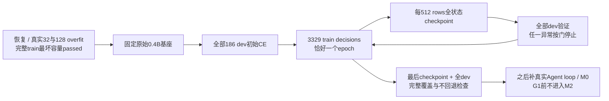

# A0 单epoch完整SFT与dev验证

日期：2026-09-05。状态：启动协议冻结，GPU结果待运行。范围仅固定0.4B、本机单卡、已准入A0成功来源；不使用更大模型。

[统一入口](../rwkv7_agent_only_data_training_plan_zh.md) · [完整数据报告](a0_sft_inputs.md) · [真实过拟合与容量](real_a0_overfit.md)

## 固定协议

[配置](../configs/a0_full_sft.yaml) SHA `e5272ad3cc21ab08dadd860a047c6c7bf9962f31bf9b2b34857e757904231022`；[闭合schema](../schemas/a0_full_sft.schema.json)、[manifest schema](../schemas/a0_full_sft_manifest.schema.json)。ADR-023按用户要求先推进受限工程SFT，不等待Agent loop完工；此顺序不同于ADR-018默认先做开发环境pilot，已经显式登记，不改变G1/G2研究门。

固定原始G1d 0.4B（实际450,834,432参数）重新开始，**不用overfit或容量checkpoint作为训练初始权重**。官方BF16/CUDA、全部参数官方LR分组、FP32 master/moments、LR3e-6、betas0.9/0.99、eps1e-18、clip1；seed20260909。只有当前assistant参与CE，action权重2，其他角色和历史assistant为0。无需更大模型、改变精度或激活重算。

严格绑定完整输入manifest `2936e54fb187c770104c4e0cddbab16368da05d6673d456a1aef160f02408882` 与capacity result `9bf4cb45bf1eddd634632b43abd9ec707acc0dfc8abad02bd2ad8e61c9b8990c`。train3329条形成3329 packed rows，24,082,820有效input、24,940 alignment tokens，utilization99.8965%；所有决策恰覆盖一次。当前长度分布每row只有一条，但仍使用相同packed/reset接口，不关闭边界功能。全train最坏3107监督tokens尾补8192的两步更新通过，peak23,406,879,232 bytes（约21.80GiB）。

## 验证、停止与恢复产物

训练前、每512 rows、最后一行后，对全部186 dev做teacher-forced CE；保留全部row指标、loss/weight分母、分位数，不用test。中途dev/initial超过1.25即停，末轮超过1.0则本次工程验证failed；不按最好checkpoint替代末轮。这些是此单epoch事前工程检查，不是G1/G2工具执行能力门。

每step沿用loss100、preclip norm1e6、23000MiB、120秒停止线与FP32状态检查；时间/资源在操作返回后判断，不是可抢占CUDA硬超时。每512 rows和末尾保存完整model/master/moments/trainer/sampler/RNG，异常另存stopped checkpoint，禁止自动重试、升epoch或读取test调参。已有checkpoint加载API经过独立恢复验证；此启动入口只提供首次单epoch执行，后续恢复需核对固定provenance和cursor，不能用重新从头跑冒充续训。

训练online CE来自更新中不同权重，不与固定checkpoint的全dev CE混为一类。是否泛化、工具grammar/执行有效率、终局成功与thinking增益，仍待真实环境Agent loop/M0，SFT完成不自动放行latent训练。

## 运行与时间预算

用户指定tmux。入口 [run_a0_full_sft.py](../scripts/run_a0_full_sft.py)，核心 [full_sft.py](../src/training/full_sft.py)。使用固定重建环境和LM/CUDA/build，输出 `<data root>/artifacts/real_sft/a0_full_sft_v1`，日志独立位于同级 `.launch.log`；不覆盖已有输出。会话名、启动commit和实际进度在启动日志补充。

估计70～90分钟：按真实overfit约6200 input tokens/s，纯训练约65分钟，再加全dev评估、checkpoint和初始化。以实际日志为准；不在尚未执行完时标记SFT通过。该预算不含后续自由生成工具执行评测或latent实验。
