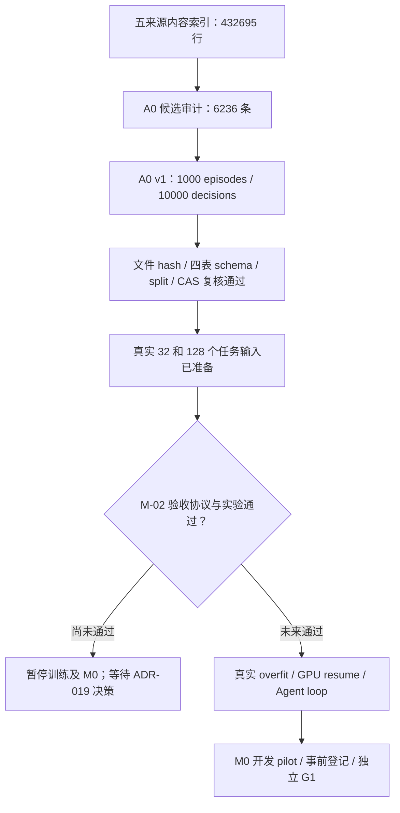

# A0 v1 验收与下一步计划

日期：2026-09-05。结论：A0 的准入、不可变构建和独立复核通过；真实 32/128 overfit 输入已准备，**没有执行对应训练**。M-02 原数值门仍失败，G0/G1 未通过，不能把数据完成等同于研究假设成立。



## 1. 数据范围与可复核证据

| 项目 | 结果 |
|---|---|
| 数据版本 | `a0-v1`；canonical schema `1.1.0`；非 preview |
| 来源 | Open-SWE 两教师，revision `1e02268b36de153ab4b18707571c1cedba62cd10` |
| 准入 | 扫描 6,236 条，接纳 1,000 条；每条均匀选择 10 个已通过上下文检查的决策 |
| split | train/dev/test = 900/50/50 episodes；同任务/仓库教师变体不能跨 split |
| 教师 | MiniMax-M2.5 / Qwen3.5-122B 各 500；每个 split 内各半 |
| outcome | 成功 399，失败 601；未知 outcome 不准入 |
| 四表 | episodes 1,000；decisions 10,000；snapshots/forks 为空但 schema 完整 |
| 许可证据 | 数据集 CC-BY-4.0；固定来源逐行 SPDX 与固定任务元数据匹配；MIT 501、Apache-2.0 427、BSD-3-Clause 63、BSD-2-Clause 9 |
| 污染比对 | 五来源 432,695 行、142,884 个任务指纹；准入样本无规则检出的跨 split 匹配 |
| 本地路径 | `/home/yueyulin/data/long_long_agent/releases/a0-v1`；blob 在同一 data root 的 CAS 中 |

[Git 中的 manifest 副本](a0_v1_manifest.json) 与本地产物逐字节相同，记录所有表、split、报告与 admission 的 SHA。关键锚点：

```text
构建代码 commit: c8609e7a5e4648baa976562a4404cb5e246383b6
manifest SHA256: 95b9ba66e2552737779845621e0cb89cba038ab25ba30b2b93a71f677d20b6e2
admission SHA256: bd5a8484d2374542c5c55ae21e6a5e4e4573ad3cc45aae190a1c248efd9a5fb6
实现 SHA256: fad73d5e28e4e22e5d8b54f7b1c4073632ba5aff6ef17b8676b8e0198893fc88
```

敏感内容只记录规则名称和 record hash，不输出命中文本。v2 首次构建因 Parquet 默认嵌套字段名 `item→element` 被严格验证拒绝；修复 writer 后完整重审 v3，两个 admission 的 accepted 列表及统计完全一致。旧失败目录保留，没有覆盖原失败证据。

独立验收命令：

```bash
/home/yueyulin/data/long_long_agent/envs/train-rebuild-cu130/bin/python \
  scripts/build_a0_release.py verify \
  --release /home/yueyulin/data/long_long_agent/releases/a0-v1
```

## 2. 长度与真实 overfit 输入

A0 的 10,000 个决策窗口共 140,062,130 个有效输入 token；min/median/p95/max 为 4,535 / 15,532.5 / 16,323 / 16,384。8,609 个决策需要删除完整旧交互，仍保留任务与必要近期 observation。

seed `20260905` 的 16K token-budget 计划有 9,089 rows、66,638 个尾部对齐 token；对齐流利用率 99.9524%，逐样本固定 16K padding 利用率 85.4871%。这只是 token 长度画像，**不是 GPU 吞吐或加速比**；长上下文几乎占满预算，真正训练仍需显存/吞吐实测。

真实 overfit 计划只读取 A0 train，按两个教师 × 成功/失败四个 strata 等额轮转，每个独立任务只选一个 hash 决定的已准入 decision，32 集合是 128 的前缀。8K 保护上下文超限的 8 个候选被排除，不换成同任务最短目标。

| 项目 | 32 输入 | 128 输入 |
|---|---:|---:|
| 独立任务 / episode / target | 32 / 32 / 32 | 128 / 128 / 128 |
| 每个 teacher/outcome stratum | 8 | 32 |
| 有效输入 token | 236,978 | 932,445 |
| loss token | 10,994 | 47,069 |
| pack rows | 32 | 128 |
| 尾部对齐 token | 222 | 947 |
| 已执行训练 | 否 | 否 |

计划路径：`/home/yueyulin/data/long_long_agent/artifacts/a0_overfit_inputs_v1.json`，SHA256 `c095653410863582b60b73c1324a080837b5c580e0d1c8ac890de0c5205437e9`。其闭合 schema 固定 `training_executed=false`；保存样本、token 和目标 hash，不保存正文。

## 3. 限制与后续执行顺序

- A0 通过的是固定规则检查，不是不存在任何 PII/secret 的证明。近重复 MinHash 召回是近似方法，基座预训练污染未测；其他来源未扫描的内容不因此获得质量/许可准入。
- snapshot/fork 空表不等于可执行 paired 数据已经生成。失败轨迹保留供诊断/恢复学习，不能把所有失败动作或终止结论默认为正确的 SFT 目标。
- [离线 fixture](executable_environment_fixture.md) 的 buggy/gold verifier 通过只是环境证据，尚无模型 Agent 成功率。
- [生成数值诊断](generation_parity_diagnosis.md) 表明匹配矩阵形状后两模型可逐值等价，但原生 BF16 形状的 KL 仍超出原门；不能用诊断结果覆盖失败。

下一步依赖顺序：

1. ADR-019 已按用户“若确认为 BF16 原因则继续”的条件授权接受（SPEC Step 074～076）；下一步执行已经事前冻结的同形状 recurrence 与原生部署漂移/行为代理独立确认。原失败记录与阈值继续保留，工程确认不取代真实 Agent 评测。
2. M-02 通过后完成真实 32/128 overfit、GPU 中断恢复、run registry 和 Agent loop；先实测 8K/16K 峰值与有效 token 吞吐。三卡 SM89/DDP/NCCL 的环境验收仍独立待办。
3. 完成 20～30 个 dev 任务的 M0 pilot，必要时做受限格式 SFT；在独立确认实验前冻结 G1 数值门槛，并用相同 checkpoint、snapshot、sampling 和工具预算比较四基线。
4. 只有 G1 通过，才扩大 paired snapshot 数据与 fixed-K V0 训练。若失败，保存诊断并停在该门，不自动推进 M2。

仓库验证：重建环境下 105 tests passed；Ruff check / format 通过。代码、配置、小型证据与报告提交至用户个人私有仓库；模型、原始数据、OCI 镜像和运行产物不进入 Git。
