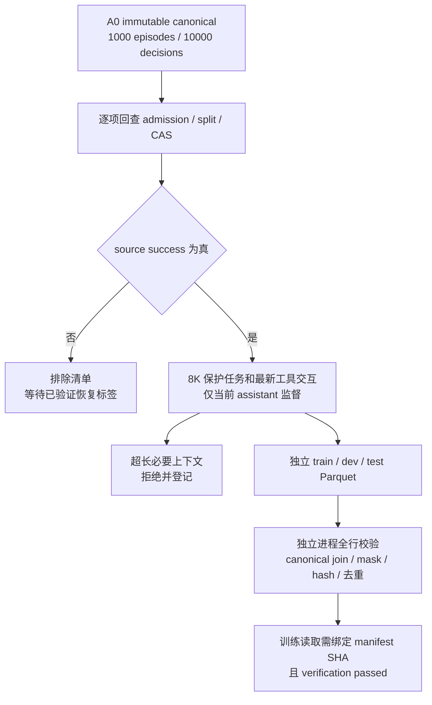

# A0 完整决策 SFT 输入报告

日期：2026-09-05。状态：完整A0决策登记、导出及独立全行验证通过；尚不代表完整SFT训练完成。关联 ADR-022 / D-10 / T-05。

[统一入口](../rwkv7_agent_only_data_training_plan_zh.md) · [数据总览](data_status_report.md) · [真实过拟合](real_a0_overfit.md)



## 1. 范围与口径

完整覆盖的是固定 `a0-v1` release（manifest SHA `95b9ba66e2552737779845621e0cb89cba038ab25ba30b2b93a71f677d20b6e2`）的全部已接纳决策，不是全部原始消息或 432,695 行下载池。原 canonical 四表和 CAS 保持不变，派生 token 缓存不构成新 canonical release。

首轮正向 SFT 仅选来源 `success=true` 轨迹。这个标签来自数据源，不是本项目已重放验证的环境成功；失败来源不自动当作正例，也不删除，将每个决策的 ID、split 和排除原因保存到 `excluded.jsonl`。超过 8K 且无法在保留任务、system 和最新交互的情况下编码的决策，同样拒绝并登记；不截断必需上下文或目标。

train/dev/test 严格继承冻结分组。test 只建立输入、统计长度与校验身份，不用其内容调参或报告模型表现。后续训练入口只读取 train；dev 用于预先固定的验证，test 保留给最终协议。

## 2. 格式与自动验证

[配置](../configs/a0_sft_inputs.yaml)、[闭合配置 schema](../schemas/a0_sft_inputs.schema.json)、[manifest schema](../schemas/a0_sft_inputs_manifest.schema.json)、[实现](../src/training/sft_inputs.py) 均版本化。原 tokenizer 与训练序列化配置通过 SHA 固定。每行包含 episode/decision/sample/group 身份、teacher、来源 outcome、原 message index、token IDs、逐 token region 与 loss weight，以及内容 hash。

system/user/tool/schema/prefix/mixed boundary 权重为 0；历史 assistant 不监督，当前 reasoning/final 为 1、action 为 2。按独立决策窗口输出，运行时继续使用已验证的 packed sampler、`cu_seqlens` 与 recurrent reset，而不是拼接 trace 后只屏蔽 loss。

构建前完整验证 A0 文件和 CAS；构建后独立进程再次校验 release，每行回查 canonical decision 身份、episode、split、teacher、source outcome、message index 与 group hash。全行检查 schema、hash、mask、token 范围、唯一性和跨 split 分组，accepted + excluded 必须恰好等于全部 10,000 canonical decisions。独立验证不重新逐条分词；分词语义由 fixture 测试、固定代码和来源绑定覆盖。训练读取另验 manifest/Parquet SHA，只允许独立验证 passed 的缓存。

## 3. 执行与产物

入口 [prepare_a0_sft_inputs.py](../scripts/prepare_a0_sft_inputs.py)，构建和验证分别独立进程，CPU 执行：

```sh
python scripts/prepare_a0_sft_inputs.py build
python scripts/prepare_a0_sft_inputs.py verify --root /home/yueyulin/data/long_long_agent/artifacts/sft_inputs/a0_success_8k_v1
```

使用固定重建环境，`CUDA_VISIBLE_DEVICES=''`。构建必须从干净已提交的代码执行；输出目录不可覆盖。data root 下保存 intent/result/manifest/verification、三个 Parquet 和排除清单；Git 仅保存代码、schema、配置、测试及小型统计报告。统计包含每个 split 的完整准入/排除分母、input/loss token 总量与 p50/p95/max。

## 4. 训练门与限制

缓存完成不等于完整 SFT 已训练，训练 loss 下降不等于真实 Agent 能力提升。完整 train 的最长监督目标需要与已验证容量比较；超过已有覆盖时先做有界容量测试。32/128 overfit、恢复和资源门通过后，才开始绑定此缓存的完整 A0 SFT/验证运行。显式 thinking 在可执行任务中的增益 G1 仍先于规模化 paired 和 M2 latent thinking 预算训练。

## 5. 完整构建与独立验证结果

构建commit `47819f7113cac84d1215b29139a02f59810ee003`；配置SHA `96fdd74a00f2829a76b90084f2001bfb21f318cd63348c20942144edb5725aa8`，派生manifest SHA `2936e54fb187c770104c4e0cddbab16368da05d6673d456a1aef160f02408882`。独立验证passed，全部10,000 decision逐一与canonical source join一致，重复sample ID和跨split group均为0。完整机器证据及各文件SHA见[输入汇总](a0_sft_inputs_summary.json)。

| split | 原准入决策 | 正向SFT输入 | 失败来源排除 | 必要上下文超8K排除 | input tokens | loss tokens |
|---|---:|---:|---:|---:|---:|---:|
| train | 9,000 | 3,329 | 5,420 | 251 | 24,082,820 | 1,078,726 |
| dev | 500 | 186 | 300 | 14 | 1,314,689 | 57,713 |
| test | 500 | 183 | 290 | 27 | 1,322,625 | 53,133 |
| 全部 | 10,000 | 3,698 | 6,010 | 292 | 26,720,134 | 1,189,572 |

train input p50/p95/max为7616/8144.6/8192，监督token p50/p95/max为130/1066.4/3107；dev监督max2408，test监督max1924。test只做以上数据统计，不参与模型指标与调参。3,329条train正例不是3,329个独立任务，同episode的多个decision保留在同一split；不是再次扩大原A0任务数量。

容量入口 [validate_a0_sft_capacity.py](../scripts/validate_a0_sft_capacity.py) 绑定此manifest和通过的128结果，选全部train实际packed plan中监督token最多的一行，尾补8192连续更新2次。结果单独进入训练报告，不用token文件验证冒充训练容量通过。
