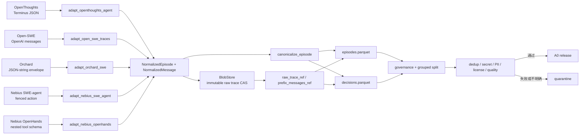

# 首批 Agent 数据格式与处理评估

> 评估日期：2026-09-04  
> 数据根：`/home/yueyulin/data/long_long_agent`  
> 状态：固定版本下载、结构审计和 adapter preview 完成；尚未形成可训练的 A0 release。

## 数据处理架构图

## 1. 落盘清单

| 固定数据项 | Parquet | 行数 | LFS bytes | schema SHA-256 |
|---|---:|---:|---:|---|
| OpenThoughts-Agent-SFT-100K | 10 | 94,334 | 1,749,498,856 | `eb80dfbe...84712b` |
| Open-SWE OpenHands MiniMax/Qwen pair | 35 | 84,066 | 7,518,472,984 | `914f1b90...aa7a4` |
| Microsoft Orchard SWE | 19 | 107,185 | 9,715,673,417 | `cb1f618f...280c` |
| Nebius SWE-agent | 12 | 80,036 | 1,114,367,701 | `40cfb66c...3a507` |
| Nebius SWE-rebench OpenHands | 1 | 67,074 | 2,079,503,354 | `adf30175...3be3` |
| 合计 | 77 | 432,695 | 20,697,516,312 | — |

每个固定 revision 目录都有 `download_manifest.json` 和 `source_audit.json`。manifest 的累计 LFS bytes 与 registry 完全一致；审计只输出结构和聚合数字，不输出轨迹正文。

## 2. 五种输入格式与处理方式

### OpenThoughts / Terminus JSON

- 输入：`conversations[{role,content}]`；assistant content 为 `<think>...</think>` 后接 Terminus JSON，包含 analysis、plan、commands 和 task_complete。
- 处理：分离 think 和 Terminus action，后续 user 消息作为 terminal observation；固定 teacher 为数据卡声明的 GLM-4.7-AWQ，保留源字段中的内部 model 名。
- 身份：`run/trial/episode` 在 94,334 行中只有 91,073 个唯一组合；完整原始行 SHA-256 加入 source ID 后为 94,334/94,334 唯一，原始行无完全重复。
- outcome 风险：`result` 有 60,296 个 null，其余主要是 32,764 个 AgentTimeoutError。null 只是没有记录异常，不能当作环境 verifier 成功；当前保守映射为 unknown。

### NVIDIA Open-SWE / OpenAI function calling

- 输入：结构化 `messages`，thinking teacher 使用 `reasoning_content`；non-thinking teacher 为空；`tool_calls.function.arguments` 是 JSON string；有 repo license、language、resolved 和 patch metadata。
- 处理：严格解析 arguments 为 JSON object，保存 function calls 和连续 tool results；`resolved=-1` 映射 unknown，不映射 false。
- provenance：行内 `hf_dataset_name` 是任务集而不是 teacher。文件路径映射 MiniMax-M2.5 thinking 与 Qwen3.5-122B non-thinking，harness 均为 OpenHands。
- 配对规模：MiniMax 43,603 rows/19,022 tasks，Qwen 40,463 rows/18,451 tasks；共有 16,372 个 instance ID。它们是 paired 候选，不等于已经验证同一 base snapshot；后续必须 join SWE-rebench snapshot/base commit。
- outcome：MiniMax resolved/failed/unknown 为 14,363/19,510/9,730；Qwen 为 9,833/21,124/9,506。
- repo license：所有所选行落在 MIT、Apache-2.0、BSD-3-Clause、BSD-2-Clause 四类，没有当前扫描可见的空值。

### Microsoft Orchard SWE / JSON-string envelope

- 输入：`tools` 和 `metadata` 是 JSON string，`messages` 是结构化 OpenAI list；reasoning 以 inline `<think>` 表示。
- 处理：先严格解码 envelope，再复用结构化 message normalizer；按 metadata source 区分 mini-swe-agent 与 OpenHands。
- 身份：`instance/sample` 只有 81,558 个唯一键，加入 source/model 仍只有 107,131；完整原始行 hash 后 107,185/107,185 唯一且无完全重复。
- outcome：74,649 resolved / 32,536 unresolved。教师含 MiniMax-M2.5 89,794 行和 Qwen3.5-397B-A17B 17,391 行。

### Nebius SWE-agent / fenced shell action

- 输入：`trajectory[{role,text,system_prompt,mask,cutoff_date}]`；assistant 角色名为 `ai`，最后一个 fenced code block 是 shell action；target、exit status、patch、eval logs 在行级。
- 处理：将 `ai` 映射 assistant，分离 fenced action，保留原 loss mask、patch 和 eval logs；大字段只进入压缩 CAS blob。
- 身份：80,036 行只有 4,219 个 `(instance,model)` 组合；加入 trajectory/outcome/exit/patch hash 后为 80,036/80,036 唯一，无完全重复。
- outcome：13,389 true / 66,647 false；exit_status 与 target 分开保存，不能把 `submitted` 当作成功。

### Nebius OpenHands / nested tool schema

- 输入：完整 OpenAI trajectory、5 个嵌套 function tools、唯一 trajectory ID、model patch、exit status、resolved 和生成测试指标；arguments 为 JSON string。
- 处理：assistant 同时有 content 和 tool call 时，content 归入 reasoning；final-only content 保持输出。arguments 严格解析；teacher 固定为 Qwen3-Coder-480B-A35B-Instruct，harness 固定 OpenHands 0.54.0。
- outcome：32,161 resolved / 34,913 unresolved；31,453 行有 `gen_tests_correct`，31,389 行有 `pred_passes_gen_tests`。
- 规模：67,074 个唯一 trajectory，覆盖 6,306 tasks、1,823 repos。

## 3. Canonical 输出与保真规则

- `episodes`：任务、来源、harness、tools、teacher、outcome 和 raw blob 引用。
- `decisions`：assistant action 前缀、当前 observation、think、action 和连续 tool results。
- `snapshots` / `forks`：当前 preview 为空，只有从可执行 snapshot 产生后才能填充。
- CAS blob schema v1 同时保存完整 `raw_record` 和派生 `normalized.messages`；decision prefix 明确引用 normalized 分支。
- 单个 tool result 保留原文本；多个结果使用按原顺序排列、含 role/tool_call_id/content 的 canonical JSON 数组。
- tool arguments 无法解析、不是 object 或结构缺失时 fail closed；生产转换仍需独立 reject/quarantine 报告。

## 4. 当前不可直接训练的原因

1. held-out task/repo/issue/base-commit 清单尚未冻结；生产转换会 fail closed。
2. 跨源 task/repo 近重复和 Open-SWE snapshot join 尚未完成。
3. OpenThoughts 没有可信环境成功标签，不能混入 supervised value/halting target。
4. 非 Open-SWE 来源缺少逐 repo license 字段，仍需 repo-level license join 或隔离策略。
5. 尚未全量扫描 tool argument validity、action/observation 配对、secret/PII、超长记录和 tokenizer 长度。
6. 旧 dev preview 反映 adapter 开发历史；只有新 release ID 且 manifest 标记 `preview=false` 才能作为训练输入。

## 5. 下一轮数据准备顺序

1. 已冻结 held-out 和 v1.1 split-group contract；D-09/D-10 必须按该 repo/task identity 生成互斥 episode ID split。
2. 生成全量质量 profile 与 reject reason 表，不修改 immutable raw。
3. 对 Open-SWE 16,372 个共同任务 join base snapshot，构造真正的 thinking/non-thinking paired 候选。
4. 做跨源 exact/near duplicate 和污染扫描，再选 A0 的 1K episodes/10K decisions。
5. 对 A0 运行 tokenizer 长度、assistant loss mask、action grammar 和 blob round-trip 验证。

当前 adapter 足以继续质量工程，但证据不支持将 432,695 行直接拼接训练。
