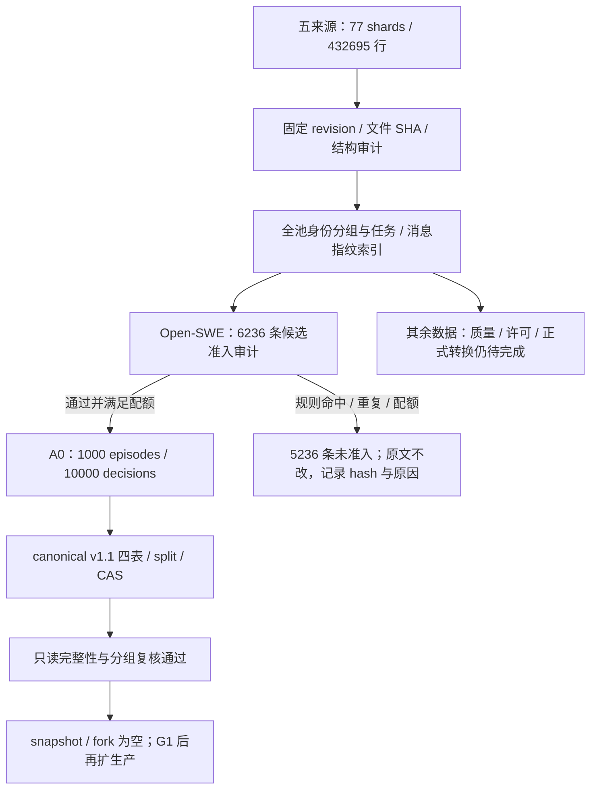

# 数据状态与质量报告

报告日期：2026-09-05。范围：五个固定下载项及正式 `a0-v1`；不包括未下载的 AgentTrove 全量，也不把任务元数据或环境镜像计为训练轨迹。

[返回统一入口](../rwkv7_agent_only_data_training_plan_zh.md) · [A0 版本细节](a0_release_assessment.md) · [规格与审计台账](../SPEC.md)

## 1. 结论：不是全部完成，A0 范围已完成准入与格式验收

| 检查层级 | 五来源下载池：432,695 行 | 正式 A0：1,000 episodes / 10,000 decisions |
|---|---|---|
| revision、文件完整性、结构 | 77 个 Parquet 已落盘；固定 revision、文件 SHA、行数及结构审计完成 | manifest 文件清单、SHA、四表 schema 复核通过 |
| 身份与 split | 全池分组边界已冻结；42,982 个 repo/task groups | 900/50/50 episodes；repo/group 跨 split 交集为 0 |
| 精确去重与污染 | 全池任务文本及原始消息指纹索引完成；不是语义去重后的发布版 | 已按任务 ID、任务文本及规范化消息内容排重，并检查跨 split 污染 |
| 近重复 | 建立全池任务 MinHash 检索索引；未做全池语义去重闭环 | 准入时对候选做跨 split 任务近重复检查；近似召回有漏检可能 |
| 工具质量、PII/secret、长度 | 未全量完成；A0 仅审计其中 6,236 条候选 | 入选样本通过固定准入规则；不是人工逐条或安全零漏检证明 |
| repo-level 许可证据 | 其他来源仍未全部完成；下载许可不等于训练发布准入 | 固定发布方逐行 SPDX 与固定任务元数据匹配通过 |
| 统一 canonical 格式 | 五个 adapter 与有限 preview 已验证，未全量正式转换 | schema v1.1.0 四表、split、CAS 引用已正式生成并验证 |
| 可执行 snapshot / fork | 未完成规模化生产 | 两表均为空；A0 不是 paired snapshot 数据集 |

因此可以继续使用 A0 的 **train split 做小规模工程验收**，不能把全部 432,695 行直接当作已清洗训练集，也不能把数据就绪等同于训练/G1 已通过。



## 2. 已下载范围与来源成熟度

这里的“全量”仅指 [sources.yaml](../configs/sources.yaml) 的固定 `allow_patterns` 选区，不是各平台数据集所有配置和未来版本。

| 数据项 | 固定 revision | shards / 行数 | A0 使用情况与主要缺口 |
|---|---|---:|---|
| OpenThoughts-Agent-SFT-100K | `45fb28fcc38d352133cb28a1c8a43a2f14fea97b` | 10 / 94,334 | adapter/preview 完成，未纳入 A0；可信 outcome、repo 许可和全量质量仍待补齐 |
| Open-SWE / OpenHands 两教师 | `1e02268b36de153ab4b18707571c1cedba62cd10` | 35 / 84,066 | A0 的唯一来源；只审计 6,236 条候选，不代表 84,066 条全已准入 |
| Microsoft Orchard / SWE | `70c05ec1f20f823ae6adc60374922e9271bb74e2` | 19 / 107,185 | adapter/preview 完成；未纳入 A0，repo 许可与全量质量/转换待办 |
| Nebius SWE-agent | `68195a1450865274106246d0d0296a1d6807b88e` | 12 / 80,036 | adapter/preview 完成；未纳入 A0，repo 许可与全量质量/转换待办 |
| Nebius SWE-rebench OpenHands | `35455389ab51bf5e2306bfd436ef72d0f98bf882` | 1 / 67,074 | adapter/preview 完成；未纳入 A0，repo 许可与全量质量/转换待办 |
| 合计 | 五个固定下载项 | 77 / 432,695 | Parquet 共 20,697,516,312 bytes |

数据集声明许可与下载选区见 registry；本报告不新增法律判断。输入格式、outcome 映射和原始 ID 风险详见 [来源格式评估](data_format_assessment.md)。OpenThoughts 的 null result 不等于成功，Nebius 的 submitted 不等于测试通过。

## 3. “去重完成”究竟指什么

实现依据：[quality.py](../src/data/quality.py)、[contamination.py](../src/data/contamination.py)、[A0 准入器](../src/data/a0_release.py)。

1. **身份分组**：采用冻结的 `repo_else_task_v1`；同仓库、同任务的教师变体留在同一个 split。全池 42,982 groups，1,738 groups 跨来源出现。这些变体不是应当一律删除的坏样本，必须先保证分组隔离。具体算法与 held-out SHA 见 [分组报告](heldout_assessment.md)。
2. **精确内容指纹**：任务文本经 Unicode NFKC、casefold 和空白归一后 SHA-256；全池有 142,884 个任务文本指纹，跨 split 精确任务匹配为 0。原始 messages/conversations/trajectory 的 canonical JSON 有 432,695 个不同 SHA，跨 split 消息指纹匹配为 0。这只证明该序列化定义下不完全相同，不排除仅工具 ID、格式或措辞不同的等价轨迹。
3. **A0 入选排重**：禁止已入选 task ID、规范化任务文本或规范化消息内容重复；候选中该规则命中 80 条。最终 A0 有 1,000 个不同任务、575 个 repo、10,000 个唯一 decision ID，每个 episode 恰为 10 个 decision。
4. **跨 split 近重复**：任务文本 5-word shingles，32 个 MinHash permutation、8 个 band；召回后用精确 Jaccard ≥ 0.8 判断。候选中 81 条命中跨 split 近重复并被拒绝；已准入 A0 的规则检出匹配为 0。该检查在基础质量检查通过后执行，不能把 81 当作全池近重复总数。

尚未证明的内容：全池同 split 的近重复聚类/代表样本选择、跨来源统一后的语义等价轨迹去重、所有代码/补丁/模板的语义污染，以及基座预训练数据污染。原始 trace 始终 immutable；排重作用于准入与派生产物，不删除原始数据。

## 4. A0 质量准入与拒绝分母

输入为 Open-SWE 固定选区；达到每 split 两教师等额配额后停止扫描，seed 为 `20260905`。6,236 条扫描记录中，1,000 条入选、5,236 条未准入；所有未准入记录均有 hash-only quarantine 条目。未准入包含配额筛选，不能全称为“脏数据”。

| 原因 | 命中记录数 | 解释 |
|---|---:|---|
| unknown outcome | 1,497 | 不把未知环境结果当成功或失败标签 |
| email | 2,634 | 固定敏感信息规则；保留规则中的测试域名及已登记公共 harness 地址例外 |
| credential URL / private key / credential assignment | 39 / 30 / 14 | 仅记录规则名，不展示命中文本；不判定凭据是否仍有效 |
| API key / AWS key / GitHub token | 2 / 5 / 1 | 同上，命中即拒绝 |
| cross-split near task | 81 | 跨分组近重复候选 |
| duplicate selected task or trace | 80 | 与已入选任务或轨迹重复 |
| invalid tool arguments | 21 | 参数不满足已声明工具 schema |
| protected context overflow | 14 | 必要任务与近期交互在 16K 窗口内放不下 |
| teacher quota / split quota full | 3,780 / 93 | 配比筛选，并非质量失败 |

同一记录可以命中多个原因，以上数值不能相加当作拒绝样本数。5,236 条中有 1,482 条仅因配额未入选；完整原因组合保存在 data root 的 quarantine，不在 Git 保存原文。

已准入样本经过工具定义/JSON 参数、call ID 与 observation 对应关系、来源许可、任务身份/base commit join、已知 outcome、敏感规则与保护上下文检查。工具 grammar 合法不等于该动作在环境中执行正确；A0 outcome 来自固定来源，未对 1,000 条教师轨迹逐条重放验证。

A0 两教师各 500 条，来源 success/failure 为 399/601。失败轨迹用于工程诊断、恢复学习或后续标签筛选，不能把所有失败动作和提前 finish 默认为正式 SFT 正例，也不能把 episode success 自动下放为每个 decision 的 progress/value 标签。

## 5. 统一格式、标签与训练输入

五来源都有 adapter 与测试，但正式 release 当前只有 A0。统一数据契约为 [canonical schema 实现](../src/data/schemas.py) 的 v1.1.0：

| 产物 | A0 数量 | 内容与限制 |
|---|---:|---|
| `episodes.parquet` | 1,000 | source/revision、task、repo、base commit、teacher、outcome、raw CAS 引用 |
| `decisions.parquet` | 10,000 | prefix、thinking、action、observation/tool result 分开保存，保留 episode 顺序与原始位置 |
| `snapshots.parquet` | 0 | schema 存在；尚无可执行同快照数据 |
| `forks.parquet` | 0 | schema 存在；尚无 depth/outcome 候选对照 |
| split 文件 | 900 / 50 / 50 | train/dev/test；512 / 31 / 32 个互斥 repo groups |
| CAS blobs | 按内容 hash 引用 | 保存原始记录与规范化消息，读取时校验；RWKV state 不写入 canonical |

工具参数解析成对象后 canonicalize；训练模板统一 tool call/response。CE 只覆盖允许的 assistant token，action 可加权；system/user/tool 不计 CE。decision window 保留任务及必要近期交互，超限删除完整旧交互组或拒绝，不截掉任务后只训练答案。

A0 的10,000个决策窗口共140,062,130个有效输入token，不能按10K条短样本估算训练成本。16K release与另行准备的train-only 8K 32/128输入不是同一长度口径；完整overfit尚未执行，另有[真实两步预检与恢复诊断](real_a0_training_preflight.md)。输入计划的 `training_executed=false` 是生成时的不可变记录，不覆盖后续独立run状态。长度、loss token、尾部对齐和manifest细节统一见[A0 验收报告](a0_release_assessment.md)。

## 6. 证据位置与本次复核

大产物根目录为 `/home/yueyulin/data/long_long_agent`；下列路径相对此根，不能直接提交原文或大表到 Git。

| 证据 | 路径 / SHA-256 |
|---|---|
| 固定源文件清单与结构审计 | `raw/<source_id>/<revision>/download_manifest.json` 与 `source_audit.json` |
| 全池指纹索引 | `artifacts/data_audit/a0_pool_index_v1.sqlite`；`b839e53b23dac41d425d296bde675bdc57f6348efccce55bb93e96ef0fced241` |
| A0 准入 | `artifacts/data_audit/a0_admission_v3.json`；`bd5a8484d2374542c5c55ae21e6a5e4e4573ad3cc45aae190a1c248efd9a5fb6` |
| 拒绝记录 | `artifacts/data_audit/a0_admission_v3.quarantine.jsonl`；仅记录 record hash 与原因 |
| A0 正式版本 | `releases/a0-v1/`；manifest SHA `95b9ba66e2552737779845621e0cb89cba038ab25ba30b2b93a71f677d20b6e2`；[Git 副本](a0_v1_manifest.json) |
| 质量、污染、许可聚合 | `releases/a0-v1/reports/{quality,contamination,licenses}.json`；各文件 SHA 已登记于 manifest |

本次重新执行以下只读验收：

```bash
/home/yueyulin/data/long_long_agent/envs/train-rebuild-cu130/bin/python \
  scripts/build_a0_release.py verify \
  --release /home/yueyulin/data/long_long_agent/releases/a0-v1
```

结果通过：完整文件清单/hash、四表精确 schema、episode 唯一性、decision 关联、split 完整覆盖和全部 episode raw CAS 读取。另用 Parquet 聚合复核任务/repo/decision 数量、每 episode decision 数及 group 隔离；用只读 SQLite 查询复核上述精确指纹分母。重新复算 77 个原始 Parquet 的 SHA/字节数/行数并与固定下载及索引清单匹配；这不是重新扫描全池 PII 或重新执行候选质量审计。

旧失败与构建修复过程仍保留在 [A0 验收报告](a0_release_assessment.md) 和 SPEC Step 060～068；不覆盖失败产物。

## 7. 剩余数据工作与使用边界

1. **现阶段输入**：只使用通过准入的 A0，训练只读 train 列表；dev 用于开发诊断，test 不用于调参。使用前校验 manifest 与相关配置/代码 hash。
2. **扩展来源前**：按来源补齐 D-01 repo 许可及任务/base commit 证据；对选定候选执行工具配对、PII/secret、outcome、长度与污染审计，保存所有拒绝分母。当前 A0 专用准入器不能被当作五来源通用正式转换器。
3. **声称全池处理完成前**：补齐来源兼容的质量策略、同 split 近重复处置与跨来源规范化内容去重；冻结策略后构建新的 immutable release，独立验证四表、引用、split、配比与 token/loss。不能只把已有索引状态改成“清洗完成”。
4. **paired / latent 数据**：共同 task ID 或两教师轨迹不等于同一个可执行 snapshot。D-11/D-12 仍受 G1 约束，A1/A2 与大规模 paired 生产不能提前启动。

报告完成不改变数据工作项的完成范围，不更改许可、去重阈值或阶段门。
