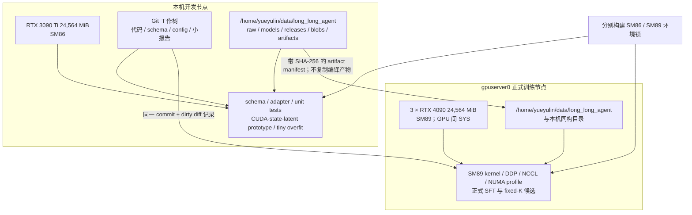

# 开发与训练环境盘点

> 盘点日期：2026-09-04  
> 性质：只读探测；未安装依赖、未修改驱动、未下载模型或数据。

## 环境拓扑图



## 摘要

已确认两级资源：本机一张 RTX 3090 Ti 用于开发和原型测试，远程 `gpuserver0` 三张 RTX 4090 用于正式训练。两端 GPU 与驱动均正常；此前 `nvidia-smi` 失败仅因为 Codex 文件执行沙箱没有映射 `/dev/nvidia*`，在宿主权限下实测正常。G0 仍未完成，因为 Python/训练依赖、代码 revision、checkpoint 和跨节点复现环境尚未固定。

## 本机开发节点

| 项目 | 探测结果 | 准备影响 |
|---|---|---|
| GPU | NVIDIA GeForce RTX 3090 Ti，24,564 MiB，compute capability 8.6 | 单卡开发、0.4B/1.5B smoke、短时 overfit 与 profile |
| CPU | AMD Ryzen 9 7900X，12 核 / 24 线程 | 足够进行 ETL、小规模并行预处理和本地 harness |
| RAM | 57 GiB，总可用约 40 GiB（探测时） | A0/A1 流式 ETL 可行；不要把大数据集整体载入内存 |
| Swap | 8 GiB | 不应依赖 swap 支撑训练 |
| 工作卷 | 3.7 TiB，总可用约 3.3 TiB | 容量充足，但仍需为 blob、环境镜像和 checkpoint 设置配额 |

## GPU 与 CUDA

| 项目 | 探测结果 |
|---|---|
| 内核模块 | `nvidia` 与 `nvidia_uvm` 已加载 |
| 驱动版本 | NVIDIA open kernel module `595.84` |
| GPU proc 信息 | `/proc/driver/nvidia/gpus/.../information` 能识别 RTX 3090 Ti |
| 设备节点 | 宿主可用；Codex 默认文件沙箱内不映射，GPU 命令需在宿主权限下运行 |
| `nvidia-smi` | 宿主实测通过：24,564 MiB、compute capability 8.6、检查时 0 MiB 使用 |
| CUDA compiler | `/home/yueyulin/software/cuda-13.0/bin/nvcc` 可用，CUDA 13.0 / V13.0.88 |
| cuDNN | `/home/yueyulin/software/cudnn-9.13.0-cuda13/lib` 存在 |
| PATH | `nvcc` 不在默认 PATH；必须通过环境配置显式固定路径 |

结论：本机驱动无需修复；下一步只需建立隔离 Python 环境并完成 PyTorch/CUDA extension smoke test。

## 软件环境

| 项目 | 探测结果 |
|---|---|
| OS/kernel | Linux x86_64，kernel `7.0.0-29-generic` |
| Python | 只有系统 Python 3.14.4 |
| Git | 2.53.0 |
| Python 包 | 当前解释器未发现 `torch`、`pyarrow`、`datasets`、`deepspeed` |
| Git worktree | `.git` 目录存在但为空；`git status` 报“not a git repository” |

Python 3.14 与训练依赖的实际兼容性尚未确认。为降低 CUDA extension、PyTorch Lightning 1.9.5 和 DeepSpeed 的兼容风险，准备阶段应创建独立、锁定版本的 Python 环境；不得直接污染系统 Python。

## 远程正式训练节点

连接入口：`yueyulin@192.168.1.39`，主机名 `gpuserver0`。SSH BatchMode 实测连通。

| 项目 | 探测结果 | 准备影响 |
|---|---|---|
| GPU | 3 × RTX 4090，每张 24,564 MiB，compute capability 8.9 | 聚合 72 GiB 显存；适合多卡 post-training 与 fixed-K 主实验 |
| GPU 状态 | 三卡均约 1 MiB 使用、0% util，无进程 | 检查时空闲；不代表之后无资源竞争 |
| 驱动 | 575.51.03，`nvidia-smi` 报 CUDA capability 12.9 | 容器/torch CUDA 版本不得超过驱动兼容范围 |
| CUDA toolkit | 12.1、12.4、12.8 的 `nvcc` 均存在；默认 PATH 未选择版本 | 首选候选为 12.8，须在 lock/config 中显式固定 |
| GPU 拓扑 | 三卡间均为 `SYS`，没有 NVLink；分别邻近 NUMA 3、1、0 | 正式训练前必须做 NCCL all-reduce、P2P 与 NUMA affinity profile |
| CPU | AMD EPYC 7262，8 核 / 16 线程，4 个 NUMA node | 数据预处理并发不要挤占训练/NCCL CPU；重 ETL 优先留在本机 |
| RAM | 220 GiB，总可用约 217 GiB（探测时） | 可支持数据缓存、ZeRO/offload 试验，但不能替代性能 profile |
| 工作卷 | 7.4 TiB，总可用约 4.0 TiB | 足够放训练数据和 checkpoint；需单独设配额/清理策略 |
| Python | 3.10.12，未发现 torch/pyarrow/datasets/deepspeed | 可作为环境基线，但必须创建隔离环境并锁版本 |
| Build tools | Git 2.34.1、GCC 11.4、CMake 3.22.1；无 Ninja | CUDA extension 可能可编译；Ninja 应作为 P0-03 依赖 |
| 容器 | Docker 29.6.1；Docker 已注册 `nvidia` runtime | 正式训练优先容器化；仍需最小 GPU 容器 smoke test |
| 调度器 | 未发现 Slurm `srun/sbatch` | 采用单机显式 launcher；并发占卡需约定锁/登记机制 |
| 项目目录 | `/home/yueyulin/github` 存在，`long_long_agent` 尚不存在 | 代码 revision 固定后再部署，不在环境确认阶段创建 |

远程 NVIDIA Container Toolkit 的独立 CLI 不在 PATH，但 Docker runtime 已注册。是否能实际启动 GPU 容器，要在选定基础镜像后做一次不拉取未知镜像的 smoke test。

## 模型规模初步建议

按“本地开发、远程正式训练”分层：

- 本机 0.4B：CUDA kernel、state clone/restore、K=0 等价性和端到端 smoke；
- 本机 1.5B：V0 功能验证、M0 小规模基线和 tiny overfit；
- 远程 3 × 4090：先 profile 1.5B/2.9B，再选择 2.9B 全参或 7.2B 参数高效训练作为正式候选；
- 7.2B 全参及 13.3B：在 3 × 24 GiB、无 NVLink 条件下需要 ZeRO-3、offload 或更激进的内存方案，不列为首轮承诺。

这只是容量导向的候选选择，不是 checkpoint pin。正式选择必须记录 Hugging Face 完整 commit、文件 SHA-256、模型变体兼容信息，并以最小前向验证为准。

## G0 前的阻塞项

1. 本机和远程分别创建受控 Python/容器环境，固定 Python/PyTorch/CUDA/Lightning/DeepSpeed/Ninja；
2. 本机通过 PyTorch GPU、CUDA extension、0.4B 最小前向、生成和 state round-trip；
3. 远程通过 Docker GPU、三卡 NCCL all-reduce、P2P/NUMA 与 1.5B/2.9B 显存吞吐 profile；
4. 恢复或初始化有效 Git worktree，使本地和远程部署可追溯到同一 commit；
5. 固定模型与上游代码完整 revision/hash。

## 已执行的只读命令

```text
python3 --version
git --version
uname -a
lscpu
free -h
df -h .
lspci -nn
lsmod
nvidia-smi --query-gpu=...
nvidia-smi -L
nvidia-smi topo -m
sed -n '1,5p' /proc/driver/nvidia/version
find /proc/driver/nvidia/gpus ...
/home/yueyulin/software/cuda-13.0/bin/nvcc --version
python3 -c 'import importlib.util; ...'
ssh -F /dev/null ... yueyulin@192.168.1.39 <read-only-command>
```

## 下一次盘点的通过证据

```text
nvidia-smi -L
nvidia-smi --query-gpu=name,memory.total,driver_version --format=csv,noheader
<venv-python> -c 'import torch; print(torch.__version__, torch.version.cuda, torch.cuda.is_available())'
<venv-python> -c 'import pyarrow, datasets, deepspeed'
<venv-python> <RWKV minimal forward smoke>
<remote-container> nvidia-smi
<remote-env> <NCCL all-reduce smoke>
```
