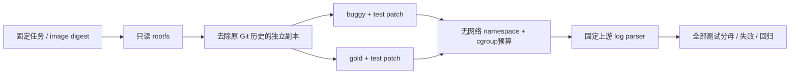

# 离线可执行任务 fixture

日期：2026-09-05。关联 T-04/T-08、SPEC Step 063～064。

结果：真实 dev 任务 `adamchainz__flake8-comprehensions-179` 在离线隔离环境中复现目标失败；gold patch使目标与回归测试全部通过。没有执行模型 Agent，不能算 M0、single-trajectory模型成功率或 G1 证据。

## 固定输入

- 任务来自 SWE-rebench-V2 revision `475dd5e8703bb5fb22dd3c60b5d038b019eba1e0`，在既有 repo-level held-out policy中为dev；repo SPDX为MIT。
- base commit：`2357af67dcf288eee8c42dacccd0c598272a0408`。
- registry manifest：`sha256:069abfc4b034b4810a1031ce1fabd690d99048146e776a57573f20ff199b75d1`。
- 转换后的OCI manifest：`sha256:483ed14b17a3c1e0f5b68832ec974302d2ac0b8e53cfd1ea1861aed683356950`。原manifest为Docker v2，umoci不接受；仅作本地格式转换，所有layer digest一致，未换镜像内容。原副本保留。
- verifier代码固定在[官方 SWE-rebench-V2 仓库](https://github.com/SWE-rebench/SWE-rebench-V2/tree/c71902a8cf8d2b725f63d51f199f4d3e56f68d2d)，使用其parser及测试名规范化，记录exact passed-set匹配。

完整配置：[environment_fixture.yaml](../configs/environment_fixture.yaml)。工具包和镜像均位于 `/home/yueyulin/data/long_long_agent`，没有安装系统Docker daemon或把镜像写到Git。

## 结果与限制

| 模式 | FAIL_TO_PASS | PASS_TO_PASS | missing / regression | 测试命令耗时 |
|---|---:|---:|---:|---:|
| buggy | 0/1通过，1失败 | 65/65通过 | 0 / 0 | 10.35 s |
| gold | 1/1通过 | 65/65通过 | 0 / 0 | 10.27 s |

gold exit0且官方exact passed-set匹配。缺失测试不会从分母剔除，缺失既有测试记为regression。

隔离：无host网络、home、SSH/socket、GPU挂载；只读rootfs；项目可写副本；验证文件只挂到专用oracle实例，不进入Agent观察。systemd用户cgroup限制4GiB内存、swap=0、64 tasks、CPUQuota=200%、120s wall limit；输出上限1MiB。

额外检查通过：网络namespace与host不同，`/etc`写入失败，host home与SSH socket不可见；1KiB输出限额阻止100KiB输出；2秒runtime限制让sleep10在2.23秒退出。没有声称执行了内存OOM压力测试。

此前两次setup问题已保留：user namespace选项缺失；只读rootfs上验证目录mountpoint不存在。v1失败报告保留，v2通过。原始测试日志不持久化，报告只存结果计数、受限stop reason和输出hash；敏感内容观察先隔离。

产物：`artifacts/environment_fixture_flake8_179_v2.json`（data root）。源代码入口为 [verify_environment_fixture.py](../scripts/verify_environment_fixture.py)。仍待：模型→parser→tool→observation的Agent loop、20～30任务pilot、四基线公平预算及独立G1确认；这些工作受M-02门限制。
