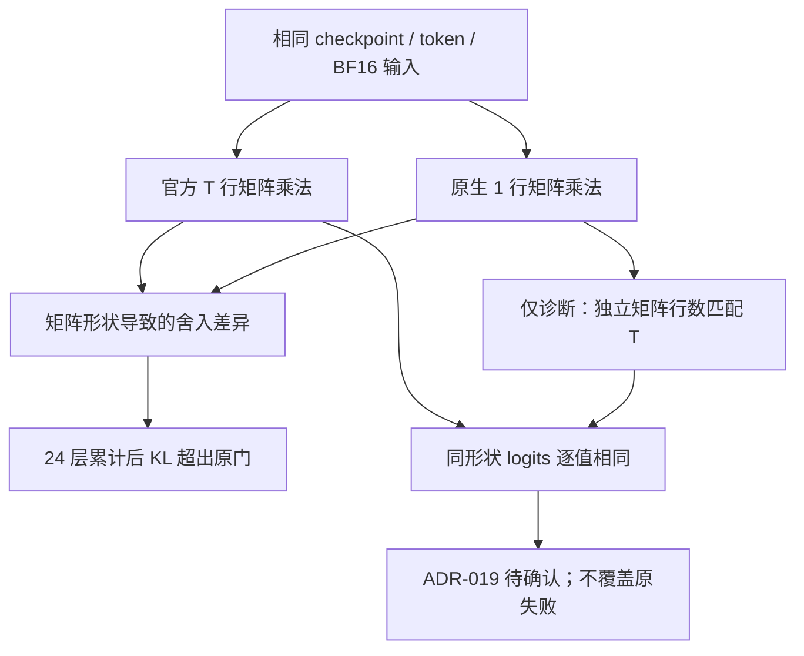

# Generation parity：数值原因与验收边界

日期：2026-09-05。关联 M-02/M-08、SPEC Step 060～064、提议 ADR-019。

结论：原生 BF16 逐 token 路径没有通过事前登记的 KL 门。整段 prefill 与官方实现逐值一致，K=0 和重复生成一致。进一步匹配矩阵运算形状后，两模型的递推 logits 逐值一致；这支持将已观察到的差异归因于 GEMV/GEMM 形状带来的舍入，而不是把它直接解释成 state 传递错误。诊断不等于正式验收通过。

## 原门和结果

原配置 [generation_parity.yaml](../configs/generation_parity.yaml) 在 GPU 实验前提交为 `c7edadd`。0.4B/1.5B 各3个固定提示与seed、16/32/64/128长度，共12 case；另测3次固定提示的重复贪心生成。seed不是额外独立任务。

每个 case 要求 logits relative RMS≤0.02、mean KL≤0.002 nats、p95 KL≤0.01、top-1 agreement≥0.95，且finite、K=0与重复生成完全一致。

| 检查 | 0.4B v1 | 1.5B v1 |
|---|---:|---:|
| 官方 vs stateful prefill | 全部逐值相同 | 全部逐值相同 |
| K=0、重复生成 | 通过 | 通过 |
| 原生 RNN 最坏 mean KL | 0.007043 | 0.017581 |
| 原生 RNN 最坏 p95 KL | 0.030299 | 0.054119 |
| 正式结果 | 失败 | 失败 |
| peak allocated | 1,237,287,424 bytes | 3,659,465,216 bytes |

内存仅对应短窗推理检查，不是16K训练峰值。完整分母、case和失败项保存在指定 data root 下的 `artifacts/generation_parity_smoke_v1.json`、`generation_parity_local_v0_v1.json`。

## 原因隔离

1. 将短窗参考递推改为严格 no-grad 下调用同一个官方 CUDA forward，0.4B v2仍失败。因此不是“换 WKV backend 就解决全部误差”。训练短窗仍保留可微 reference/full-BPTT；没有调用未对齐 backward。
2. Hook 显示第0层 receptance 输入逐值相同，但1行与16行输出约39.36%元素存在少量 BF16 ULP 差异。改变 reduced-precision reduction 开关不能稳定消除漂移。
3. 单纯固定16行只让16-token case逐值相同，不能解决所有长度；该 v3没有被纳入部署默认。
4. 对一个固定公开提示，分别匹配16/32/64/128参考矩阵行数：两模型共8组 logits 的 RMS/KL均为0、top1=1。同一个CUDA WKV在非零初始状态及位置13 reset时，整段与逐token的输出/最终state也逐值相同。

第4项只对独立矩阵乘法的计算行做对齐，不增加 recurrent timestep，不写假token或丢弃state更新。[inference_math.py](../src/model/inference_math.py) 的对齐功能默认关闭，只能进入显式诊断context。

诊断产物：`artifacts/generation_math_smoke_v1.json`、`generation_math_local_v0_v1.json`。新依赖环境和全新CUDA build cache也复现了0.4B诊断，产物 `generation_math_rebuilt_smoke_v1.json`。

## 下一步决策

[SPEC ADR-019](../SPEC.md) 提议分开验收：

- 同矩阵形状的严格递推等价：验证算法、状态传递和边界重置。
- 实际部署形状的数值/行为稳定性：用独立提示、长窗、生成结果与真实工具预算重新事前登记，不能把本轮诊断样本作为确认结果。

这不是批准放宽旧门。原 v1/v2/v3 失败和阈值不改写；M-02保持阻塞，M0、长训练、paired规模化和M2未启动。若选择保持原门不变，就继续数值路径研究，不能自动往下扩阶段。
