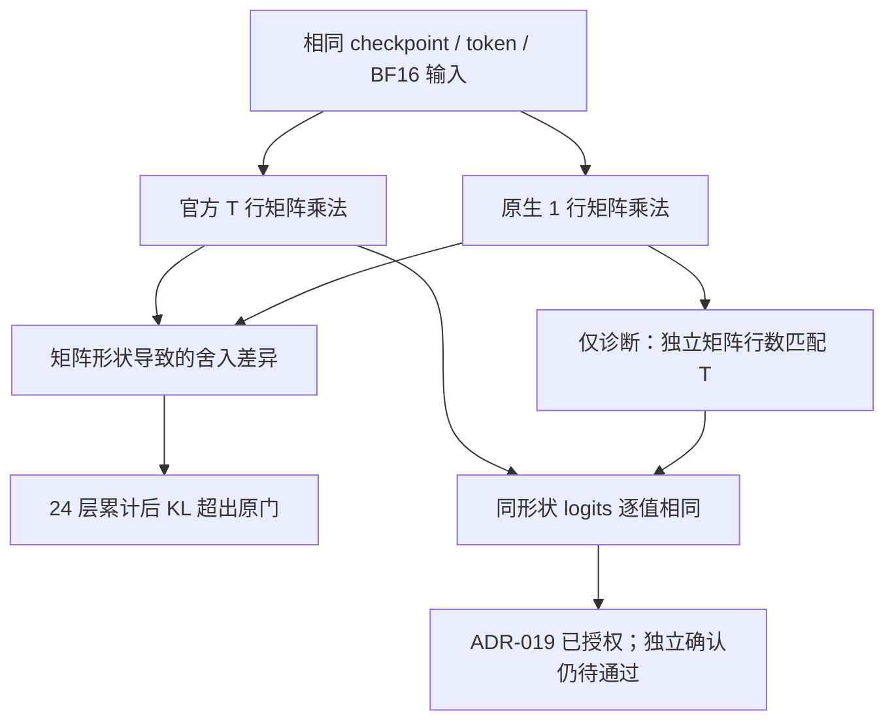

# Generation parity：数值原因与验收边界

日期：2026-09-05。关联 M-02/M-08、SPEC Step 060～064及073～076。ADR-019已按用户BF16原因条件授权接受；独立确认尚未完成。

结论：原生 BF16 逐 token 路径没有通过事前登记的 KL 门。整段 prefill 与官方实现逐值一致，K=0 和重复生成一致。进一步匹配矩阵运算形状后，两模型的递推 logits 逐值一致；这支持将已观察到的差异归因于 GEMV/GEMM 形状带来的舍入，而不是把它直接解释成 state 传递错误。诊断不等于正式验收通过。

## 原门和结果

原配置 [generation_parity.yaml](../configs/generation_parity.yaml) 在 GPU 实验前提交为 `c7edadd`。0.4B/1.5B 各3个固定提示与seed、16/32/64/128长度，共12 case；另测3次固定提示的重复贪心生成。seed不是额外独立任务。

每个 case 要求 logits relative RMS≤0.02、mean KL≤0.002 nats、p95 KL≤0.01、top-1 agreement≥0.95，且finite、K=0与重复生成完全一致。

| 检查 | 0.4B v1 | 1.5B v1 |
|---|---:|---:|
| 官方 vs stateful prefill | 全部逐值相同 | 全部逐值相同 |
| K=0、重复生成 | 通过 | 通过 |
| 原生 RNN 最坏 mean KL | 0.007043 | 0.017581 |
| 原生 RNN 最坏 p95 KL | 0.030299 | 0.054119 |
| 正式结果 | 失败 | 失败 |
| peak allocated | 1,237,287,424 bytes | 3,659,465,216 bytes |

内存仅对应短窗推理检查，不是16K训练峰值。完整分母、case和失败项保存在指定 data root 下的 `artifacts/generation_parity_smoke_v1.json`、`generation_parity_local_v0_v1.json`。

## 原因隔离

1. 将短窗参考递推改为严格 no-grad 下调用同一个官方 CUDA forward，0.4B v2仍失败。因此不是“换 WKV backend 就解决全部误差”。训练短窗仍保留可微 reference/full-BPTT；没有调用未对齐 backward。
2. Hook 显示第0层 receptance 输入逐值相同，但1行与16行输出约39.36%元素存在少量 BF16 ULP 差异。改变 reduced-precision reduction 开关不能稳定消除漂移。
3. 单纯固定16行只让16-token case逐值相同，不能解决所有长度；该 v3没有被纳入部署默认。
4. 对一个固定公开提示，分别匹配16/32/64/128参考矩阵行数：两模型共8组 logits 的 RMS/KL均为0、top1=1。同一个CUDA WKV在非零初始状态及位置13 reset时，整段与逐token的输出/最终state也逐值相同。

第4项只对独立矩阵乘法的计算行做对齐，不增加 recurrent timestep，不写假token或丢弃state更新。[inference_math.py](../src/model/inference_math.py) 的对齐功能默认关闭，只能进入显式诊断context。

诊断产物：`artifacts/generation_math_smoke_v1.json`、`generation_math_local_v0_v1.json`。新依赖环境和全新CUDA build cache也复现了0.4B诊断，产物 `generation_math_rebuilt_smoke_v1.json`。

## 后续精度原因对照

用户要求确认是否BF16误差，并授权在原因确认后继续推进，无需再次确认ADR。Step074～075增加了两类只读控制，正式训练/部署配置没有修改。

首层固定真实receptance/key/value输入与权重，三投影×四长度，表内为各模型12组中的最大relative RMS（1行与多行计算）：

| 投影计算方式 | 0.4B | 1.5B |
|---|---:|---:|
| 原BF16，低精度累加开启 | 0.004266 | 0.004321 |
| BF16，低精度累加关闭 | 0 | 0.0001085 |
| FP32 IEEE（无TF32） | 3.27e-7 | 8.70e-7 |
| FP32结果转回BF16 | 0 | 0.00007657 |
| FP64 | 0 | 0 |

这里上转换的是**同一份已量化BF16张量**，不是重新加载不同精度权重；故隔离的是计算精度与矩阵形状，而非checkpoint文件差异。FP32的细小累加差异在接近BF16舍入中点时，仍可能转化为不同的BF16输出。

再对完整24层递推做投影精度干预：仅将线性投影和矩阵乘法提升到FP64，输出仍转回BF16，WKV/state/reset及其余路径不变。两模型×16/64 token共4组中，整段与逐token的**logits及全部三类最终状态逐值相同**。FP32投影则仍有漂移。这提供了比“仅观察数值很小”更强的因果隔离证据，但只覆盖这些诊断输入。

关闭BF16 reduced-precision reduction的整模型对照也全部保留：两模型仍不满足旧门，最坏mean KL为0.007904/0.018022。因此未将该开关当成已经验证的完整修复，也未将FP64诊断路径用于训练或部署。

产物位于data root的 `artifacts/projection_precision_{smoke,local_v0}_v1.json`、`generation_precision_{smoke,local_v0}_v1.json`、`recurrent_precision_{smoke,local_v0}_v1.json`；各文件明确为diagnostic_only。[复用入口](../scripts/diagnose_projection_precision.py)与[可测试逻辑](../src/model/precision_diagnostics.py)均记录精度开关、输入/权重hash及恢复边界。

## 已授权的后续验收

[SPEC ADR-019](../SPEC.md) 已接受分开验收：

- 同矩阵形状的严格递推等价：验证算法、状态传递和边界重置。
- 实际部署形状的数值/行为稳定性：用独立提示、长窗、生成结果与真实工具预算重新事前登记，不能把本轮诊断样本作为确认结果。

原 v1/v2/v3失败和阈值不改写。新 [confirmation配置](../configs/generation_confirmation.yaml) 采用3个未用于诊断的合成提示：128/256 token严格同形状/非对齐位置reset检查；原生128-token prefill加64-token逐步continuation，覆盖0.4B的1K/4K/8K及1.5B的1K/4K/16K。

新原生漂移上限为relative RMS≤0.04、mean KL≤0.02、p95 KL≤0.10、top1≥0.90，并要求reference概率≥0.90的最高概率token无翻转、K0完全一致、贪心和固定seed采样重复一致。**这些数值比旧门宽，是诊断后的新工程预算，必须在独立确认前冻结；不是旧门通过，也不代表Agent成功率不下降。** 高置信位置的分母保留，不能用长prefix平均掩盖末尾64个受检位置。

原生部署继续使用原BF16默认计算，既不填充矩阵行，也不启用FP64投影或reduction-off。M-02须等独立确认通过；M0仍需真正的Agent loop，G1仍需真实环境结果，不能由本工程确认取代。
