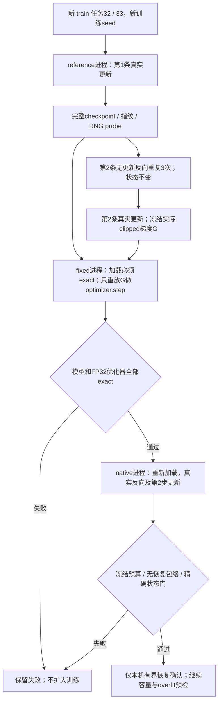

# GPU 恢复三层独立确认（ADR-020）

日期：2026-09-05。状态：**固定梯度恢复机制逐位一致；独立原生确认仍失败**。新任务无恢复对照超过冻结预算，未放行较长训练；[机器汇总与原始报告SHA](gpu_resume_confirmation_summary.json)保留全部运行及失败。

[统一入口](../rwkv7_agent_only_data_training_plan_zh.md) · [原预检与失败证据](real_a0_training_preflight.md) · [执行台账](../SPEC.md)

## 1. 为什么拆开验收

旧 `real8k_v2/v3` 在保存/加载后所有训练状态逐位一致，但真实下一步更新后的FP32优化器不完全相同。Step088直接对照已证明：相同输入重复反向、不再次加载checkpoint也存在微小梯度变化；固定官方CUDA中相应参数使用FP32原子归约并转换为BF16。旧strict失败保留，不能用新协议改写历史。

本报告只验证本机SM86、固定0.4B、官方BF16、FP32-master AdamW的一次恢复后更新。不改变官方kernel或精度开关；不证明长轨迹误差累积有界、SM89/DDP恢复、32/128 overfit或真实Agent收益。

## 2. 事前固定的协议

[新配置](../configs/a0_resume_confirmation.yaml) 通过[闭合schema](../schemas/a0_resume_confirmation.schema.json)校验，引用旧配置及SHA，不修改原exact门。manifest通过[独立schema](../schemas/resume_confirmation_manifest.schema.json)校验；共用旧runtime/environment的闭合字段定义，schema仅从仓库解析，不访问网络。

- 从固定A0 128输入计划完整重建并逐项核对，再取零基索引32/33。两个任务未用于旧GPU诊断，train-only、成功/失败各一；输入7484/6643 tokens，监督字段合计272/393 tokens（实际causal loss分母由trainer报告），不裁减保护上下文。
- 输入重建seed仍为20260905；训练/RNG seed为20260906，CPU比较线程数4。学习率3e-6、clip1、betas0.9/0.99、epsilon1e-18、weight decay0、head chunk32、unrecomputed官方CUDA均沿用旧配置。
- 先运行reference：第1条正常更新并保存checkpoint；第2条重复3次forward/backward/clip，不更新、不恢复，要求模型/优化器/计数/RNG不变；然后正常执行第2步，冻结该步实际clipped梯度和最终checkpoint。
- fixed为独立进程：加载必须exact，校验下一batch、RNG probe、梯度文件SHA、内部hash、provenance、全参数coverage/dtype/shape/finite；只重放同一份梯度做optimizer.step。模型、FP32 master/moments和RNG必须与reference逐位一致；trainer和sampler必须保持第1步，因为本层没有真正消耗新batch，不能伪造trainer计数。
- native再次独立启动：只有reference和fixed通过才允许执行；恢复点仍须exact，正常train_step消耗第2条。BF16模型、trainer/sampler/RNG、所有非计时step指标及更新后同输入loss必须exact；仅允许FP32优化器受已确认的原生微小梯度波动影响。
- 非有限、OOM、任一验证失败均保留报告。资源停止线沿用loss100、preclip norm1e6、23000MiB、单次更新/对照120秒；时间与峰值在操作返回后检查，并非可抢占硬超时。有限的实际更新在等价性判定前保存。

## 3. 独立确认前的数值预算

以下数值基于旧诊断的量级制定，**在本次新任务GPU结果出现前冻结**，不是事后拟合。每个张量同时满足两列；relative-L2=`||actual-reference||₂ / max(||reference||₂, 1e-30)`，不能以全模型分母掩盖小参数误差。

| 对象 | 最大绝对差值 | 每张量relative-L2 |
|---|---:|---:|
| FP32 master | 2e-7 | 1e-6 |
| exp_avg | 1e-6 | 1e-3 |
| exp_avg_sq | 1e-9 | 1e-3 |
| clipped gradient | 1e-5 | 1e-3 |

optimizer step、参数映射和超参数严格一致；所有参数及moment完整覆盖、FP32、有限。原生梯度还须落在同任务无恢复对照包络内：每项不超过`max(3 × 对照最大值, floor)`，absolute/relative floor分别1e-6/1e-4，且同时满足表中的硬上限。允许出现差异的参数族只限已定位的`att.x_*`、`att.k_k/k_a`、`att.ln_x.weight/bias`、`ffn.x_k`；出现其他族不自动归因BF16。

此处三次对照用于固定公式的同任务噪声参照，不用于调节配置或阈值。报告保留全部不同参数、不同元素数、张量与元素总分母及最大误差，不只汇报均值。

## 4. 复现与结果

入口 [validate_a0_resume_confirmation.py](../scripts/validate_a0_resume_confirmation.py)，核心 [resume_confirmation.py](../src/training/resume_confirmation.py) 与[比较器](../src/training/resume_comparison.py)。新run root位于配置data root下 `artifacts/training_preflight/adr020_independent_v1`，三个phase为`reference`→`fixed`→`native`，各自独立Python进程。同一干净Git commit执行；拒绝覆盖任何已有phase。

沿用本机重建环境`envs/train-rebuild-cu130`、CUDA13.0与旧预检固定LM/CUDA worktree、build cache。每phase保存intent、manifest、result；reference另存step1、实际梯度及final，fixed/native各保留final。大文件不进Git，不打印轨迹内容。

`adr020_independent_v1`（commit `a55ef8a`）：输入重建后，新增行顺序断言错误地比较tuple/list，GPU加载前失败，0更新。修复为sampler实际tuple接口并补反序拒绝测试，配置不动，新建v2。

`adr020_independent_v2`（commit `87a26b9`）：第一条真实更新通过，7484 input /272 loss tokens，loss1.41544795、norm133、1.507s、peak17,724,090,368 bytes。第二条无更新反向完成2次，loss均0.3693450689、norm均47.75，对照peak19,768,647,168 bytes；第2次相对第1次有47张量/54元素不同。最大绝对差`3.0517578125e-5`超过冻结`1e-5`，最大relative-L2`1.45823e-4`未超`1e-3`；另4个`att.r_k`不在冻结allowlist。按门失败，未执行第3次对照、reference第2次更新、fixed/native后续phase。

最大差在`blocks.0.att.ln_x.bias`；新参数为`blocks.4/10/19/21.att.r_k`。固定官方源码 `rwkv7_tmix_lnx_rkvres_xg_bf16_v1.cu:249–254` 对ln_x与r_k均使用FP32 atomicAdd，随后转BF16。新证据仍指向原生并行归约/舍入，但也说明从旧样本量级选出的固定absolute上限及参数名单不能直接迁移；**不因此改动本次阈值、allowlist或failed结论**。

梯度分母为795张量/450,767,872元素，798是模型参数总张量数；None梯度单独保留。AdamW仅为参与过更新的参数惰性创建moment，比较器允许显式None名单中的合法空状态，但仍拒绝任何有效参数moment缺失、字段未知或映射不一致。

## 5. 失败后的固定梯度机制诊断

独立[诊断配置](../configs/fixed_gradient_resume_diagnostic.yaml)固定v2 manifest/result SHA和已保存step1。新目录`fixed_gradient_diagnostic_v1`，入口 [diagnose_a0_fixed_gradient_resume.py](../scripts/diagnose_a0_fixed_gradient_resume.py)，实现 [fixed_gradient_diagnostic.py](../src/training/fixed_gradient_diagnostic.py)。这不是继续运行已失败协议的native层，也不拟合新的数值阈值。

capture/replay两个独立进程均加载同一step1；加载点的模型/master/moments/计数/RNG及sampler、随机probe和下一batch必须与source逐位一致。capture只做1次真实更新并冻结实际clipped梯度G；replay不反向，只重放G做optimizer.step。要求最终BF16模型、完整FP32优化器和RNG与capture逐位一致；replay的trainer/sampler保持原第1步，明确它没有执行新的train_step。完整成功/失败checkpoint与梯度保留，不进Git。

本项完成也只隔离checkpoint/optimizer机制；本次独立原生确认仍failed。下一步需先制定新的原生确认协议（考虑BF16表示尺度和完整源码参数族，保留现有失败，使用新的未测train任务），之后才允许容量/padded/32→128 overfit。G1与规模化训练仍未通过。

诊断已完成（commit `c7d8f6c`）：capture/replay均为`diagnostic_complete`，不是新原生门的`passed`。两进程在加载点的所有指纹、RNG probe和下一batch全同；重放梯度hash全同；最终BF16模型、完整FP32 master/moments及RNG逐位相同。replay的trainer/sampler保持第1步，避免伪造训练计数。由此排除本对照中checkpoint/optimizer恢复机制是差异来源，不能推广为所有模型/平台/长作业恢复已验证。

capture更新6643 input /393 loss tokens，loss0.3693450689、norm47.75、1.255s、peak20,335,908,864 bytes（约18.94GiB）。replay只有optimizer更新，0次反向，0.033s、peak9,016,163,840 bytes；此计时不含加载/hash/IO，不能与完整训练步吞吐等同。两进程均退出，GPU显存0MiB。

3个None梯度为`blocks.0.att.v0/v1/v2`。固定官方`train_temp/src/model.py:619–627`的首层分支直接保存`v_first=v`，只有后续层调用这些value-residual参数。这是合法的官方计算图，不是冻结参数或漏掉参数组。

## 6. 下一步的最小范围

1. 在新的原生确认协议中，基于BF16表示尺度（例如ULP或尺度归一化误差）定义梯度预算，完整列明源码中的原子归约参数族；仍保留FP32 master/moments、模型/计数/RNG各自的约束。**本报告不预先接受具体新阈值**。
2. 用未参与上述诊断的新train任务、固定seed，在GPU前提交协议；保留无恢复对照、原生恢复分支和失败停止，不因本次固定梯度成功自动通过原生门。
3. 原生门通过后再测最长监督目标容量与可比padded baseline，事前登记完整32→128 overfit的步数/下降目标；之后接真实Agent loop和M0开发pilot，不越过G1。

## 7. v2尺度归一化确认：事前登记

用户要求继续并尽快进入完整SFT工程阶段，Step096/ADR-021冻结独立[v2配置](../configs/a0_resume_confirmation_v2.yaml)，不改旧配置或上述失败。新train索引34/35，Qwen3.5-122B失败/成功各一，7863/6419 input tokens、102/722 loss tokens；训练seed20260907，输入重建仍按固定计划seed20260905。新目录`adr021_scaled_v1`，仍使用reference→fixed→native三个独立进程。

gradient与两类FP32 moment同时满足每张量relative-L2≤1e-3、`max_abs / max(reference RMS,1e-30)`≤0.03125。后者为4×BF16 epsilon的**张量尺度归一化限制，不是逐元素4 ULP保证**。梯度还需符合3×无恢复对照包络，normalized-abs/relative-L2 floor为0.001953125/1e-4。原子归约参数族补齐源码的att.r_k；FP32 master仍max-abs≤2e-7且relative-L2≤1e-6，模型、计数、RNG、加载点、固定梯度optimizer及前后loss仍exact。资源限制和失败停止机制不变。

两种config/manifest使用独立闭合schema，程序按明确版本派发；v2 schema同时固定数值，拒绝运行时悄悄调大阈值。此门在新GPU结果前登记，仅允许后续本机工程推进，不取代G1或数据准入。
