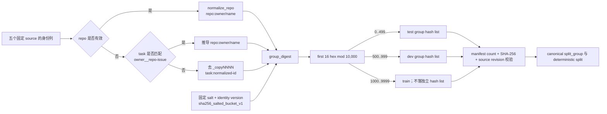

# Held-out 分组边界冻结报告

> 日期：2026-09-04  
> 状态：P0-04 完成；这是内部数据 split 边界，不等于 M0 可执行环境评测集已经建立。

## Held-out 冻结架构图

## 1. 固定策略

- identity version：`repo_else_task_v1`。优先使用 repo；统一 `owner/repo`、`owner__repo`、GitHub URL 和 `.git` 后缀；无 repo 时从 `owner__repo-issue` 推导 repo，否则使用 task。OpenThoughts 的 `_copyNNNN` 后缀在分组前移除。
- hash：`sha256_salted_bucket_v1`，固定 salt `long-long-agent-heldout-v1-20260904`，10,000 buckets。
- split：test `0..499`、dev `500..999`、train `1000..9999`，即按 group 5%/5%/90%。
- 仓库只保存 dev/test group 的 SHA-256，不保存轨迹正文。非 preview 转换必须校验 manifest、source revision 和两个列表的内容 hash。

该规则采用 repo 优先是保守选择：同一仓库的不同 issue 不跨 split，可减少共享代码、测试和补丁造成的泄漏；代价是 episode 比例会因大 repo 偏离精确 90/5/5。

## 2. 全量身份列扫描

扫描固定五个来源的 432,695 行，只读取 task/repo/instance/metadata 身份列，不读取或输出轨迹正文：

| 来源 | episodes | normalized groups |
|---|---:|---:|
| OpenThoughts Agent | 94,334 | 37,186 |
| Open-SWE OpenHands pair | 84,066 | 2,626 |
| Microsoft Orchard SWE | 107,185 | 2,788 |
| Nebius SWE-agent | 80,036 | 1,276 |
| Nebius OpenHands | 67,074 | 1,823 |

全局去并后为 42,982 groups，其中 1,738 groups 出现在至少两个来源；无法规范化的 identity 为 0。

| split | groups | episodes |
|---|---:|---:|
| train | 38,520 | 382,251 |
| dev | 2,268 | 21,191 |
| test | 2,194 | 29,253 |

dev/test 列表 SHA-256 分别为 `a53ca87e1269b1fe62f1f7f53f715695c0120134e96f7adb57295bd53d0af336` 与 `ea2415d0751c1e8d28340365d1a9a289b1b086959ff2fcde5332d957b9906e2a`；manifest SHA-256 为 `a93ace21426ed6680af209fde3ddacb259a30f13c4633af5472d8a1ae57d9f4b`。

## 3. Canonical migration 与验证

canonical schema 从 v1.0.0 升为 v1.1.0，仅变更 `split_group` 的语义为版本化 `repo:`/`task:` identity，字段布局不变。新的 1-episode preview 生成 16 decisions，manifest 与 Parquet metadata 均为 v1.1.0；其 split group 命名空间和 deterministic split 可由冻结策略复算。

自动测试覆盖 repo 拼写归并、SWE task 推导、copy 后缀、salt/bucket 确定性、列表 checksum、dev/test 不重叠、bucket 完整覆盖和五个 source revision。生成器拒绝覆盖已有 `data/heldout`，规则变更必须创建新版本并记录 ADR。

## 4. 限制与下一步

- hash split 只冻结训练数据内部的 task/repo 边界；M0 还需要相同 snapshot、可执行 harness、工具预算和统计功效设计。
- 当前没有把 held-out 数据从 canonical 表物理删除；D-10 release builder 必须生成互斥 episode ID split 文件，trainer 只能读取 train 列表。
- P0-04 已关闭。下一步 D-09 必须基于该 identity 执行 exact/near dedup、held-out 交叉、secret/PII、tool grammar、质量和 repo-level license provenance 审计。
