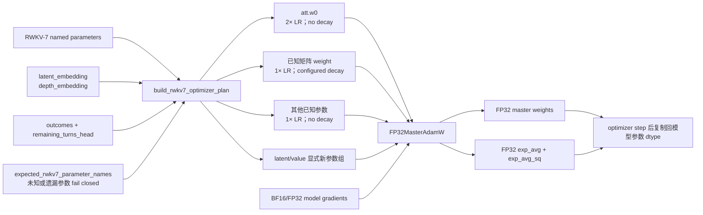

# RWKV-7 参数初始化与 optimizer 分组审计

日期：2026-09-04  
关联工作：T-02、M-05  
状态：官方 base + V0 latent + value readout 参数覆盖及本机 FP32-master smoke 通过

## Optimizer 架构图

## 1. 固定规则

规则逐项复刻固定 revision `9a75f9f037afa4418ee6283b584b92b1adb89ca1` 的 `RWKV-v7/train_temp/src/model.py::configure_optimizers()`：

- 名称包含 `att.w0`：2× learning rate，no decay；
- `squeeze` 后至少二维、名称含 `.weight` 且启用 weight decay：1× learning rate，configured decay；
- 其余已知 base 参数：1× learning rate，no decay。

新参数不依赖字符串启发式：两个 latent 参数和四个 value readout 参数分别显式进入独立 1×、no-decay 组。base checkpoint 通过 strict load，禁止重新初始化；latent 原型初始化沿用 M-05，value weight 使用 gain 0.01 的 orthogonal initialization、bias 为零。

具体 `lr_init/lr_final/warmup_tokens/weight_decay/grad_clip` 仍为空，必须由 A0 Agent 数据 overfit/profile 选择，当前没有把官方从零预训练默认学习率或合成 smoke 的 `3e-6` 误当作 Agent post-training 超参数。

## 2. 真实 checkpoint 覆盖

`scripts/audit_rwkv_parameter_policy.py` 使用 mmap/weights-only 读取固定 checkpoint，只输出聚合参数信息：

| 模型 | covered tensors | base numel | latent numel | value numel | coverage |
|---|---:|---:|---:|---:|---:|
| 0.4B | 804 | 450,834,432 | 17,408 | 9,225 | 100% |
| 1.5B | 804 | 1,527,668,736 | 34,816 | 18,441 | 100% |

两者 tensor 分组计数完全相同：

| 分组 | tensors | LR scale | decay |
|---|---:|---:|---:|
| base matrix decay | 146 | 1× | configured |
| base no-decay | 628 | 1× | 0 |
| base `att.w0` | 24 | 2× | 0 |
| V0 latent | 2 | 1× | 0 |
| value readout | 4 | 1× | 0 |

未知名、缺失名、重复名、负 decay、非正 LR scale 均 fail closed。冻结参数仍进入 coverage 审计，但不会进入实际 optimizer group；当前冻结 base、训练 latent + value 时 optimizer 只有两个显式新参数组。

M1 base-only 路径也必须显式传入 `latent_prefix=None/value_prefix=None`，并对 798 个 base tensor 做同样的精确覆盖，不能通过忽略未知参数复用 V0 配置。

## 3. Optimizer precision 发现

真实 0.4B full-parameter tiny-overfit 暴露出裸 PyTorch BF16 AdamW 不稳定：其 `exp_avg/exp_avg_sq` 实测为 BF16；`eps=1e-18` 和 `1e-8` 两条路径都出现明显 epoch loss 尖峰。该失败没有通过调阈值隐藏。

本机单卡加入 FP32 master weight/moments 后，32/128 样本在预登记的 1.25× 最大 epoch 涨幅门下均通过，峰值约 8.46 GiB。训练 optimizer schema 已升级到 v2，full-parameter 强制 FP32 master/moments；裸 BF16 AdamW 禁止用于正式全参训练。详细曲线见 `reports/tiny_overfit_assessment.md`。

## 4. 限制

- 当前 allowlist 对应已确认的 G1d/G1j、24 层、无 DeepEmbed checkpoint；新 variant 或 DeepEmbed 不能静默进入训练。
- 本地 `FP32MasterAdamW` 尚未实现 checkpoint/resume、分片或 offload；DeepSpeed engine 的真实 master/state dtype、scheduler resume 和三卡行为尚未 smoke，这些属于 T-07/P0-03。
