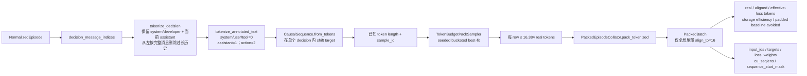

# RWKV tokenizer、decision window 与真实 packed 数据画像

> 日期：2026-09-04  
> 性质：开发样本 smoke，不是 A0 全量统计或正式训练基准。

## Tokenize 与打包架构图



## 1. 固定配置

- RWKV byte vocabulary SHA-256：`e6dee3d4e31b4d5c40ac99508ac6c701ceef4bed681bf2167ce9a908552bca89`。
- 词表文件定义 ID `1..65529` 共 65,529 个 byte token；checkpoint embedding 为 65,536，ID 0 作为 EOD，ID `65530..65535` 未由该文件定义。
- context/pack 上限 16,384；全局尾部按 16 对齐。
- loss：system/user/tool 为 0，assistant reasoning/final 为 1，assistant action 为 2；只监督当前 decision 的 assistant。
- 历史超过上限时只在消息边界从左侧移除；system/developer 和当前 assistant 保留。当前 assistant 单独仍超过上限时拒绝样本。

## 2. 真实样本结果

命令：

```bash
.venv/bin/python scripts/profile_packed_episodes.py \
  --per-source 4 --decisions-per-episode 3 --max-pack-tokens 16384 \
  --sampler-seed 20260904 --bucket-size 2048
```

每个来源取固定 revision、排序后首批 4 个 episode，并在每个 episode 的早/中/晚位置各取一个 decision，共 20 episodes / 60 decisions。未输出轨迹正文。

| 来源 | 整 episode token 中位数 / 最大值 | 整 episode 超过 16K | decision window token 中位数 / 最大值 | 发生历史裁剪 |
|---|---:|---:|---:|---:|
| OpenThoughts Agent | 21,282 / 31,658 | 3/4 | 10,228 / 16,356 | 4/12 |
| Open-SWE OpenHands pair | 62,167 / 69,889 | 4/4 | 15,180 / 16,326 | 8/12 |
| Microsoft Orchard SWE | 27,444 / 35,964 | 4/4 | 15,304 / 16,357 | 6/12 |
| Nebius SWE-agent | 33,612 / 33,956 | 3/4 | 11,291 / 16,248 | 4/12 |
| Nebius OpenHands | 68,311 / 106,420 | 4/4 | 15,555 / 16,364 | 8/12 |

60 个 decision window 全部能在 16K 内构造，没有“仅当前 assistant 已超长”的拒绝样本。固定 seed 的 bucketed best-fit sampler 形成 42 个 pack row，含 663,245 个真实 causal token 和 323 个尾部对齐 token，存储有效率 99.9513%；相对旧 next-fit 画像减少 10 row（19.2%）和 96 个 alignment token（22.9%）。当前 row 成员关系下，逐样本 padding baseline 为 761,189 token，packed 少 97,621 token；该 baseline 会随分组变化，不能把这个差值直接当作与旧 next-fit 的严格同口径提升。后续 A0 仍须在全量长度分布上复测。

三 rank 分片预演使用同一全局 plan 后按 row 交错分配；42 row 正好能被 3 整除，因此每 rank 14 step、没有丢弃 row 或 sample，也没有跨 rank 重复：

| rank | pack rows | real tokens | aligned tokens |
|---:|---:|---:|---:|
| 0 | 14 | 223,860 | 223,968 |
| 1 | 14 | 224,464 | 224,576 |
| 2 | 14 | 214,921 | 215,024 |

rank 间 real-token 极差为 9,543，即三 rank 均值的 4.32%。这只是分片确定性和无重复预演，不是 NCCL 吞吐证据；当全局 row 数不能整除 world size 时，sampler 会显式记录被丢弃的尾部 row/sample，正式 trainer 必须把它们写入 run log，并通过 epoch shuffle 轮换。

## 3. 结论与结构影响

整 episode 直接作为 16K independent-reset 样本不可行：本次 20 个样本有 18 个超限，且 OpenHands 最大达到 106K。当前可执行的 SFT 冷启动路径应使用 bounded decision window，并保持每个 window 独立 reset；这能满足 assistant-only/action-weighted CE 和 packed varlen，却不能证明长期 slow-state 学习。

长 episode 的正式路径已经具备 M-03 完整 state container、TimeMix/ChannelMix previous-x、WKV matrix 和可微 window continuation；但当前 token-budget sampler 只接收独立 reset 的 decision window。前一 window 的 final state 归属于同一 episode 的后一 window，不能作为普通 packed segment 与其他 episode 混淆；stateful continuation 仍需独立 sampler/trainer ownership 接入。

## 4. 后续验证

1. 在 A0 候选上统计全部 decision 长度、当前 action/reasoning 单体超长、裁剪消息数和 source `loss_mask` 覆盖率。
2. 在已通过的 trainer core 上增加 checkpoint/resume、run registry 与 DDP，逐 step 持久化 real/aligned/loss token、边界密度、丢弃 sample 与 WKV replay 成本。
3. 为 stateful episode continuation 建立独立顺序 sampler，并对连续 window 与未切分 reference 做 trainer 级 state/logit/gradient parity。
4. 在远程 SM89 三卡上重新编译两类 packed patch，并测 DDP/NCCL 与真实数据吞吐。
