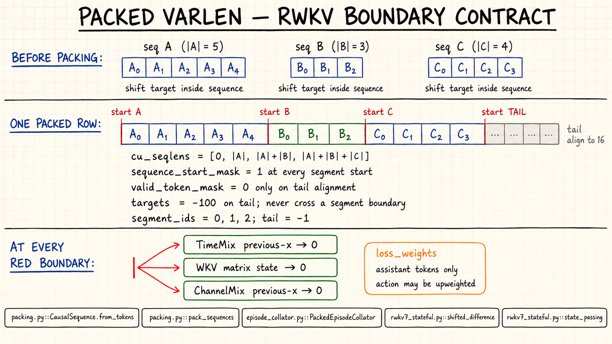
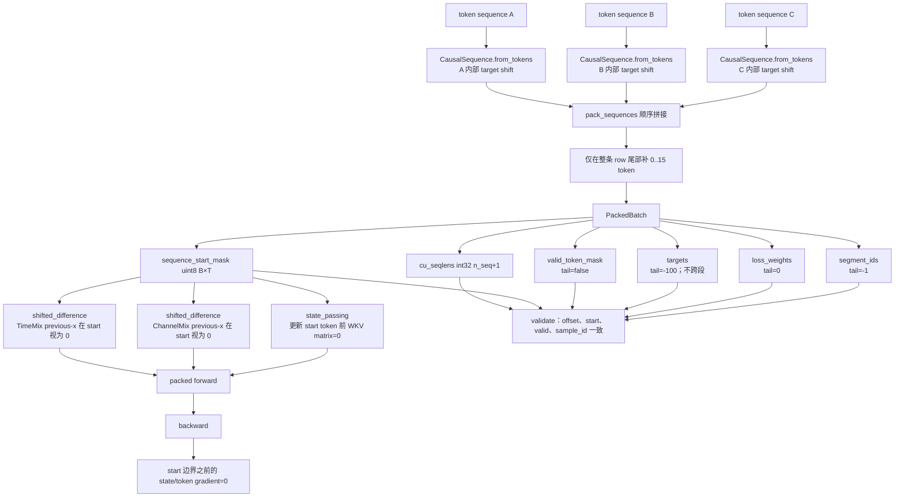

# RWKV-7 packed varlen 设计与原型验证

> 日期：2026-09-04  
> 状态：RWKV-LM full-sequence、RWKV-CUDA state-passing、完整 state container 与本机 0.4B packed trainer 均已通过；远程 SM89/DDP 与 stateful episode trainer 待完成。

## Packed-varlen 架构图

手绘图展示边界直觉；下面的字段流是实现规范。`cu_seqlens` 是 canonical segment index，CUDA 热路径消费由同一 collator 物化并交叉校验的 `sequence_start_mask`。

## 1. 边界语义

多条独立训练序列打包为同一 token 流时，`sequence_start_mask[t]=1` 表示 token `t` 在零 recurrent state 上开始。该边界必须同时作用于：

1. TimeMix previous-x：边界处 `x_prev=0`；
2. ChannelMix previous-x：边界处 `x_prev=0`；
3. WKV matrix：处理边界 token 前将矩阵 state 置零；
4. backward：任何 state/previous-x 梯度不得越过边界；
5. causal target：每个样本内部 shift 后再拼接，禁止前一条样本预测后一条的首 token。

批次保存 `cu_seqlens` 作为可审计 segment 索引，同时物化 uint8 `sequence_start_mask` 进入 CUDA 热路径。当前 WKV kernel 要求 `T % 16 == 0`，所以只在整个 packed row 尾部增加最多 15 个无 loss 的 dummy token，不做逐样本 padding。

## 2. 已实现产物

- `src/training/packing.py`：框架无关的 `CausalSequence`、`PackedBatch` 和 `pack_sequences()`；生成并互校 `cu_seqlens`、start mask、valid mask、segment ID、target 与 loss weight。
- `scripts/validate_packed_varlen_reference.py`：PyTorch reference 的 reset-aware shift/WKV 前反向 parity。
- `scripts/validate_rwkv_packed_kernel.py`：编译 CUDA、算子 parity、0.4B 全模型隔离和合成吞吐 smoke。
- `patches/rwkv-lm-packed-varlen-reset-mask.patch`：修改 RWKV-LM full-sequence WKV、TimeMix、ChannelMix 及模型接口。
- `patches/series`：固定四份 RWKV-LM patch 的依赖顺序。
- `scripts/validate_rwkv_state_passing_varlen.py`：验证非零 `s0`、内部多段 reset、`sT`、`ds0` 和 `dsT` 边界语义。
- `patches/rwkv-cuda-state-passing-packed-varlen.patch` 与 `patches/rwkv-cuda-series`：修改 state-passing 前反向和上游 benchmark wrapper。
- `src/training/tokenizer.py`、`src/training/episode_collator.py`：固定 RWKV byte tokenizer、角色/动作 loss mask、decision window 和 PyTorch packed batch 物化。
- `scripts/profile_packed_episodes.py`、`reports/packed_data_profile.md`：真实来源 tokenizer/窗口/packing 开发画像。
- `src/training/token_budget_sampler.py`、`src/training/sft_trainer.py`：可复现 token-budget row、严格 tensor batch 校验、仅有效 token 的 chunked head loss 和 optimizer step 计数。
- `scripts/run_rwkv_tiny_overfit.py`、`reports/tiny_overfit_assessment.md`：固定 0.4B checkpoint 的 32/128 packed 全参数训练验证。

第四份 patch 的 SHA-256 为 `429209f46a40afec69881695bb4322ec689056de4740a54eda3dfc1707aa59e7`。
state-passing patch 的 SHA-256 为 `d0fbdc3e7c8060f1555155af25e1257980e5353bb2135ed32c623b2b72e77fa5`。

## 3. WKV backward 的关键实现

forward 在 reset token 前清零 state 很直接，但 backward 不能只清零反向 state。官方 kernel 每 16 token 保存一次 WKV state，并通过逆递推恢复 chunk 内前一时刻；内部 reset 会使逆递推不可逆，也会丢失 reset 前一个 segment 的真实末态。

当前原型在遇到 reset 时：

1. 用零 pre-state 计算当前 token 的 `w/a` 等梯度；
2. 清零向前一 segment 传播的 state gradient；
3. 从当前 chunk 的前置 checkpoint 出发，最多重放 15 个 token，恢复 reset 前的真实 state；
4. 按官方 backward 使用的转置 state 布局写回，继续处理前一 segment。

这样不增加逐 token `N×N` state 存储；代价是每个内部边界最多重放 15 步。编译报告显示 SM86 backward 使用 255 registers、18,688 bytes shared memory，并存在 spill，后续需要用真实长度分布评估和优化。

## 4. 正确性结果

本机 RTX 3090 Ti、PyTorch 2.11.0+cu130、BF16、head size 64：

| 检查 | 结果 |
|---|---:|
| PyTorch reference packed/unpacked shift forward 最大绝对误差 | 0 |
| PyTorch reference packed/unpacked WKV forward/gradient 最大绝对误差 | 0 |
| CUDA TimeMix packed/unpacked forward relative RMS | 0 |
| CUDA TimeMix input/shared gradient relative RMS | 0 / 0.002411 |
| CUDA ChannelMix packed/unpacked forward relative RMS | 0 |
| CUDA ChannelMix input/shared gradient relative RMS | 0 / 0.003245 |
| CUDA WKV packed/unpacked forward relative RMS | 0 |
| CUDA WKV 最大 gradient relative RMS | 0.000459 |
| 0.4B、24 层 packed/unpacked hidden relative RMS | 0 |
| 扰动第一 segment 后第二 segment hidden relative RMS | 0 |

JIT on/off 均通过完整 0.4B checkpoint 验证。patch series 还在第二个全新 checkout 上重新应用、重新编译并复现上述正确性结果。

## 5. 合成效率 smoke

长度 `{16,32,64,128}`，4 个 pack row，共 960 个有效 token；padded baseline 为 2,048 个计算 token：

| 指标 | packed | padded | 改善 |
|---|---:|---:|---:|
| 0.4B forward | 20.33 ms | 30.55 ms | 1.50× |
| 0.4B forward+backward | 78.98 ms | 142.29 ms | 1.80× |
| 训练 smoke 峰值 allocation | 2.63 GiB | 4.59 GiB | 下降 42.6% |

该结果只证明实现具有预期方向，不代表真实 Agent 数据吞吐。A0 完成后必须按真实 tokenizer 长度、assistant loss mask、pack-row 数、DDP rank 和 gradient checkpoint 配置重测。

## 6. State-passing 正确性

state-passing forward 在每个 reset token 更新前清零矩阵 state；backward 在边界切断梯度，并从 `s0` 或前一个 chunk checkpoint 重放最多 15 步，以恢复 reset 前一 segment 的 state。这样同时支持首段继承非零 `s0` 和 pack 内后续独立段从零开始。

本机 SM86 结果：

| 配置 | forward y relative RMS | final state relative RMS | 最大 gradient relative RMS | 边界泄漏 |
|---|---:|---:|---:|---:|
| FP32, N=16 | 1.84e-7 | 1.78e-7 | 4.59e-7 | 0 |
| BF16, N=16 | 0.001680 | 2.07e-7 | 0.002485 | 0 |
| BF16, N=64 | 0.001645 | 1.66e-7 | 0.002326 | 0 |

边界泄漏同时检查：`mask[0]=1` 后 `ds0=0`、最终 state 只依赖最后 segment、仅由 `dsT` 引起的梯度不会进入最后 reset 之前。补丁已在第二个干净 RWKV-CUDA fixed-revision worktree 重放并复现。

## 7. 真实 tokenizer 与 decision-window 发现

固定 RWKV 词表 round-trip 通过。开发画像抽取 20 个真实 episode：18/20 整 episode 超过 16K，最大 106,420 token，因此正式冷启动 SFT 改用“只监督当前 assistant、按消息边界左裁”的 bounded decision window。60 个早/中/晚 decision 均可构造到 16K 内；固定 seed 的 bucketed best-fit sampler 使用 663,245 个真实 token、323 个尾部对齐 token 和 42 个 row，存储有效率 99.9513%。三 rank 预演各 14 row、无重复/丢弃，real-token 极差为均值的 4.32%。详情见 `reports/packed_data_profile.md`。

## 8. 尚未关闭的工作

1. 为 packed trainer 增加 checkpoint/resume、run registry、scheduler 与 DDP/DeepSpeed 接入。
2. 将已完成的模型级完整 state container 接入同 episode window continuation trainer；不得把有状态 continuation 当成独立 packed segment。
3. 覆盖 `@rwkv3`/H100 fast kernel、head size 128 等未选路径；首轮 SM86/SM89、head size 64 以当前基础 kernel 为准。
4. 用 A0 全量长度分布做 packing policy、吞吐、显存、边界密度和 replay 开销 profile。
5. 在远程 SM89 上独立编译并做三卡数值/NCCL、FP32 master/moments 与真实数据吞吐验证。

因此 M-09 仍为进行中，但 packed-varlen 的批次契约、基础 CUDA 实现、本机 0.4B 全参数 trainer 正确性和开发效率证据已经建立。
