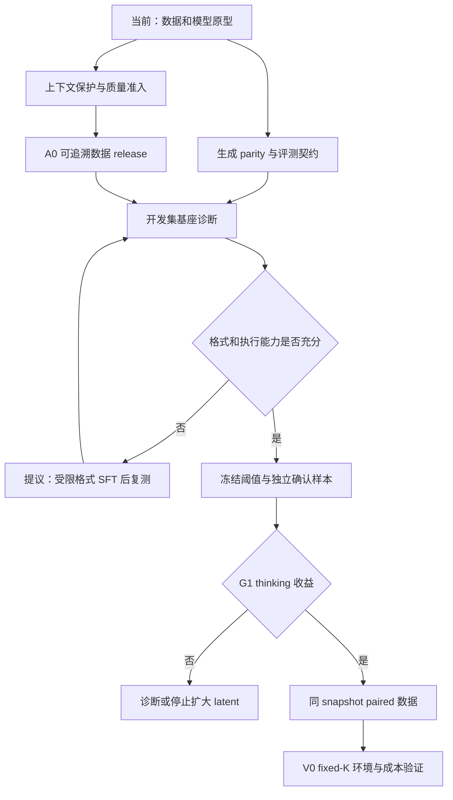

# 项目进展与研究路线审查

日期：2026-09-05。依据：SPEC 0.10.0、当前工作区、既有本地运行产物及本轮回归检查。

结论：核心方向值得继续验证，工程机制已具备原型证据；下一阶段的主要投入应转向合格 A0 和可执行 M0。当前仍为 P0，G0 未整体通过，尚无 Agent 成功率、latent 收益或长程记忆收益结论。

图中 SFT 退路属于 ADR-018 提议，尚未替代现行 SPEC 阶段门。

## 目标与值得保留的设计

同一组 RWKV-7 权重承担两种时间尺度：slow state 保存真实任务经历，fast state 从 slow 克隆后执行 K 次内部 recurrent step，再生成 action；后续学习按真实环境收益选择 K。训练只使用 Agent 数据，最终以同预算单轨迹成功率、进度、回归、工具成本与 wall-clock 验收。

1. 双状态所有权使未执行的假设留在当前决策内，并支持从同一状态公平比较 K。
2. V0 保持全 block、无 LM-head latent step 和 K=0 anchor，变量少，便于证伪。
3. packed 边界覆盖 WKV、TimeMix previous-x、ChannelMix previous-x 和 causal target，已发现并修正过实际 backward 问题；这是实质工程资产。
4. 固定 revision/hash、原文 CAS、四表、跨来源分组和失败保留，为后续结论提供追溯基础。
5. 将 outcome 与 single-trajectory 放在核心位置，能检验模型是否实际完成任务。

RWKV-7 论文支持固定规模 recurrent state 的架构动机，但不提供本项目的长程 Agent 证据。[RWKV-7 原始论文](https://arxiv.org/abs/2503.14456)。Coconut 使用上一轮 hidden 作为下一轮输入，当前 V0 则输入固定控制与 depth embedding，两者的机制不同；相关论文不能直接证明这里的 V0 有效。[Coconut 原始论文](https://arxiv.org/abs/2412.06769)。本次未进行系统性新颖性检索，不作“首个”或“领先”声明。

## 当前进度与证据强度

| 工作面 | 已有证据 | 实际限制 |
|---|---|---|
| 固定输入 | 五个固定数据项约 20.70 GB、432,695 episodes；0.4B/1.5B 权重及上游 pin | 下载完成不代表可用于训练的 release |
| 数据处理 | 五种 adapter、四表、CAS、42,982 group 分组 | D-09 内容级审计、repo license、A0 尚未完成 |
| 模型机制 | 本机 0.4B state、slow/fast、V0、readout 与梯度验证 | 未训练 latent，无真实环境收益；generation parity 待办 |
| 训练机制 | packed trainer、官方参数分组、FP32 master；合成 32/128 overfit | 重复简单请求，无真实工具执行；无 resume、DDP 或正式 16K profile |
| 评测 | SPEC 有 G0～G5 和指标要求 | 当前没有可执行 M0、确认实验或成功率报告 |
| 可复现性 | 数据/模型 hash、patch 和报告存在 | 项目无基线 commit；训练环境尚未完整锁定/远程重建 |

本轮 Ruff check/format 通过；普通环境 49 passed / 8 skipped，加载现有 torch 依赖后 76 passed。未复跑 GPU、远程或长训练，历史数值来自已存在报告与 JSON。

## 按优先级排列的问题

### P1：裁剪可以删除任务和当前 observation，继续监督答案

[`episode_collator.py`](../src/training/episode_collator.py) 的 `tokenize_decision` 把所有非 system/developer 历史列为可删除项，`_decision_candidate` 不保护初始用户任务、当前 observation 或工具配对；`task_text` 也不会单独补回序列。复用现有合成 fixture 和边界预算，实测删除 3 条消息后任务与 observation 都不存在，assistant 答案仍保留。

这会让模型拟合缺少条件信息的 action，且独立 reset window 无法从旧 state 找回已删除内容。现有测试对这种行为仍判通过。ADR-017 提议在 A0 前保留最小任务契约、必要 observation 和成对工具交互；仍超限则拒绝或送入后续 continuation 路径。真实数据发生率尚未测量，需在 A0 报告中统计。

### P1：正式数据准入目前主要靠文档约束

[`build_canonical.py`](../scripts/build_canonical.py) 非 preview 路径检查 held-out manifest/source revision 和 download manifest 是否存在，未要求 D-09 通过证据，也未生成 release 所需的互斥 split 文件和质量/污染/许可报告。held-out 冻结后，这个入口已可生成 `preview=false` 的转换目录。

目前未发现违规正式 release；问题是入口没有强制落实约束。D-09/D-10 应增加绑定输入内容 hash、审计版本和配置的机器准入，缺证据或输入变化即拒绝；trainer 只从通过验收的 train ID 列表读取。A0 候选可以缩小，但跨源重复/held-out 检索应覆盖相关已下载数据池。

### P1：核心研究反馈循环尚未建立

内部 held-out group 清单没有包含可执行环境、snapshot 重放、固定 verifier 和任务预算。模型/value 原型已较完整，但 T-04 仍未开始，因此无法判断瓶颈究竟是工具格式、任务难度、基座能力，还是 thinking 机制。

下一项价值最高的产物是小型、可重放、能够实际判定进度/终局结果的评测闭环。A0 完成前可以准备 harness 契约和 synthetic 重放；正式 M0 仍需满足当前依赖。

### P1：M0 冷启动与阈值冻结顺序存在歧义

SPEC 将 M0 排在小样本 SFT 前，T-09 又依赖 M0 结果；若未经 Agent 格式训练的基座连 action 都无法执行，no-think/long-think 同为零不能识别 thinking 是否有潜力。现有 T-05 依赖本身并未要求 G1，但文字未明确这个退路。

ADR-018 提议区分开发集 pilot 与独立确认实验：先诊断格式/执行能力，必要时做受限 Agent 格式 SFT，再用同一 checkpoint 比较 thinking 模式。G1 门槛、困难样本定义、主指标、样本量规则和停止规则在确认实验前冻结；M2 和 paired 规模化仍等待 G1。小样本结果不足以支持收益时，不得通过更换 test 子集来凑通过。

### P1：长作业的可复现与恢复尚未就绪

Git 为 `No commits yet on main`，当前代码均未进入提交；本地 `FP32MasterAdamW` 没有保存/恢复接口，trainer 只有内存计数器。需要稳定代码基线、精确依赖锁，以及 model/master/moments、scheduler、RNG、sampler 游标和 step 的完整恢复，验证恢复后下一批和连续训练相符。

### P2：现有通过项的覆盖面较窄

- 32/128 fixture 只有 8 种重复请求，输出恒为 `acknowledged`；0.4B loss 从约 3.97 降到接近零只证明优化接线。下一轮要用真实、去重的 32/128 Agent decisions，覆盖多工具、失败恢复、验证和不同长度。
- stateful 原有 2% 门失败后使用 6% 诊断容差；该历史处理已透明记录，但不足以判定正式生成行为等价。需在多 seed/长度/0.4B/1.5B 实验前冻结新阈值，包含 logits 分布、确定性生成差异及其任务影响。
- K=1/2/4/8 走 PyTorch reference；每个 step 仍运行完整网络，且逐 token action 也涉及短窗路径。LM head 被跳过不等于端到端更快。M-08 应测相同 backend 下 no-think/explicit/latent 的模型耗时、工具耗时、总时延、峰值和 state clone 成本。
- 远程三卡吞吐、FP32 master 分片与 16K 激活占用尚无证据。不同 GPU 显存不能视为一块统一显存，模型规模应由实际 profile 决定。

### P2：研究假设与训练信号还需要具体化

V0 有梯度不代表它会学出随 K 改善的决策；强行把长教师思考压进少数步也可能超出当前 student 能力。应以匹配数据/训练预算的 K=0 基线和固定 K 比较，另保留未训练 latent 负对照，辨别增益来自 SFT 还是额外循环。

原设计的 KL 需要可获得且可对齐的 teacher action 分布。公开轨迹通常只有文本；不同模型词表不能直接逐 token 做该 KL。一个与原公式兼容的候选是同 tokenizer 的 RWKV-SFT long-think teacher；若改用纯序列 CE 或其他目标，需先登记 loss ADR。

独立 reset 的 decision SFT 不会训练跨 window 的长期记忆。应尽早定义小规模长依赖评测，并在 G3 后按原路线接入 continuation 训练与 correct/reset/shuffled state、ledger 消融。固定状态内存只说明容量成本有界，不保证所有早期事实都被保留。

## 下一步按交付物推进

| 顺序 | 工作项 | 验收结果 |
|---|---|---|
| 1. 关闭输入和追溯缺口 | P0-00/P0-03、D-09；ADR-017 待决 | 可追溯代码基线、训练环境锁；上下文完整性统计；许可/污染/质量报告与 fail-closed 准入 |
| 2. 形成首个可运行闭环 | D-10、M-02、T-04/T-07/T-08 | A0 约 1K episodes/10K decisions；generation/K=0 parity；环境重放和 verifier；run/resume；真实 32/128 overfit |
| 3. 回答 thinking 是否有效 | T-04/T-05/T-09；ADR-018 待决 | 先用开发集约 20～30 个任务 pilot 估计有效率和方差，再按功效确定独立确认样本；同 checkpoint 四基线、置信区间及失败分母 |
| 4. G1 后验证 V0 | D-11/D-12、T-06、M-08 | 同 snapshot paired 数据；匹配训练的 K=0 与 K=1/2/4/8；任务收益与真实成本；G3 判断 |
| 5. G3 后扩大研究 | 原 slow-state/value/adaptive 路线 | 长依赖 state 消融、真实 outcome value 校准、adaptive-K 和后续 on-policy |

第 3 步的 20～30 仅为开发 pilot 建议，不是 G1 的显著性样本量。统计单位以 task/repo 为主，不能把同任务的多 decision 或多 seed 作为独立任务。公平比较应分别报告同工具预算与同端到端预算下的结果，并保留每条轨迹的真实成本和所有失败。

近期停止新增模型分支和扩大数据规模，将主要精力用于第 1～3 步。受限格式 SFT、generation、训练恢复和评测闭环应尽快提供第一张可复核的 Agent 结果表；在这些证据出现前，继续维持正式 latent 训练 No-Go。
