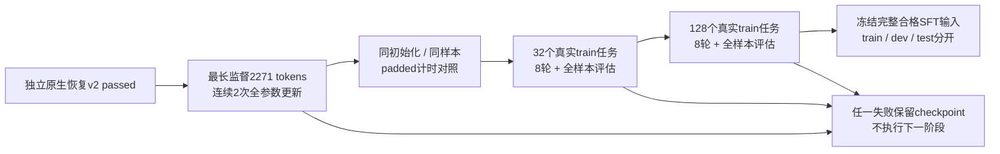

# 真实 A0 容量与32/128 overfit训练报告

日期：2026-09-05。状态：独立原生恢复v2已通过，本报告的训练协议已冻结，结果待执行。不是全下载池SFT或Agent能力验收。

[统一入口](../rwkv7_agent_only_data_training_plan_zh.md) · [恢复协议及证据](gpu_resume_confirmation.md) · [数据范围](data_status_report.md)

## 1. 固定协议

- 配置 [a0_real_overfit.yaml](../configs/a0_real_overfit.yaml)，SHA `c76bb36c265d14392c99361ce29aba365f4ce61b362560e5ab0f6ec35ac2b1be`，通过[闭合schema](../schemas/a0_real_overfit.schema.json)；依赖固定原生恢复result SHA `c97b4a6d71f44f4659c8f78b90153cc9c0baefff28d4b8ed22f338e9a8d653cb`。运行前提交代码/配置，不事后调门。
- 固定0.4B、官方BF16 CUDA、FP32 master与moments、所有参数进入官方分组；LR3e-6、betas0.9/0.99、epsilon1e-18、clip1、head chunk32，无latent或激活重算。沿用本机3090 Ti重建环境。
- 重建并逐项核验已冻结的128输入计划，只用train样本。capacity索引78（8124 input /2271 loss tokens）为128中最长监督，连续2次更新以覆盖optimizer moments建立后的峰值。padded独立进程从同一基座、seed和样本开始，只有独立reset的无loss尾部补到8192；n=2计时含初始化/warmup，不宣称整体训练加速。
- overfit32与overfit128各从基座独立开始，分别取固定输入计划前32/128。训练seed20260908，sample-aware packed sampler每epoch完整覆盖一次；8 epochs，分别256/1024次样本呈现。初始及每轮结束评估所有样本，以loss weight为分母聚合CE，保存逐row loss/样本hash、分母、分位数；不使用dev/test调参，不拿最好epoch替代末轮。
- 完整overfit门：末轮weighted CE/初始≤0.5；任一epoch/前轮≤1.25（分母floor1e-8）；完整样本覆盖、有限梯度/FP32状态、逐步资源限制均通过。原停止线为loss100、preclip norm1e6、23000MiB、单步120秒；返回后检查资源，并非可抢占的CUDA硬超时。任何失败保留checkpoint/结果，不继续下一phase。

## 2. 产物与复现

入口 [run_a0_real_overfit.py](../scripts/run_a0_real_overfit.py)，核心 [real_overfit.py](../src/training/real_overfit.py)。固定重建环境运行，参数`--run-root <data root>/artifacts/real_sft/a0_overfit_v1 --phase capacity|padded|overfit32|overfit128`，LM/CUDA/build与恢复验证相同。每phase独立进程，同一干净Git commit；依赖阶段非passed即拒绝运行。

每phase有intent、闭合schema manifest、逐步metrics JSONL与result；完整训练另存初始/各epoch全样本评估、第4/8轮checkpoint及异常停止checkpoint。run manifest记录数据/模型/tokenizer/环境/config SHA、源代码commit与空diff、实际包版本/数值开关。大文件只在data root。

## 3. 验收范围

这是多样真实样本的工程记忆训练，仍不是A0全部9,000条train decisions的完整SFT，也不是M0/G1证据。128包含来源失败轨迹以覆盖训练工程边界；正式SFT不能把这些动作全部默认视为正例，须独立冻结数据筛选和train/dev/test范围并报告拒绝分母。

恢复v2结果仅授权本机有界工程训练；远程SM89/DDP、完整SFT的泛化/格式/执行验证、显式thinking增益仍须各自验收。G1通过前不启动规模化paired或M2 latent训练。
