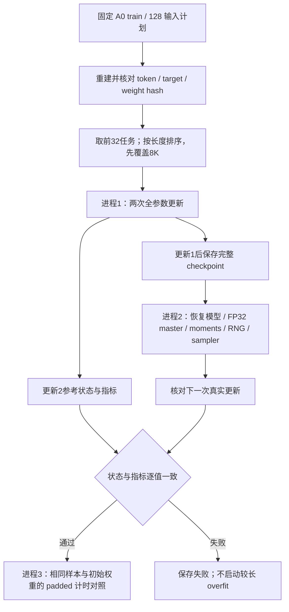

# 真实 A0 训练预检与 GPU 恢复验证

日期：2026-09-05。当前状态：真实两步全参数更新通过；checkpoint加载逐值一致，下一步优化器严格指纹门未通过；已在不重复恢复的对照中确认原生反向梯度波动。不是32/128 overfit完成报告。

[统一入口](../rwkv7_agent_only_data_training_plan_zh.md) · [数据范围](data_status_report.md) · [A0 输入计划](a0_release_assessment.md)

## 1. 事前协议

- 关联 T-03/T-05/T-07/T-08、M-08；固定本机 SM86 / 0.4B，沿用官方 BF16、官方参数分组、FP32 master 与 AdamW moments，全参数更新；不启用 latent 或激活重算。
- [配置](../configs/a0_training_preflight.yaml) 与 [闭合 schema](../schemas/a0_training_preflight.schema.json) 在 GPU 实验前提交；使用固定 A0 manifest 和 Step069 的128输入计划，重建全部128条后逐项比较 token/weight/target 元数据，只取前32构建工程 sampler。
- sampler 不 shuffle，按既有长度降序规则先运行最长两条：8K 是 token budget，不声称每条都恰好8192个真实 token。最初32输入最长8153 tokens；保护上下文和跨样本 reset/mask 不变。
- 两次 optimizer update，学习率 `3e-6`、betas `0.9/0.99`、epsilon `1e-18`、weight decay `0`、clip norm `1`、head chunk `32`、seed `20260905`。这些是本次预检配置，不代表已选定正式 SFT 最优配方。
- 事前停止界限：非有限 loss/梯度立即失败；loss >100、preclip gradient norm >1e6、peak allocated >23000 MiB 或单步 >120s 时不再执行下一步。耗时上限在单步返回后检查，不是可抢占的 CUDA 硬超时；OOM保留失败报告。首行需≥8100个真实 token。
- 恢复门为 exact：恢复点及下一更新后的模型、FP32 master/moments、trainer counters、sampler/下一批和 Python/NumPy/Torch CPU/CUDA RNG 全内容指纹一致，loss/gradient norm 等非计时指标一致；不因 BF16 自动放宽同路径恢复要求。
- padded 对照只有恢复通过后才跑：同初始化、同样本、同顺序，仅将无 loss、独立 reset 的尾部补到8192。比较有效 token/秒与显存，记录第一步分配/warmup；n=2不足以宣称吞吐加速或代表全数据训练。

## 2. 运行与产物

核心逻辑在 [preflight.py](../src/training/preflight.py)，薄入口为 [validate_a0_training_preflight.py](../scripts/validate_a0_training_preflight.py)。三种 phase 各启动独立 Python 进程，顺序为 `continuous` → `resume` → `padded`，run root 须为 data root 下的新 `artifacts/training_preflight/<run_id>`，拒绝覆盖及未提交代码。

每个 phase 保存 intent、闭合 schema 校验的 manifest 和结果；checkpoint 保存完整 BF16 参数、FP32 master/optimizer、sampler、计数及 RNG，校验文件 SHA。配置、输入、模型代码、训练代码 commit、依赖锁/实际包版本和数值开关可追溯。报告只保存聚合、hash及代码异常位置，不打印轨迹正文或异常中的数据内容。

连续进程在更新1后保存 `step1.pt`，独立恢复进程加载该点再执行更新2；同时核对更新1状态指纹与下一批，避免仅凭最终loss相近判断恢复正确。成功/失败产物均留在指定data root，不进Git。

## 3. 结果与后续边界

首轮 `real8k_v1`：固定输入重建和基座加载通过，包版本列表中的Python tuple被manifest的array schema拒绝；0次更新，无训练loss。只将包列表转换为list并补回归测试，配置/seed/阈值保持不变；旧intent与失败报告保留。不得把加载基座时约0.90GB显存当作8K训练峰值。

`real8k_v2`（commit `4802f51`）：798张量、450,834,432参数全参数更新通过。两任务输入8153/8128 tokens，监督62/66 tokens，loss为1.396583/1.169002，步耗时1.632/1.412s，最高allocated22,589,985,280 bytes（约21.04GiB）。这是不同任务上的两次更新，不能把loss差值解释为收敛；32/128输入中最长监督分别1363/2271 tokens，容量还不能仅凭这两条短目标外推。

独立恢复进程：step1加载后的所有指纹一致；更新2后的loss、gradient norm、BF16模型、RNG、sampler与trainer counters仍exact，仅优化器指纹不同，因此恢复门失败。padded对照和较长overfit暂停。新增逐参数梯度/master/moment诊断与失败checkpoint保留后，在新目录重跑，不放宽exact门，也不把此新差异直接归因于此前ADR-019。

此预检即使通过，也只证明两次真实更新与独立进程恢复，不证明32/128任务集稳定过拟合、真实Agent成功率、SM89/DDP恢复或G1。真实32→128 overfit的完整步数与下降阈值须在对应实验前另行登记。

## 4. 反向归约差异的直接对照

`real8k_v3`（commit `cdf9df5`）增加逐参数指纹和失败checkpoint保留，重复确认两步更新通过、原严格恢复门失败。模型、配置、输入及阈值不变；两步耗时1.601/1.310s，峰值仍约21.04GiB。完整分母、代码commit及原始报告SHA见[机器汇总](a0_training_preflight_summary.json)，不只保存成功结果。

CPU比较连续与恢复的 `step2.pt`（`torch.load(weights_only=True)`）：

| 对象 | 不同元素 | 最大绝对差值 |
|---|---:|---:|
| BF16模型权重 | 0 | 0 |
| FP32 master | 11 | 1.49e-8 |
| 一阶moment | 46 | 1.91e-7 |
| 二阶moment | 33 | 1.44e-11 |
| optimizer step计数 | 0 | 0 |

40个优化器参数与40个梯度差异参数集合完全对应，均为mix、k_k/k_a、ln_x、ffn.x_k等归约向量。固定官方CUDA源码对这些梯度使用FP32 `atomicAdd`分块归约，再转换为BF16；这是源码观察，不把所有CUDA算子都归为非确定性。

为排除checkpoint恢复本身，事前登记并执行 [无恢复重复反向对照](../src/training/resume_diagnostics.py)：checkpoint只加载一次，固定同一8128-token输入，重复三次forward/backward/clip，中间没有load/restore或optimizer更新。结果：

- 三次loss都是 `1.1690021753311157`，preclip norm都是 `328`。
- 第2/3次相对第1次，分别有44/37个梯度张量、48/43个元素不同。
- 模型与optimizer状态始终未突变；参数更新次数为0。

该直接对照证明梯度波动不需要再次恢复就会发生；结合差异参数与官方源码，证据指向FP32并行原子归约经BF16舍入后产生的原生微小波动，而非保存时漏掉训练状态。尚不能据三次重复推断长作业误差界限，或据此把旧exact失败改为通过。

对照命令为固定重建环境运行 `scripts/diagnose_a0_backward_repeat.py --reference-root <data root>/artifacts/training_preflight/real8k_v3 --output <data root>/artifacts/training_preflight/native_backward_repeat_v1.json`，LM/CUDA worktree与build参数沿用预检；执行commit `a5f3a5d`。产物是原因诊断，不是新验收门的确认实验。

## 5. 下一步，不静默改门

Step088时在SPEC登记ADR-020提议：保持保存/加载本身逐值一致；补充固定同一梯度的GPU optimizer续步对照，隔离checkpoint机制；原生下一步则需与不经过恢复的重复运行波动比较，并在独立确认前冻结新数值预算。Step089用户继续后接受该框架，后续协议与结果另见[三层独立确认报告](gpu_resume_confirmation.md)，不改写本报告旧strict失败。padded对照和完整32/128 overfit仍未启动。

不为追求hash相同改动官方CUDA，也不直接切换dtype、缩短保护上下文或扩大训练。真实32/128还须覆盖较长监督目标和多个任务，再估算完整训练预算。
