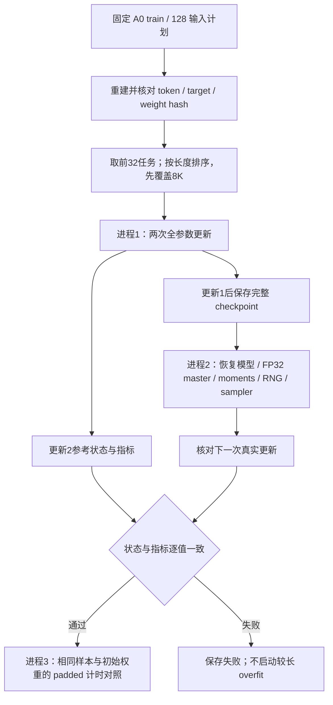

# 真实 A0 训练预检与 GPU 恢复验证

日期：2026-09-05。当前状态：协议与实现已准备，GPU 实验尚未执行；不是 32/128 overfit 完成报告。

[统一入口](../rwkv7_agent_only_data_training_plan_zh.md) · [数据范围](data_status_report.md) · [A0 输入计划](a0_release_assessment.md)

## 1. 事前协议

- 关联 T-03/T-05/T-07/T-08、M-08；固定本机 SM86 / 0.4B，沿用官方 BF16、官方参数分组、FP32 master 与 AdamW moments，全参数更新；不启用 latent 或激活重算。
- [配置](../configs/a0_training_preflight.yaml) 与 [闭合 schema](../schemas/a0_training_preflight.schema.json) 在 GPU 实验前提交；使用固定 A0 manifest 和 Step069 的128输入计划，重建全部128条后逐项比较 token/weight/target 元数据，只取前32构建工程 sampler。
- sampler 不 shuffle，按既有长度降序规则先运行最长两条：8K 是 token budget，不声称每条都恰好8192个真实 token。最初32输入最长8153 tokens；保护上下文和跨样本 reset/mask 不变。
- 两次 optimizer update，学习率 `3e-6`、betas `0.9/0.99`、epsilon `1e-18`、weight decay `0`、clip norm `1`、head chunk `32`、seed `20260905`。这些是本次预检配置，不代表已选定正式 SFT 最优配方。
- 事前停止界限：非有限 loss/梯度立即失败；loss >100、preclip gradient norm >1e6、peak allocated >23000 MiB 或单步 >120s 时不再执行下一步。耗时上限在单步返回后检查，不是可抢占的 CUDA 硬超时；OOM保留失败报告。首行需≥8100个真实 token。
- 恢复门为 exact：恢复点及下一更新后的模型、FP32 master/moments、trainer counters、sampler/下一批和 Python/NumPy/Torch CPU/CUDA RNG 全内容指纹一致，loss/gradient norm 等非计时指标一致；不因 BF16 自动放宽同路径恢复要求。
- padded 对照只有恢复通过后才跑：同初始化、同样本、同顺序，仅将无 loss、独立 reset 的尾部补到8192。比较有效 token/秒与显存，记录第一步分配/warmup；n=2不足以宣称吞吐加速或代表全数据训练。

## 2. 运行与产物

核心逻辑在 [preflight.py](../src/training/preflight.py)，薄入口为 [validate_a0_training_preflight.py](../scripts/validate_a0_training_preflight.py)。三种 phase 各启动独立 Python 进程，顺序为 `continuous` → `resume` → `padded`，run root 须为 data root 下的新 `artifacts/training_preflight/<run_id>`，拒绝覆盖及未提交代码。

每个 phase 保存 intent、闭合 schema 校验的 manifest 和结果；checkpoint 保存完整 BF16 参数、FP32 master/optimizer、sampler、计数及 RNG，校验文件 SHA。配置、输入、模型代码、训练代码 commit、依赖锁/实际包版本和数值开关可追溯。报告只保存聚合、hash及代码异常位置，不打印轨迹正文或异常中的数据内容。

连续进程在更新1后保存 `step1.pt`，独立恢复进程加载该点再执行更新2；同时核对更新1状态指纹与下一批，避免仅凭最终loss相近判断恢复正确。成功/失败产物均留在指定data root，不进Git。

## 3. 结果与后续边界

待执行；暂不报告 loss、训练显存或恢复通过。此预检即使通过，也只证明两次真实更新与独立进程恢复，不证明32/128任务集稳定过拟合、真实Agent成功率、SM89/DDP恢复或G1。真实32→128 overfit的完整步数与下降阈值须在对应实验前另行登记。
