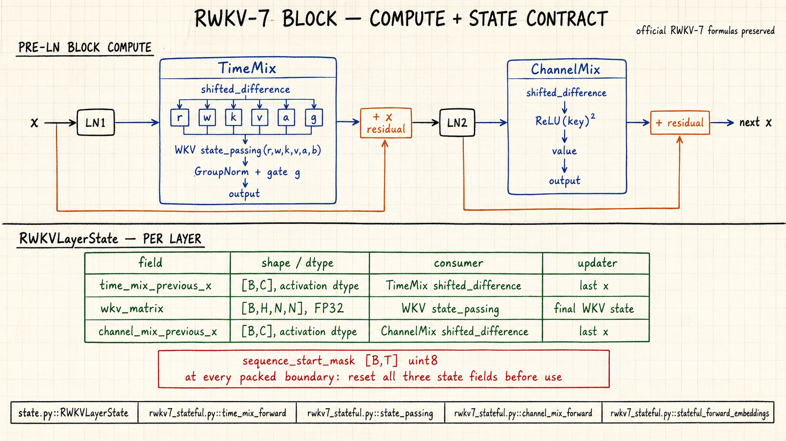
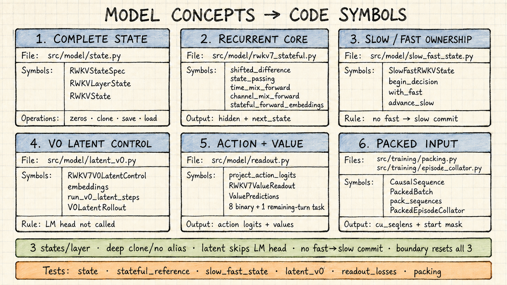
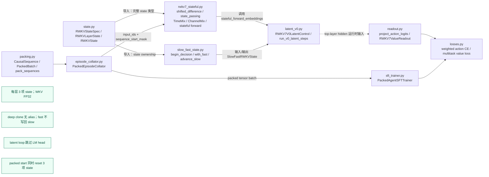

# RWKV-7 长 Agent 架构与训练准备评估

> 评估日期：2026-09-04  
> 结论状态：本机兼容层、packed trainer 与 0.4B tiny-overfit 已通过；允许继续 A0/远程训练准备，暂不开始正式训练或修改 RWKV-7 核心公式。

## 模型架构图集（审计入口）

以下 ImageGen 手绘图按“系统 → block/state → latent → packed → 源码符号”逐级下钻。手绘图用于视觉审计，紧随其后的 Mermaid 依赖图和本报告正文用于消除生成式图像可能带来的歧义。

### A. 系统总览

### B. RWKV-7 单层计算与完整状态

### C. V0 latent 内部调用链

### D. Packed-varlen 边界

### E. 概念到源码符号

### 精确源码依赖与运行时数据流

## 1. 固定评估对象

本报告只针对下列不可变版本；“最新”只用于发现候选，进入工程后全部固定为完整 commit 或文件 SHA-256：

| 对象 | 固定版本 | 用途 |
|---|---|---|
| RWKV-LM | `9a75f9f037afa4418ee6283b584b92b1adb89ca1` | G1x 训练和逐 token RNN 参考 |
| RWKV-CUDA | `9b17d5d80a0e9d2cbf090590725672464daa3aee` | 可微 state-passing WKV kernel 参考 |
| rwkv7-g1 模型库 | `53b2ec91e3c68c90fe1ae9b878fc4ce0b15d69f0` | checkpoint 与模型卡 |
| 本机 smoke checkpoint | G1d 0.4B ctx8192，SHA-256 `947cb9b8...def83bb` | 单卡接口、数值一致性和 tiny overfit |
| 本机 V0 候选 | G1j 1.5B ctx16384，SHA-256 `c4317688...823860f` | 本机推理/原型，远程训练候选 |

2.9B 与 7.2B 只登记为远程候选，当前不下载。训练规模必须由显存、吞吐和 NCCL profile 决定，不能只按参数量决定。

## 2. 代码结构事实

### 2.1 官方训练参考的优点

- `RWKV-v7/train_temp/src/model.py` 包含 G1x TimeMix、ChannelMix、Pre-LN、`v_first`、GroupNorm 和官方初始化路径。
- optimizer 对 `att.w0` 使用 2× 学习率，对符合条件的大型 `.weight` 参数单独施加 weight decay；这些规则不能在重构时丢失。
- `_forward_features()` 已经将 hidden feature 与最终 LM head 分开，是实现“latent step 不调用 head”的可利用边界。
- 官方 README 指定 Python 3.10+、PyTorch 2.5+、CUDA 12.5+、最新版 DeepSpeed，并要求保留 `pytorch-lightning==1.9.5`。该组合是参考环境，不等于本项目已经验证的兼容矩阵。

### 2.2 不能直接满足本项目的部分

| 项目需求 | `train_temp` 当前能力 | 缺口 |
|---|---|---|
| episode/decision 数据 | 只接受 `binidx` 连续 token 数据 | 需要 Parquet episode sampler 和 collator |
| assistant-only CE | fused CE 接收 dense targets | 需要明确 token mask、action 权重和零分母保护 |
| 跨 window slow state | 全序列并行调用不接收/返回 state | 需要完整 state-passing block API |
| 从 slow state 分叉 fast state | 没有 state container/clone 接口 | 需要无别名 clone、restore 和兼容校验 |
| 连续 latent embedding | 入口只接受 token IDs | 需要 embedding-level forward |
| latent 跳过 LM head | 只有内部 `_forward_features()` 边界 | 需要稳定公开接口和 head 调用测试 |
| 不等长 Agent 轨迹 | 固定长度样本和 `40320` 伪 epoch 约束 | 需要按 token/decision 预算定义 epoch 与调度 |
| packed varlen | 无 sequence boundary 输入，WKV/TMix/CMix 都默认同一行连续 | 需要原生 reset-aware 前反向 kernel 与 packed collator |

因此不能把 canonical Agent 数据直接转换为 `binidx` 后沿用原 trainer。那会丢失角色 loss mask、decision 边界、工具 observation 边界和 persistent state 语义。

### 2.3 最新 checkpoint 与训练参考的实测兼容性

两份 checkpoint 都有 798 个 BF16 tensor key，key 命名与 `train_temp` 一致，但低秩维度不等于当前构造器的经验公式：

| checkpoint | decay rank | AAA rank | value rank | gate rank |
|---|---:|---:|---:|---:|
| G1d 0.4B | 64 | 64 | 32 | 128 |
| G1j 1.5B | 96 | 96 | 64 | 256 |

例如 0.4B 构造器默认会生成 value/gate rank 64/160，1.5B 默认会生成 decay/AAA/gate rank 128/128/224，因而 strict load 失败。兼容层必须从 checkpoint shape 生成显式 architecture descriptor，并让构造器接受 rank 参数；未知或不一致 shape 必须 fail closed。

此外，本机实测发现两项上游实现兼容问题：

- 三个 fused helper 无条件调用 `atomicAdd(float2*)`，CUDA 13.0 对 SM86 编译失败；远程 SM89 同样不满足该向量原子操作的 SM90 条件。兼容 patch 在 SM90 保留 float2，在 SM80/SM89 使用两个 scalar float atomicAdd。
- 非 JIT wrapper 复用了五个同名全局 `_forward_op`，Python late binding 使第一个 wrapper 最终调用最后一个四参数函数。官方普通路径默认开启 JIT，因此未触发；但 `train.py` 在 DeepSpeed stage 3 时主动关闭 JIT，会触发错误。patch 通过默认参数绑定各 wrapper 创建时的 op。

应用三个独立 patch 后，0.4B/1.5B 均 strict load，16-token logits 全部 finite；JIT on/off 的 0.4B logits shape 和 mean 一致。0.4B fused loss backward 产生 finite loss 与 795 个 finite gradient tensor。上游 checkout 在验证后已恢复到干净的固定 commit，补丁以 patch series 管理。

### 2.4 packed varlen 原型结果

上游 full-sequence 路径没有 sequence boundary 输入；将多条轨迹直接拼接会同时污染 WKV matrix、TimeMix previous-x 和 ChannelMix previous-x。现已增加第四份 patch，采用 `cu_seqlens` 批次契约和 uint8 `sequence_start_mask` CUDA ABI，在三个位置重置前向 state，并在 backward 切断跨 segment 梯度。

SM86 BF16 算子级 packed/unpacked forward relative RMS 均为 0，最大 gradient relative RMS 为 0.003245；0.4B 24 层 hidden parity 与跨 segment 扰动隔离误差均为 0。合成 960-token packed 对 2,048-token padded smoke 中，forward 为 1.50×、forward+backward 为 1.80×，峰值 allocation 从 4.59 GiB 降至 2.63 GiB。详细语义、测试和限制见 `reports/packed_varlen_assessment.md`。

### 2.5 state-passing 的可用基线

- `rwkv_v7_demo_rnn.py` 明确展示每层三类递归状态：TimeMix 前一时刻输入、float32 的 `[H, N, N]` WKV 矩阵、ChannelMix 前一时刻输入。
- 该 demo 在 `torch.no_grad()` 下运行并总是投影 LM head，只能作为逐 token 语义参考，不能直接训练 latent step。
- RWKV-CUDA 的 `rwkv7_fast_fused/rwkv7_cuda_benchmark_state_passing.py` 提供可微 `(s0, r, w, k, v, a, b) -> (y, sT)`，并对初态和终态保留梯度。
- 此 kernel 只传递 WKV 矩阵，要求 WKV state 为 float32、序列长度能被编译期 `CHUNK_LEN` 整除；完整 block 仍需传递两类 previous-x 状态。

`v_first` 是同一 token 在层间传递的值残差，不是跨时间持久状态，不能误存到 `S_slow` 中。

## 3. 是否需要改良架构

### 结论

需要增加 checkpoint/kernel 兼容层、状态化执行层和训练接口，但当前不应改良 RWKV-7 核心 TimeMix/ChannelMix 方程。

首版修改限定为：

1. 从 checkpoint tensor shape 推导并验证层数、维度、head size 和四个低秩 rank，不再用默认公式猜测已训练 checkpoint。
2. 应用并测试 SM80/89 atomic fallback 与 non-JIT op binding patch；patch hash 进入 run manifest。
3. 定义版本化 `RWKV7State`，每层包含 `time_mix_prev_x`、float32 `wkv_matrix`、`channel_mix_prev_x`。
4. 实现 `clone_state()`，保证 slow/fast 无 storage alias；保存 checkpoint 时记录模型代码、checkpoint、tokenizer 和 state schema hash。
5. 将执行边界拆成：
   - `embed_tokens(token_ids)`；
   - `forward_embeddings(embeddings, state) -> (hidden, new_state)`；
   - `project_logits(hidden)`。
6. 普通 action token 更新 fast/slow state并可调用 head；V0 latent 输入为 `e_latent + e_depth(k)`，完整通过所有 RWKV-7 block，但不调用 head。
7. 增加 masked CE：只覆盖 assistant token，action token 可配置权重；初版先用可读的 PyTorch 实现验证数值，再决定是否写 fused kernel。
8. 用 episode-aware trainer 取代 `binidx`/固定 `40320` 样本循环，同时复制而不是猜测官方初始化、参数分组和 weight decay 规则。
9. 增加 packed-varlen 路径：`cu_seqlens` 负责批次/审计契约，预计算 `sequence_start_mask` 进入 CUDA；WKV state、TimeMix previous-x、ChannelMix previous-x 和 causal target 在同一边界切断。

这属于“执行与训练架构适配”，不是新模型方程。V1 continuous feedback、跳层、浅层 action decoder 和 chunked latent 都继续受 G3 阶段门约束。

### 为什么现在不修改核心公式

- M0 尚未证明 explicit CoT 相对 no-think 在同一真实 Agent 评测上有增益；尚无证据证明 latentization 值得更复杂的模型改动。
- 当前首要技术风险是 state 语义、loss mask、数据可重放性和数值一致性，改写核心会把错误来源混在一起。
- 固定 control embedding 的 V0 已足够回答“无文本 token 的额外 RWKV recurrent compute 能否恢复显式思考收益”的第一性问题。

## 4. 推荐实现顺序与验收门

### R0：数据闭环

- 每个来源用真实 shard 运行 adapter，保留 thinking、action、tool result 和 source ID。
- 冻结 repo/task/issue 级 held-out 后才生成 A0 正式 release；当前 preview 不可用于训练结论。
- 统计成功/失败、重复、空 thinking、无 action、超长 observation、repo license 和跨源任务重叠。

验收：四表 schema 校验、原始 blob hash 回读、相同输入两次生成相同 ID、held-out 零交叉。

### R1：官方模型加载与前向基线

- 先用 0.4B 验证 tokenizer/checkpoint key、标准 full-sequence 前向和逐 token RNN 前向。
- 固定短序列，比较 full-sequence、逐 token、分段 state-passing 三条路径的 hidden/logits。
- 本机和远程分别编译 kernel；不能复制某台机器的二进制 extension。

验收：容差在 bf16/fp32 预登记范围内，跨 segment 后状态与连续运行一致。

### R2：状态化兼容层

- 实现 state init/shape/dtype/device/clone/serialize/restore。
- 加入 batch reset mask，episode 结束必须清空对应 slow state。
- window 边界允许 detach slow state；同一 decision 内 K 个 latent step 不做 inner TBPTT。

验收：K=0 与基线路径等价；clone 后修改 fast state 不影响 slow state；状态尺寸和 checkpoint 不兼容时 fail closed。

### R3：Agent SFT trainer

- 输入 canonical episode/decision，而不是丢失结构的纯文本 binidx。
- tool/system/user token loss 为 0；assistant thinking/action/final 分开统计，action weight 独立配置。
- 先 32/128 样本 overfit，再做 A0/M0，不直接启动大作业。
- 用 packed varlen 拼接不同长度 episode/decision；只允许整个 packed stream 为 `CHUNK_LEN=16` 做最多 15 token 的尾部对齐，不做逐样本 padding。

验收：masked loss 手算对齐；零有效 token batch 拒绝；packed 与逐样本运行的 forward/backward/loss 一致；跨 segment 扰动隔离；resume 后 sampler、optimizer、state 和计数一致。

### R4：M0 与架构决策

比较同一 checkpoint、同一任务、同一 action sampling/工具预算下：

- no-think；
- explicit short/long think；
- 未训练 latent 的 `K={1,2,4,8}`。

只有 explicit thinking 在 single-trajectory 环境 outcome 上产生可重复增益，才进入 paired snapshot 和 M2。若 explicit think 无增益，先修数据、prompt、模型能力或 evaluator，不实现 V1。

### R5：V0 fixed latent

- 从 `S_slow(t)` 无别名克隆 `S_fast(t,0)`；
- 运行 K 个完整 block latent step；
- latent 位置无 token CE，K 个 step 完整反传；
- 从最终 fast state 生成 action；环境确认执行后的真实 action/observation 才推进 slow state。

验收：K=0 anchor、head 未调用、depth 越界拒绝、latent 参数有梯度、slow state 未突变。

## 5. 硬件与首轮规模判断

checkpoint 文件大小不能代替训练显存 profile。粗略按 BF16 参数、梯度、FP32 master 和 Adam moments 计算，1.5B 全参数训练在本机 24 GB 上没有给激活和 state 留出可靠空间；本机定位如下：

- 0.4B：完整前向、state kernel、masked loss、tiny overfit 的首选；
- 1.5B：推理、数据管线和可能的 PEFT/受控小实验；全参数训练不作无 profile 承诺；
- 远程 3×4090：先 profile 1.5B，再评估 2.9B ZeRO/offload；
- 7.2B：首轮只考虑 PEFT 候选，不承诺全参数训练。

三张 4090 之间为 `SYS` 且无 NVLink，因此必须记录 NCCL 带宽、NUMA 绑定、gradient accumulation 和端到端 tokens/s；不能假定三卡线性扩展。

WKV 矩阵 state 的量级也不可忽略。仅 float32 WKV state 每个样本约为：0.4B 6 MiB、1.5B 12 MiB、2.9B 20 MiB、7.2B 32 MiB；训练时还有快照、梯度和其余 previous-x 状态，必须由实测峰值决定 batch size。

### 5.1 训练环境候选

PyTorch 官方安装矩阵显示 2.11.0 同时提供 cu130 和 cu128 wheel，且满足 RWKV 参考实现的 PyTorch 2.5+ 下限。因此当前候选是保持 PyTorch/Python API 版本一致，只让 CUDA build 匹配节点 toolkit：

- 本机：Python 3.11.15、PyTorch 2.11.0+cu130、CUDA toolkit 13.0；
- 远程：Python 3.11.15、PyTorch 2.11.0+cu128、CUDA toolkit 12.8。

本机环境已安装并验证 PyTorch 2.11.0+cu130、Lightning 1.9.5 与 DeepSpeed 0.19.6 import；SM86 上完成官方 state-passing N=16 数值检查、N=64 benchmark、两份 checkpoint full-sequence forward 和 0.4B backward。N=64 官方 benchmark 的最短 forward/backward 为 9.64/42.10 ms；该数字只用于 kernel smoke，不能当作 Agent 训练吞吐。

0.4B 16-token full forward 峰值 allocation 约 0.92 GB，1.5B 约 3.07 GB；0.4B 16-token forward/backward 约 2.16 GB。它们不含 optimizer state、长 context、episode state cache 或 DeepSpeed，因此不能外推正式 batch size。远程仍未安装，所以 P0-03 继续进行中。

参考：

- https://pytorch.org/get-started/previous-versions/
- https://github.com/BlinkDL/RWKV-LM/tree/9a75f9f037afa4418ee6283b584b92b1adb89ca1/RWKV-v7/train_temp

## 6. 当前 Go/No-Go

| 工作 | 决定 | 条件 |
|---|---|---|
| 固定源下载与 adapter 开发 | Go | 完整 revision、许可、manifest 和本地 hash/size 校验 |
| 0.4B 模型/状态兼容层 | Go | 必须应用已验证 patch series，并从 full/RNN/state parity test 开始 |
| packed-varlen reference/collator | Go | 先固定边界语义，再修改并验证 CUDA forward/backward |
| 1.5B 本地全参数训练 | No-Go | 显存 profile 前不启动 |
| A0 正式数据 release | No-Go | held-out、去重、污染和 license 审计未完成 |
| 正式三卡训练 | No-Go | packed-varlen parity、远程环境锁、kernel/NCCL profile、A0/M0 未完成 |
| 修改 RWKV-7 核心方程或实现 V1 | No-Go | G1/G3 尚未通过 |

本机下载、逐源真实格式验证、held-out 冻结、R2 state 接口和 packed tiny-overfit 已完成。下一步完成 D-09 并产出 A0，同时建立 T-07 run/resume 和远程 SM89/DDP 证据。任何模型改良提案都应以 parity、M0 和 V0 消融结果为输入，而不是在训练前凭直觉引入。
