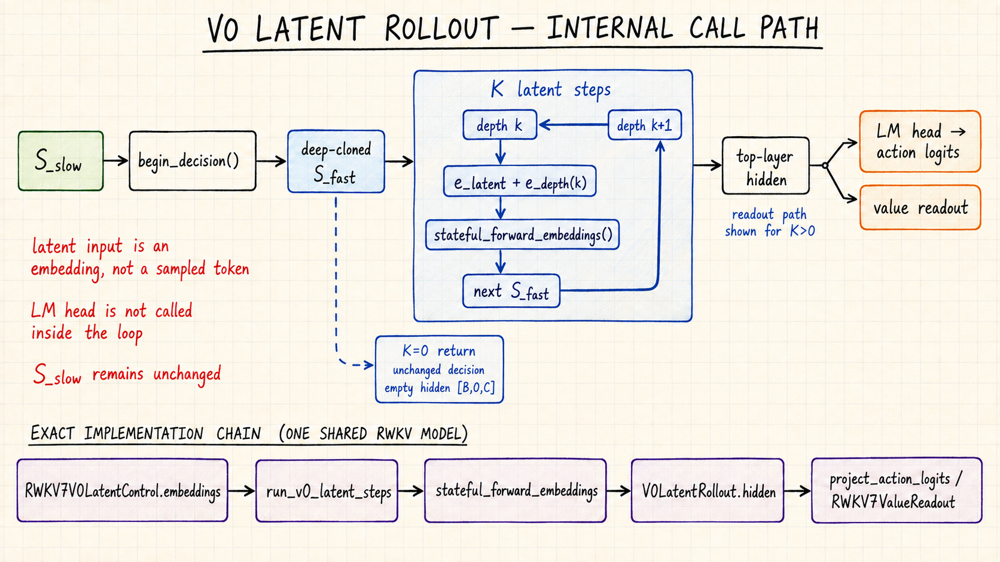
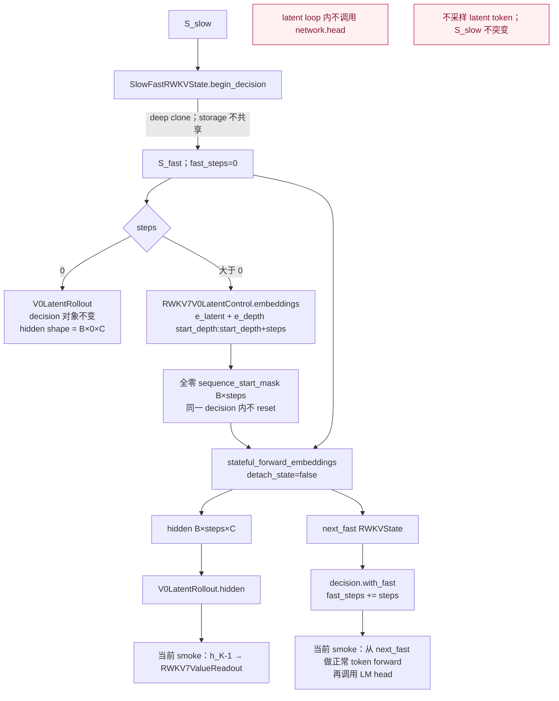

# RWKV-7 V0 latent-control 原型评估

日期：2026-09-04  
关联工作：M-04、M-05、M-08  
状态：本机 RTX 3090 Ti / SM86、真实 0.4B checkpoint 正确性通过；训练与性能未验收

## V0 latent 架构图





## 1. 实现结论

已按冻结设计实现 V0：

```text
x_k = e_latent + e_depth(k)
S_fast(k+1), h_k = RWKV7_FULL_BLOCKS(x_k, S_fast(k))
```

每个 latent position 完整执行全部 RWKV-7 block，但不调用 LM head、不采样 token、不输出到环境，只推进当前 decision 的 fast state。`K=0` 不访问模型、不产生 latent timestep，并原样返回 decision state。

实现没有加入 V1 continuous feedback、部分 block 循环、ChannelMix 跳过、浅 action decoder 或 chunked latent 优化。

## 2. 短窗 recurrence 适配

现有 state-passing CUDA kernel 要求 `T % 16 == 0`，而训练深度为 `K={0,1,2,4,8}`。在 latent 后添加 dummy token 会改变 WKV、TimeMix 和 ChannelMix state，不能作为正确 padding。

因此当前短窗使用固定 RWKV-CUDA benchmark 同一公式的可微 PyTorch recurrence；16 的倍数仍走 CUDA state-passing。该 fallback 使用 FP32 WKV matrix/内部运算、activation dtype 输出，支持 initial state、start reset mask 和完整 autograd。

同一组 BF16 `B=1,T=16,H=2,N=64` 输入上，CUDA 与短窗参考路径的 relative RMS 为：

| 检查 | relative RMS |
|---|---:|
| output | 0 |
| final state | 3.7370e-7 |
| 七组输入/state 最大梯度 | 2.7668e-4 |

CPU 测试还验证了整段与分窗组合的 output/state/gradient 精确一致，以及 reset 后 loss 对 reset 前 state/token 的梯度为 0。

## 3. 真实 0.4B 验证

固定输入与环境沿用 `reports/rwkv7_stateful_assessment.md`。从真实 checkpoint 产生的 slow state 派生 fast state，再执行 `K=4`：

| 检查 | 结果 |
|---|---:|
| `K=0` decision identity | preserved |
| `K=0` hidden timesteps | 0 |
| `K=4` 记录的 fast steps | 4 |
| latent 阶段 LM-head calls | 0 |
| 随后的正常 action LM-head calls | 1 |
| latent embedding gradient RMS | 125.8258 |
| 已用 depth rows gradient RMS | 46.1479 |
| 未用 depth rows gradient max abs | 0 |
| fast/slow storage alias | false |
| latent 后 slow contamination relative RMS | 0 |

这证明 head bypass、梯度、深度索引和 slow/fast 所有权工作正常；它不证明未训练 latent 能改善 action 或环境 outcome。

## 4. 参数与初始化

- `e_latent`：`[n_embd]`；
- `e_depth`：`[max_depth,n_embd]`，当前 `max_depth=16`；
- 原型初始化：`e_latent` 使用固定 checkpoint token embedding 的逐维均值，`e_depth` 为 0；
- 参数保持 FP32，forward 时转换到模型 activation dtype，梯度回到 FP32 parameter。

初始化只用于兼容性 smoke，不是已选定的训练最优值。T-02 必须在首次 latent 训练前登记这些新参数的初始化、learning-rate scale、weight decay 与 checkpoint key；不得让它们落入未知参数或沿用大矩阵 decay。

## 5. 限制与下一步

- PyTorch 短窗 recurrence 是 correctness backend，不是性能最终方案；K profile 前不得宣称 latent 比显式 CoT 更快。
- 当前 ChannelMix 同样使用可读 PyTorch continuation；M-08 应 profile fused single-step/short-window kernel 的必要性。
- action/value readout 与 optimizer 参数覆盖已经实现，但 K curriculum、KD/exit/anchor loss、checkpoint/run manifest 和真实标签训练尚未完成。
- M-05 仅满足模型结构与梯度验收。下一步在 D-10/T-10 依赖满足后建立 tiny overfit；真实 latent 有效性仍受 G1/M0 阶段门约束。
