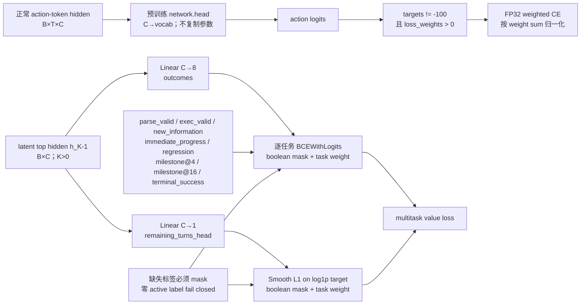

# RWKV-7 Agent action/value readout 评估

日期：2026-09-04  
关联工作：M-06、T-01、T-02  
状态：本机真实 0.4B shape/mask/loss/gradient smoke 通过；环境标签生产与训练未开始

## Action / value readout 架构图

## 1. 结构

Action readout 直接复用预训练 `network.head`，不创建第二份词表投影。V0 value readout 只读取顶层 latent hidden，使用两个独立线性层：

- `outcomes: n_embd → 8`；
- `remaining_turns_head: n_embd → 1`。

八个概率任务为 parse valid、execution valid、new information、immediate progress、regression、4/16 turn milestone progress 和 terminal success。剩余 turn 预测在 `log1p` 空间训练。当前不 flatten WKV matrix，也不加入 V1 feedback 或大型 critic MLP。

Value weight 使用 gain `0.01` 的 orthogonal initialization，bias 为零。这样初始概率接近 0.5，同时第一步 loss 可以向 hidden 和 latent control 回传梯度。

## 2. Loss 契约

- action：FP32 weighted cross entropy，只对正 `loss_weights` 且非 ignore target 的 token 归一化；action 权重 2 能真实改变分子和分母。
- binary value：逐任务 `BCEWithLogits`，允许 `[0,1]` soft target。
- remaining turns：对 `log1p(target)` 使用 Smooth L1。
- 缺失标签：必须由同 shape boolean mask 指定；masked NaN 不参与算子。
- 聚合：每个 active task 内先归一化，再按 versioned task weight 聚合，避免高频标签支配 loss。
- 零有效 action token、零正权 active value label、非法 target、错误 shape/dtype 或未知 task weight 集合均 fail closed。

## 3. 验证

单元测试验证 action loss 与手算一致、masked action logits 梯度为 0；value masked sample 的 hidden 梯度为 0，outcomes/remaining-turn heads 和 active hidden 的梯度非零。

真实 0.4B checkpoint 的 `K=4` latent hidden 上：

| 指标 | 结果 |
|---|---:|
| value loss | 0.734844 |
| value-head weight gradient RMS | 0.323592 |
| latent embedding gradient RMS | 0.302607 |
| used depth embedding gradient RMS | 0.126910 |
| unused depth gradient max abs | 0 |
| action weighted CE | 6.483753 |
| action effective tokens | 1 |
| latent/action LM-head calls | 0 / 1 |

这些数值只证明计算图、mask 和接口有效，不表示 value 已校准或 action 质量改善。

## 4. 参数成本与 optimizer

Value readout 有 4 个 tensor；0.4B/1.5B 分别增加 9,225/18,441 个参数。连同 V0 latent，冻结 base 时总 trainable 参数为 26,633/53,257。

所有 value 参数显式进入独立 1× LR、no-decay optimizer group。更新后的真实 checkpoint policy 覆盖为 798 base + 2 latent + 4 value = 804/804；未知、缺失或重复名称仍拒绝。

## 5. 数据限制与下一步

- canonical forks v1 已有八个 outcome 字段，但尚无 `remaining_turns`；在真实训练该任务前需要版本化 schema migration，不能用默认 0 冒充标签。
- 现有公开轨迹并不天然提供可信 parse/exec/milestone 全标签；缺失项必须 mask，value/halting 主数据仍需同 snapshot 环境 rollout。
- 当前只完成 synthetic label smoke；正式 value calibration 属于 G4，受 G1、paired snapshot 和执行环境阻塞。
- 下一工程步骤是 T-03 tiny-overfit/trainer skeleton，但必须先满足其 D-10/T-10 依赖，或明确仅运行 synthetic smoke，不把它误称为 A0 overfit。
