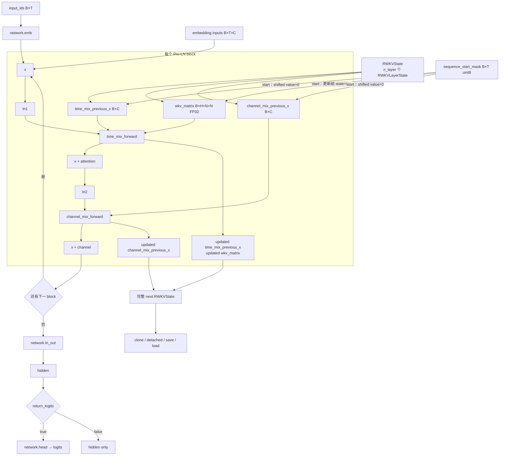

# RWKV-7 完整 recurrent state 与分窗验证

日期：2026-09-04  
关联工作：M-02、M-03、M-09  
状态：本机 RTX 3090 Ti / SM86 的 M-03/M-04 原型通过；远程 SM89 与 trainer 接入待验证

## Stateful RWKV-7 架构图




## 1. 结论

当前 RWKV-7 每层需要跨 window 持久化三项状态：

1. TimeMix previous-x：`[B,C]`，与模型 activation dtype 相同；
2. WKV matrix：`[B,H,64,64]`，固定 FP32；
3. ChannelMix previous-x：`[B,C]`，与模型 activation dtype 相同。

`v_first` 只在一次完整的多层 forward 内从第 0 层传播到后续层，不跨 window 持久化。仓库现有 `RWKVState` 对完整 state tree 提供版本化 shape/dtype/device 校验、深 clone、显式 detach、serialize/load，并默认保留计算图以支持 full-BPTT。

真实 0.4B checkpoint 验证表明：stateful full-window 路径与已应用 packed-varlen patch 的官方 full-sequence hidden output 精确一致；底层 state-passing WKV 的 32-token 整段与 16+16 continuation 在输出、最终状态和全部七组梯度上精确一致。slow/fast 双状态容器也已通过单测和真实 state 推进验证，可以进入 M-05 V0 latent control，但正式训练仍为 No-Go。

## 2. 固定输入

- RWKV-LM revision：`9a75f9f037afa4418ee6283b584b92b1adb89ca1`；按 `patches/series` 应用四份兼容 patch。
- RWKV-CUDA revision：`9b17d5d80a0e9d2cbf090590725672464daa3aee`；应用 `rwkv-cuda-state-passing-packed-varlen.patch`，SHA-256 为 `d0fbdc3e7c8060f1555155af25e1257980e5353bb2135ed32c623b2b72e77fa5`。
- checkpoint：`rwkv7-g1d-0.4b-20260210-ctx8192.pth`，SHA-256 为 `947cb9b8013224e06b112b72204256bec65096cc935a7767ce63d8e3ddef83bb`。
- runtime：PyTorch 2.11.0+cu130、CUDA toolkit 13.0、BF16、RTX 3090 Ti / SM86。
- 随机种子：模型 token `20260904`；梯度 `20260907`；底层 WKV continuation `20260908`。

## 3. 验证结果

| 检查 | relative RMS / 结果 |
|---|---:|
| 官方 full sequence vs stateful full hidden | 0 |
| WKV 整段 vs 16+16 output | 0 |
| WKV 整段 vs 16+16 final state | 0 |
| WKV 整段 vs 16+16 最大梯度 | 0 |
| 24 层整段 vs 16+16 hidden | 0.019014 |
| 24 层内部 reset vs 两段独立 hidden | 0.026752 |
| 24 层整段 vs 16+16 input gradient | 0.043467 |
| continuation TimeMix previous-x state | 0.014217 |
| continuation WKV state | 0.010563 |
| continuation ChannelMix previous-x state | 0.014474 |
| full-BPTT 第一窗梯度 RMS | 197.172806（非零） |
| 显式 detach 后第一窗最大绝对梯度 | 0 |
| clone storage alias | false |
| serialize/load 最大误差 | 0 |
| slow/fast 初始 storage alias | false |
| 修改 fast 后 slow contamination | 0 |
| 下一决策从 slow 重建 fast 的数值误差 | 0 |
| 直接 fast → slow 提交 | rejected |

底层 WKV composition 的精确一致和官方整段前向的精确一致共同排除了 reset/state ABI 或 RWKV-7 公式错配。完整 24 层在 32-token GEMM 与两次 16-token GEMM 之间存在 BF16 舍入路径差异，误差会逐层累积；因此分窗模型不应要求 bitwise equality。

第一次验证使用统一 2% relative RMS 阈值，因内部 reset hidden 为 2.675% 且输入梯度为 4.347% 而失败。该结果出现后才增加底层 WKV composition 诊断，并把完整模型的诊断容差放宽到 6%；6% 不是预登记的训练质量阈值，也不能覆盖第一次失败。后续正式回归门必须在更多 seed、长度、dtype 和 1.5B profile 之前单独预登记。

## 4. State 内存

BF16 previous-x 下，每个 batch item 的字节数为：

```text
n_layer × (2 × n_embd × 2 + n_head × 64 × 64 × 4)
```

| 模型候选 | 层/宽度/头数 | 单个 state / batch item |
|---|---|---:|
| 0.4B | 24 / 1024 / 16 | 6.094 MiB |
| 1.5B | 24 / 2048 / 32 | 12.188 MiB |
| 2.9B | 32 / 2560 / 40 | 20.313 MiB |
| 7.2B | 32 / 4096 / 64 | 32.500 MiB |

训练时上述只是持久状态本体；full-BPTT 还会保留每个 window 的 autograd 图和 state-passing checkpoints。`detach_state=True` 会精确切断旧 window 梯度，只能作为显式 TBPTT 策略，不能静默成为默认值。

## 5. 当前接口与限制

- `src/model/state.py`：版本 1 state schema、严格字段/shape/dtype/device 校验、clone/detach/save/load 和 state 字节统计。
- `src/model/rwkv7_stateful.py`：embedding 或 token ID 入口、完整 24 层 state continuation、reset mask 和可选 LM head。
- `src/model/slow_fast_state.py`：decision ID、slow revision 与 fast step 计数；fast 只能在决策边界由 slow 深拷贝，并且没有 fast-to-slow commit API。
- `src/model/latent_v0.py`：V0 latent/depth embedding、`K=0` anchor 和只推进 fast state 的 head-free rollout。
- `scripts/validate_rwkv_stateful_windows.py`：真实 checkpoint、官方前向、continuation、内部 reset、full-BPTT/TBPTT、序列化及底层 WKV composition 验证。
- window 长度当前必须为 16 的倍数；独立 SFT pack 的 dummy tail state 必须丢弃，不能当 episode continuation state。
- 当前 ChannelMix continuation 是可微 PyTorch 实现，尚未优化为训练热路径；activation checkpointing 仍 fail closed。
- 容器可拒绝直接或共享 storage 的 fast-to-slow 提交，但不能从一个任意新 tensor 的数值反推出其环境 provenance；trainer 必须把 `confirmed_token_count` 与已执行 action/observation 事件绑定并写入 run log。
- 只完成本机 SM86/0.4B 验证；1.5B、远程 SM89、三卡和长 window 显存/吞吐仍待 profile。

## 6. 下一步

1. T-10：给 stateful episode continuation 增加 segment ownership；与独立 reset packed SFT 分开采样。
2. T-03：依赖满足后建立真实 32/128 样本 overfit harness；此前只允许 synthetic smoke。
3. M-08：预登记数值容差后，对 1.5B、长 window、activation checkpoint 和显存/吞吐做 profile。
