# Packed Agent SFT 32/128 tiny-overfit 评估

> 日期：2026-09-04  
> 结论：本机 0.4B 全参数、packed decision、FP32-master 路径通过稳定性门；这不是 A0 或真实 Agent 数据训练结果。

## Tiny-overfit 训练架构图

```mermaid
flowchart LR
    FIX[32 / 128 synthetic<br/>NormalizedEpisode fixtures] --> TOK[tokenize_decisions<br/>单一监督 turn]
    TOK --> SAMPLE[TokenBudgetPackSampler<br/>确定性 row plan]
    SAMPLE --> COLLATE[collate_tokenized<br/>不回到原 episode 重编码]
    COLLATE --> BATCH[packed tensor batch<br/>input / target / weights / starts / offsets]
    BATCH --> CHECK[validate_packed_tensor_batch<br/>fail closed]
    CHECK --> FEAT[patched RWKV-7 _forward_features<br/>sequence_start_mask]
    FEAT --> SELECT[只选择正 loss-weight hidden]
    SELECT --> CHUNK[预训练 LM head<br/>32/128 token chunks]
    CHUNK --> CE[FP32 weighted CE]
    CE --> BW[backward + finite grad check + clip]
    BW --> OPT[FP32MasterAdamW<br/>FP32 master + moments]
    OPT --> COUNT[optimizer/sequences/real/aligned/effective counters]
    COUNT --> EVAL[固定 row plan evaluate]
    EVAL --> GATE{loss 下降且无超阈值 spike}
    GATE -- 通过 --> PASS[T-03 tiny-overfit pass]
    GATE -- 失败 --> FAIL[清梯度、保存诊断；不得称为稳定]
```

## 1. 覆盖的训练链路

实现的最小链路为：normalized synthetic Agent decision → assistant-only/action-weighted tokenize → token-budget sampler → 已 tokenize decision collator → `cu_seqlens`/`sequence_start_mask` → patched RWKV-7 `_forward_features` → 只投影有效监督 token 的 chunked LM head CE → optimizer step/counter。

本轮修正了一个接线错误风险：sampler 的成员是已经裁成单一监督 turn 的 decision，collator 必须直接打包这些 tokenized decision，不能回到原始 episode 重新编码并监督多个 assistant turn。`pack_tokenized()`/`collate_tokenized()` 现在明确承接该路径。

为避免构造 `[1, 16384, 65536]` 全量 logits，训练 loss 先按 target/loss weight 选择有效 hidden，再以固定 token chunk 投影预训练 head。单测证明该 loss 与全量 logits weighted CE 一致，且 masked hidden 梯度为零。

## 2. 合成 backend 与真实 checkpoint 接线

框架无关 tiny backend 的 20 epoch 结果：

| samples | rows | initial loss | final loss | final/initial | 状态 |
|---:|---:|---:|---:|---:|---|
| 32 | 3 | 5.6203 | 0.1853 | 0.03297 | passed |
| 128 | 12 | 5.5409 | 0.1851 | 0.03341 | passed |

固定 G1d 0.4B checkpoint 的 head-only 接线诊断也通过：32 样本为 `3.9723 → 4.78e-6`，128 样本为 `3.9748 → 0`，峰值 allocation 约 1.49 GiB。它只证明真实 tokenizer、patched CUDA、packed trainer 和大词表 head 已连通，不是全参训练证据。

## 3. 被拒绝的裸 BF16 optimizer 路径

最初只预登记“最终 loss 下降”时，裸 PyTorch fused AdamW 直接对 BF16 参数/状态优化，128 样本首 epoch 从 3.97 上升到 14.71 后饱和为零。该旧判据虽返回 passed，但事后稳定性审查拒绝把它作为 T-03 证据。

随后在运行前增加“任一 epoch loss 不得超过前值 1.25×”并降低 LR/clip；两次仍失败：

| 配置 | 32 样本最大 epoch/前值 | 128 样本最大 epoch/前值 | 结论 |
|---|---:|---:|---|
| LR `3e-5`, eps `1e-18`, clip 1 | 1,158.16× | 2.24× | failed |
| LR `3e-5`, eps `1e-8`, clip 1 | 360.20× | 2.31× | failed |

最小张量审计确认裸 PyTorch AdamW 对 BF16 参数创建 BF16 `exp_avg/exp_avg_sq`。改变 epsilon 没有消除训练尖峰，因此 full-parameter 正式训练禁止使用该 fallback。

## 4. FP32-master 全参数结果

最终预登记配置为 LR `3e-6`、`beta=(0.9,0.99)`、eps `1e-18`、global grad clip 1、8 epochs；模型与 CUDA kernel 保持 BF16，master weight 和 Adam moments 使用 FP32。798/798 base tensors、450,834,432 参数全部进入官方 1×/`att.w0` 2× 分组。

| samples | rows | initial → final loss | 最大 epoch/前值 | 最大 clip 前 grad norm | peak allocation | 状态 |
|---:|---:|---:|---:|---:|---:|---|
| 32 | 1 | 3.9723 → 2.51e-5 | 0.7291× | 1,336 | 8.46 GiB | passed |
| 128 | 3 | 3.9748 → 0 | 0.7086× | 1,352 | 8.44 GiB | passed |

两组每个 epoch 的评估 loss 均下降；训练分别执行 8/24 optimizer step，累计呈现 256/1,024 个 sequence，和配置完全一致。optimizer state 实测只有 FP32。

## 5. 边界与下一步

- 数据是合成、重复且容易记忆，结果不能选择正式 M1 learning rate，也不能支持 Agent 能力结论；`configs/training_optimizer.yaml` 继续把正式超参数留到 A0 Agent 数据 overfit。
- 本地 `FP32MasterAdamW` 是单卡正确性实现，尚无 checkpoint/resume、分片或 offload；远程必须验证 DeepSpeed engine 确实提供等价 FP32 master/moments，不能只因类名为 FusedAdam 就假设成立。
- T-03 的 32/128 harness 验收完成。下一训练侧工作是 T-07 run/checkpoint registry 和远程 SM89/DDP；数据侧仍应先完成 held-out/D-09/A0。

聚合 artifact：`/home/yueyulin/data/long_long_agent/artifacts/tiny_overfit/`。其中失败配置与成功配置使用不同文件名保留；未保存训练后模型权重。
