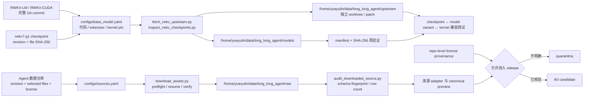

# 上游模型与数据源初步清单

> 核验日期：2026-09-04  
> 状态：网页级初筛；没有下载文件，不能代替完整 revision、文件 hash、schema 与 license 审计。

## 上游固定与落盘架构图



## RWKV-7

- 官方 RWKV-LM 的 RWKV-7 README 仍将 `RWKV-v7/train_temp` 指定为训练参考实现，并提供 GPT/RNN 推理示例。
- `BlinkDL/rwkv7-g1` 当前页面显示 Apache-2.0、约 107 GB、main 短 commit `53b2ec9`。
- 当前文件列表包含 2026-08-31 的 G1j 1.5B、2.9B、7.2B、13.3B ctx16384 checkpoint；也保留 G1d 0.1B/0.4B 和 G1i 系列。
- main 是浮动引用，短 commit 也不足以成为 pin。P0-01 必须取得完整 commit、选定文件的 SHA-256，并验证 checkpoint 与 `train_temp`/DeepEmbed 变体兼容。

参考：

- https://github.com/BlinkDL/RWKV-LM/tree/main/RWKV-v7/train_temp
- https://huggingface.co/BlinkDL/rwkv7-g1/tree/main

## 首发数据候选

| 来源 | 页面初筛结果 | 进入 adapter 前必须解决 |
|---|---|---|
| OpenThoughts-Agent-SFT-100K | Apache-2.0；约 1.75 GB；viewer 当前显示 94,334 rows；字段含 `conversations/task/trace_source/agent/model/result/...` | 名称/卡片写 100K 而 viewer 为 94,334，必须按固定 revision 复算行数、去重和过滤原因 |
| NVIDIA Open-SWE-Traces | CC-BY-4.0；当前页面为多版本/多 subset，总 viewer 显示 511,668 rows、42.6 GB；含 thinking/non-thinking 教师、`resolved` 和 repo `license` | 禁止直接用 main；明确选 v1.0/v1.1/v1.2、subset、过滤后的精确 revision，审计 `resolved=-1` 和 git-hacking 过滤 |
| Microsoft Orchard | MIT；总计 110,255 rows、11 GB；SWE 107,185 条，含 resolved 与 unresolved，`metadata.verify_status` 对应 hidden tests | 首阶段只纳入 SWE，GUI 是否属于项目边界需单独 ADR；核验匿名化对 repo/snapshot 重放能力的影响 |
| Nebius SWE-agent trajectories | CC-BY-4.0；约 80K rows、1.11 GB；含 target、trajectory、patch 和 eval logs | eval logs 最大很大，采用 blob 引用；核验 target/exit_status 与真实 verifier 的一致性 |
| Nebius SWE-rebench OpenHands | CC-BY-4.0；67,074 rows、2.08 GB；含 resolved、generated-tests 指标和完整 trajectory | 按 instance/repo/base snapshot 做 held-out 与交叉源去重 |

## 后期来源

- AgentTrove 当前约 1.70M rows、19.6 GB，Apache-2.0；继续按原计划只作后期扩展，不在 A0 全量下载。
- TaskTrove 当前约 1.97M rows、9.32 GB，Apache-2.0；版本化子目录才是 canonical artifact，适合作为 Harbor 可执行任务入口。其内容含数学/科学来源，必须在 source allowlist 层排除，不能因为总集合是 Agent task packaging 就绕过“纯 Agent、无数学数据”的边界。

## D-01 的精确核验模板

每个来源必须生成一条 source registry：

```yaml
source_id:
repo_id:
revision:             # 完整不可变 commit
configs_and_splits:
files:
  - path:
    size:
    sha256:
declared_license:
row_count_raw:
row_count_accepted:
schema_fingerprint:
repo_license_field:
teacher_models:
harnesses:
outcome_fields:
known_filters:
known_leakage_risks:
adapter_version:
verified_at:
```

## 初筛结论

来源均仍可访问，原始设计的数据分工基本成立；但 Open-SWE-Traces 和 TaskTrove 的内容/版本在持续变化，OpenThoughts 100K 的展示行数也与名称不一致。因此 D-01 必须先 pin 和取样审计，不能以仓库名或网页 `main` 直接作为训练输入。
