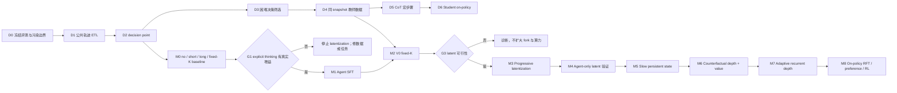

# 基于最新 RWKV-7 的纯 Agent 数据生产与训练计划

> 版本日期：2026-09-04  
> 项目范围：纯 RWKV-7、纯 Agent 数据、双时间尺度 recurrent reasoning  
> 明确删除：数学 CoT 数据、数学 benchmark、Qwen/Transformer sidecar、soft-token 注入到 Qwen 的方案

## 设计架构图


下图是本研究设计的阶段依赖图。它描述目标路线，不代表这些阶段已经完成；当前实现状态与允许执行的下一步始终以 `SPEC.md` 为准。



---

## 0. 项目定义

目标模型不是“用 RNN 保存 Agent 历史”这么简单，而是同一个 RWKV-7 模型承担两种递归：

\[
S^{slow}_t
\rightarrow
\underbrace{S^{fast}_{t,0}\rightarrow S^{fast}_{t,1}\rightarrow\cdots\rightarrow S^{fast}_{t,K_t}}_{\text{一次 Agent 决策前的 latent CoT}}
\rightarrow a_t
\rightarrow o_{t+1}
\rightarrow S^{slow}_{t+1}
\]

- **外层时间轴 `t`**：工具调用、环境反馈、任务进度和持久状态。
- **内层时间轴 `k`**：每次动作前的隐空间迭代思考。
- **训练期**：可以利用显式长 CoT、失败轨迹、教师批判和环境 verifier。
- **运行时**：不输出长 CoT，只执行少量 latent recurrent steps，然后输出短工具动作。
- **最终指标**：单轨迹长程任务成功率、真实 wall-clock、总模型计算、工具调用数量和回归率，而不是数学正确率或 best-of-N。

---

## 1. 模型基线：只使用最新 RWKV-7

### 1.1 起始权重与实现

使用项目启动时最新的 RWKV-7 G1x checkpoint，并固定以下版本信息：

```yaml
base_model_repo: BlinkDL/rwkv7-g1
base_model_file: <实际使用的 checkpoint>
base_model_revision: <HF commit hash>
rwkv_lm_revision: <RWKV-LM git commit>
tokenizer_hash: <tokenizer file hash>
cuda_kernel_revision: <kernel commit/hash>
```

不要把“latest”写成浮动依赖。训练、数据缓存和评测都必须绑定 checkpoint 与代码 revision。

实现以官方 `RWKV-v7/train_temp` 为主参考，不要把通用 FLA 层直接当作等价 RWKV-7。必须保留：

- 官方参数初始化；
- 参数级学习率分组；
- 只对指定的大矩阵使用 weight decay；
- Pre-LN LayerNorm 与官方 block 细节；
- 与目标 checkpoint 一致的 DeepEmbed/模型变体配置；
- 官方 CUDA kernel 的数值路径。

### 1.2 双状态而不是双模型

同一套 RWKV-7 权重维护两份运行状态：

#### Slow state

```text
S_slow(t)
```

保存已经由真实 token/观察确认的信息：

- 长期目标；
- 用户约束；
- 已执行动作；
- 工具返回；
- 当前任务进度；
- 已验证事实。

#### Fast state

```text
S_fast(t, 0) = clone(S_slow(t))
S_fast(t, k+1) = RWKV7_LATENT_STEP(S_fast(t, k))
```

只服务于当前决策的假设、比较、反思和动作选择。

第一版中，fast state **不直接覆盖** slow state。动作执行后，slow state只消费：

```text
实际 action token
+ 实际 tool response token
+ 可选的结构化 memory-write token
```

这样可避免未验证的隐空间假设污染长期状态，也方便从同一 slow-state snapshot 分叉多个 recurrent depth。

### 1.3 Latent step 的两阶段实现

#### V0：固定 latent-control embedding

每个 latent step 输入一个学习到的控制 embedding：

\[
x_{k}=e_{latent}+e_{depth}(k)
\]

完整运行一次 RWKV-7 recurrent step，但：

- 不执行词表投影；
- 不采样 token；
- 不向外部环境输出；
- 只更新 fast state，并保留顶层 hidden 作为 action/value readout。

优点是对原生 RWKV token-step 改动最小，适合先验证训练信号。

#### V1：门控 continuous feedback

V0 成功后再增加：

\[
x_{k+1}=e_{latent}+e_{depth}(k+1)+\sigma(g_k)W_hh_k
\]

其中 feedback gate 初始接近 0，使初始行为退化到 V0。该版本允许下一次 latent step 显式依赖上一轮顶层表示，但不要在第一版同时引入。

### 1.4 Action 生成

latent steps 完成后，从最终 fast state 开始正常生成：

```text
<tool_call>{...}</tool_call>
```

latent 阶段跳过 LM head，action 阶段才执行词表投影和采样。

首版仍由完整 RWKV-7 生成 action token。只有在 latentization 已经证明有效之后，才评估：

- 只循环部分中高层 block；
- latent step 跳过部分 channel-mix；
- 独立浅层 action decoder；
- chunked latent steps。

这些属于推理优化，不应和可行性验证同时进行。

---

## 2. 只使用 Agent 数据的数据策略

### 2.1 数据优先级

#### A. Agent 格式与工具能力冷启动

**OpenThoughts-Agent-SFT-100K**

用途：

- 多轮 terminal 工具调用；
- 标准 Agent trajectory 格式；
- action/tool-response 交替；
- 建立纯 RWKV-7 Agent SFT baseline。

#### B. 显式思考与无思考对照

**NVIDIA Open-SWE-Traces**

用途：

- thinking 与 non-thinking Agent 轨迹；
- 多种 SWE harness；
- resolved/unresolved 标签；
- 长 CoT 到 latent decision 的蒸馏；
- 研究哪些 Agent 决策真正从长思考受益。

公开数据中的 thinking/non-thinking 轨迹不一定是严格同一快照配对；真正的 paired 数据要在可执行环境中自行生成。

#### C. 成功、失败、回归与恢复

**Microsoft Orchard SWE**

用途：

- 成功与失败轨迹同时存在；
- hidden-test 终局标签；
- recovery、premature finish、wandering、regression 数据；
- persistent-state 训练。

**Nebius SWE-agent / SWE-rebench OpenHands trajectories**

用途：

- 完整 reasoning/action/observation；
- resolved 标签与测试日志；
- 较长失败轨迹；
- 测试生成、验证行为和 patch outcome。

#### D. 扩展与自生产环境

**AgentTrove**

用途：

- 大规模 Agent 轨迹池；
- 多教师、多 harness、多任务来源；
- 后期扩大 domain diversity。

**TaskTrove + Harbor**

用途：

- 可执行任务；
- 自己生成严格同快照的 long-think/no-think/不同 K 数据；
- on-policy rollout；
- counterfactual fork；
- verifier-driven RFT/RL。

#### 不作为第一阶段主数据

**SWE-ZERO execution-free traces** 可以用于后期 Agent mid-training 或 code navigation SFT，但不适合作为 value/halting 主数据，因为缺少可靠的真实执行闭环。

### 2.2 数据只按 Agent 决策分类

每个 decision point 标注为以下一种或多种类型：

```text
mechanical_action       简单、无需深思的操作
information_gathering   搜索、读取、检查状态
planning                制定子目标或动作序列
replanning              原计划失败后的重规划
editing                 修改文件或环境
verification            运行测试、检查产物
recovery                工具失败、回归或错误假设后的恢复
memory_update           应写入长期状态的信息
termination             是否完成、是否需要继续
```

第一版训练集必须同时包含：

- 不需要 latent thinking 的简单动作；
- 明显从长 CoT 受益的困难动作；
- 失败与恢复；
- 验证和 finish 判断；
- 长期约束回忆。

否则模型会学成“所有动作都固定想 K 次”。

---

## 3. 数据存储协议

建议使用四张 Parquet 表，并把大日志存入 content-addressed blob。

### 3.1 `episodes.parquet`

```yaml
episode_id:
task_id:
split_group:
source_dataset:
source_revision:
source_license:

harness:
tools_schema:
task_text:
acceptance_criteria:

repo:
base_commit:
env_image_digest:
verifier_id:
verifier_version:

teacher_model:
teacher_prompt_version:

success:
terminal_reward:
turn_count:
failure_type:
raw_trace_ref:
```

### 3.2 `decisions.parquet`

```yaml
episode_id:
turn_id:
decision_id:

prefix_messages_ref:
current_observation:
tools_schema:

teacher_think_raw:
teacher_think_tokens:
macro_thoughts:
teacher_action:

next_tool_result:
env_delta:
verifier_delta:

progress_label:
regression_label:
recovery_label:
decision_type:
```

### 3.3 `snapshots.parquet`

```yaml
snapshot_id:
episode_id:
turn_id:

env_snapshot_ref:
prefix_messages_ref:
task_contract:
current_observation:

milestones:
ledger:
known_constraints:
```

不要把 RWKV state 作为不可变的 canonical 数据。state 会随 checkpoint 改变。可以缓存，但缓存键必须包含：

```text
model_checkpoint_hash
+ model_code_hash
+ tokenizer_hash
+ prefix_hash
```

### 3.4 `forks.parquet`

```yaml
snapshot_id:
policy_checkpoint:
candidate_id:

recurrent_depth:
latent_mode:
sampling_seed:
action:

parse_valid:
exec_valid:
new_information:
immediate_progress:
regression:

h4_progress:
h16_progress:
terminal_success:

model_latency_ms:
model_flops_estimate:
tool_latency_ms:
```

---

## 4. 数据生产流水线

### D0：冻结评测集与污染边界

先划出不可训练的 held-out task/repo：

```text
heldout_task_ids
heldout_repos
heldout_issue_pr_commit
heldout_templates
```

按 `task_id/repo/issue/PR/base_commit` 分组切分，不能把同一任务的不同教师轨迹分到 train 与 test。

### D1：公共轨迹 ETL

为每个来源单独实现 adapter，统一为：

```text
system/task
assistant thinking
assistant tool call
tool observation
assistant final/finish
terminal reward
```

清洗规则：

- 保留原始 trace；
- thinking 与 action 分字段；
- tool-call arguments 反序列化并 canonicalize；
- 统一 `<tool_call>` 与 `<tool_response>` 格式；
- 记录 teacher、harness、prompt、环境版本；
- 丢弃解析损坏、工具 schema 不完整或明显数据泄漏样本；
- repo license 单独保留，不只依赖数据集总 license。

### D2：拆分 decision point

每一个 assistant action 前生成一个 `decisions` 样本。

不能只把完整 trajectory 拼成一段文本。项目需要显式知道：

```text
当前 state/prefix
+ 当前 observation
+ 当前 long CoT
→ 当前 action
→ 真实 tool result
```

一条 80-turn trajectory 可以形成约 80 个局部决策训练点，同时仍保留 episode 顺序用于 slow-state 训练。

### D3：困难决策筛选

优先保留或重新生成长 CoT 的决策：

- thinking 与 no-thinking 动作不同；
- no-thinking 失败、thinking 成功；
- 多个教师动作分歧；
- action 具有明显破坏风险；
- 需要读取多个之前观察才能决定；
- 是否验证、回退、重规划或 finish；
- 工具失败后的恢复；
- 早期约束容易被遗忘。

机械动作应保留 action-only/no-think 版本。

### D4：同快照教师数据生产

从同一个可执行 snapshot 生成：

```text
teacher_long_think → action
teacher_short_think → action
teacher_no_think → action
teacher_critique(student_failure) → recovery action
```

先执行每个候选 action 一步。只在以下情况继续进行 4～16 步后续 rollout：

- 不同模式动作不同；
- immediate outcome 无法区分；
- 涉及回归或 finish；
- value model 不确定；
- 可能存在 delayed benefit。

### D5：CoT 宏步骤标注

将显式 CoT 压缩成 1～16 个 Agent 语义转换，而不是逐 token 对齐：

```yaml
observation_interpretation:
belief_update:
current_subgoal:
candidate_actions:
rejected_actions:
risk_check:
verification_need:
selected_action:
expected_tool_result:
memory_write:
```

宏步骤只用于 curriculum、probe 和 partial latentization，不要求 latent state 与某个文本 hidden 一一对应。

### D6：Student on-policy 数据

模型开始可运行后，重点收集：

```text
重复命令
无效工具调用
读取错误文件
错误假设持续多轮
没有验证就 finish
测试回归
工具失败后重复原动作
忘记早期用户约束
slow state 与 ledger 冲突
思考不足
过度思考后动作变差
```

这些状态比继续堆积教师成功轨迹更适合训练 recovery 和 value。

---

## 5. 训练阶段

## M0：纯 Agent baseline

全部在 Agent task 上建立四个基线：

1. RWKV-7 no-think；
2. RWKV-7 explicit short-think；
3. RWKV-7 explicit long-think；
4. 未训练 latent steps，固定 `K={1,2,4,8}`。

任务来源使用 held-out TaskTrove/Harbor terminal tasks 和 held-out SWE tasks。

记录：

```text
action parse validity
action execution validity
one-step progress
milestone progress
terminal success
reasoning tokens
action tokens
model latency
tool latency
turn count
loop/regression rate
```

这一阶段的目的不是证明 latent model，而是量化显式长 CoT 对真实 Agent 决策的增益上限。

## M1：RWKV-7 Agent SFT

使用：

- OpenThoughts-Agent-SFT-100K；
- Open-SWE-Traces；
- 少量 Orchard/Nebius 成功与恢复轨迹。

建议起始采样比例：

```yaml
action_only_or_no_think: 35%
explicit_think_success: 35%
verification_and_finish: 15%
failure_recovery: 15%
```

目标：

- 工具调用格式稳定；
- 理解 observation；
- 能显式 long-think 后作出较好动作；
- 能正确验证和 finish；
- 不丢失原有语言/代码能力。

训练时只对 assistant token 计算 CE；action JSON/token 可以给予高于自然语言 thinking token 的 loss 权重。

## M2：Latent step 机制验证

数据：约 10K～30K 个高质量 Agent decision point。

首先只训练：

- latent-control embedding；
- depth embedding；
- continuous-input projector（若启用 V1）；
- 必要的 RWKV-7 LoRA/小学习率全参；
- action/value readout。

深度：

```text
K ∈ {0, 1, 2, 4, 8}
```

要求：

- `K=0` 保留 no-think 能力；
- latent positions 不做 LM token loss；
- K 个 latent steps 完整反传，不做 inner TBPTT；
- 每个 batch 只随机选择一个中间 depth 加小权重 action supervision。

损失：

\[
\mathcal L=
\mathcal L_{action,K}
+\lambda_{KD}\mathrm{KL}(\pi_{teacher\_think}\Vert\pi_{latent,K})
+\lambda_{exit}\mathcal L_{action,k_{aux}}
+\lambda_{anchor}\mathcal L_{action,K=0}
\]

其中建议从小权重开始：

```text
lambda_KD     = 0.2～0.5
lambda_exit   = 0.05～0.15
lambda_anchor = 0.05～0.10
```

这些是起始搜索范围，不是固定最优值。

## M3：Progressive latentization

不要直接把完整 CoT 一次性删掉。

### M3-A：替换前部 CoT

```text
latent × K1
→ 剩余显式 CoT
→ action
```

剩余 CoT 与 action 的 teacher-forced loss 为前面的 latent steps 提供训练信号。

### M3-B：只保留最后一个宏步骤

```text
latent × K2
→ selected_action/risk_check 文本
→ action
```

### M3-C：完全 latent

```text
observation
→ latent × K
→ action
```

显式教师只提供 action distribution、宏步骤 probe 与环境结果，不进入 student 运行时输入。

初始 K 可以使用 teacher CoT 长度或宏步骤数作为粗先验，但至少 25%～30% 样本随机打乱 K，以免模型把“长文本”等同于“必须深想”。后续 K 标签必须被 forced-depth 环境结果替代。

## M4：Agent-only latent 验证门

在同一批 held-out Agent snapshot 上比较：

```text
no-think
explicit long-think
latent K=1/2/4/8/16
```

主要指标不是 action exact match，而是：

- action 是否有效；
- 执行后是否获得信息或进度；
- 是否引入回归；
- 若继续执行，是否更快达到下一 milestone；
- 最终单轨迹成功率。

建议进入 slow-state 和大规模 fork 前满足：

1. 困难决策上 `score(K)` 随 K 有稳定正趋势；
2. latent 模型恢复显式长 CoT 相对 no-think 增益的主要部分；
3. 简单动作上 `K=0/1` 不明显退化；
4. latent wall-clock 明显低于显式 CoT；
5. 改善来自单轨迹，不依赖 best-of-N。

## M5：Slow persistent-state 训练

训练 episode 长度课程：

```text
8 → 16 → 32 → 64 → 128 个 Agent 决策
```

训练时保留真实 turn 顺序并传递 RWKV state。可在 window 边界 detach，但每个 Agent decision 都有 action/outcome 辅助损失，因此不需要把终局梯度穿过整个不可微环境。

增加以下扰动：

```text
history dropout
只保留最近 observation
从 state checkpoint 恢复
插入无关工具输出
tool failure
ledger 缺失或过期
重新打开中途 snapshot
```

辅助目标：

- 当前 task/subgoal 分类；
- 关键约束恢复；
- 下一步 action；
- 是否应 verify/replan/finish；
- ledger delta；
- 下一 observation/result class；
- milestone 状态。

必须做消融：

```text
full history
slow state only
external ledger only
slow state + ledger
reset state
shuffled state
```

若正确 state 与 shuffled state 表现接近，说明持久状态没有被模型利用。

## M6：Counterfactual depth 与 value model

先冻结或低学习率固定 policy，从同一个 `S_slow(t)` snapshot 分叉：

```text
K = 0, 1, 2, 4, 8, 16
```

每个 K：

1. 运行 fast latent steps；
2. 生成一个 action；
3. 在克隆环境中执行；
4. 记录真实 outcome。

Value head 不判断“latent state 是否正确”，而预测：

```text
P(parse_valid)
P(exec_valid)
P(new_information)
P(immediate_progress)
P(regression)
P(next_milestone_within_4_turns)
P(next_milestone_within_16_turns)
P(terminal_success)
E(remaining_turns)
```

部署 critic 输入建议使用：

```text
顶层 latent hidden h_k
+ h_k - h_(k-1)
+ 当前 action logits/候选 action embedding
+ depth embedding
+ slow-state compact readout
```

不要直接 flatten 全部 WKV matrix。

K 的“最优”使用字典序定义：

1. 更高终局/里程碑结果；
2. 更低 regression 和安全风险；
3. 结果相近时更少 latent steps；
4. 结果相近时更少工具调用和 wall-clock。

\[
K^*=\min\{k:U_k\ge \max_j U_j-\epsilon\}
\]

对于所有 K 都失败的 snapshot，不要标成 `K=0` 最优；应跳过 halting 标签或标成“继续到最大预算但当前 policy 无解”。

## M7：Adaptive recurrent depth

运行时先执行 1 个 latent step，然后按 chunk 决策：

```text
stop
+1
+2
+4
```

停止条件基于“继续计算的期望环境收益”而不是 hidden norm 或模型置信度：

\[
V_{continue}-C_{think}\le V_{act\_now}+\epsilon
\]

评测：

- 相对固定 `Kmax` 的得分保持率；
- 平均 latent steps；
- underthinking rate；
- overthinking rate；
- halting regret；
- critic calibration。

## M8：On-policy RFT / preference / RL

从当前 student 自己的 snapshot 生成局部对比：

```text
progress > neutral
no-regression > regression
recovery > repeat-failure
verify-first > premature-finish
sufficient-K > insufficient-K
sufficient-K > overthinking-K
```

优先采用：

1. success/recovery trajectory rejection fine-tuning；
2. 同快照 action preference；
3. milestone-segmented RL；
4. 最后才做完整长 episode RL。

reward 以真实环境为主：

\[
r_t=
\alpha\Delta milestone
+\beta\Delta verifier
-\gamma regression
-\eta invalid/duplicate
-\mu tool\_cost
-\nu latent\_compute
\]

终局 verifier 权重必须高于局部 shaping，避免模型通过无意义的“小进度”刷分。

---

## 6. 数据规模与推进门槛

| 数据版本 | 建议规模 | 目的 |
|---|---:|---|
| A0 | 1K episodes / 10K decisions | adapter、格式、baseline |
| A1 | 5K episodes / 50K decisions | RWKV-7 Agent SFT |
| A2 | 10K～30K 高价值 decisions | latentization |
| A3 | 5K snapshots × 6 depths | 首版 value/halting |
| A4 | 20K+ 长 episodes | slow-state 8～128 turns |
| A5 | 持续 on-policy 失败与恢复 | RFT/RL |
| A6 | 300K～1M curated decisions | 目标规模训练 |

不要直接下载 AgentTrove 全量后一次性训练。每一阶段先通过可观测门槛，再扩大数据。

---

## 7. 第一批数据配比

首个 50K decision-point 版本建议：

```yaml
simple_action_no_think: 15%
normal_tool_use: 25%
explicit_long_think_success: 25%
verification_and_finish: 15%
failed_action_and_recovery: 15%
long_term_constraint_recall: 5%
```

首个 latentization 20K 子集建议优先包含：

```yaml
think_beats_no_think: 35%
teacher_action_disagreement: 20%
recovery_or_replan: 20%
verification_or_finish: 15%
long_memory_dependency: 10%
```

这些比例是启动值，应根据 held-out failure taxonomy 调整。

---

## 8. 必须记录的实验指标

### 决策级

```text
action syntax validity
action execution validity
one-step progress
new information
regression
teacher-action agreement（次要）
```

### Episode 级

```text
single-trajectory success
partial verifier score
milestones completed
turn count
recovery success
loop / duplicate rate
premature finish rate
```

### 计算级

```text
explicit CoT tokens avoided
latent steps per decision
LM-head calls
model GPU time
tool time
end-to-end wall-clock
peak memory
state snapshot size
```

### 状态级

```text
resume after checkpoint
state reset ablation
state shuffle ablation
history dropout robustness
constraint retention
slow/fast state contamination
```

最终必须比较同一真实计算预算下的：

```text
RWKV-7 no-think
RWKV-7 explicit CoT
RWKV-7 fixed-K latent
RWKV-7 adaptive-K latent
```

---

## 9. 首批工程任务

1. 固定 RWKV-7 G1x checkpoint、RWKV-LM commit、tokenizer 和 CUDA kernel revision。
2. 从官方 `train_temp` 分叉 Agent post-training branch，保留参数分组与初始化规则。
3. 实现标准 RWKV-7 state serialize/clone/restore。
4. 实现 slow-state 与 fast-state 双状态容器。
5. 实现 V0 fixed latent-control step，并在 latent step 跳过 LM head。
6. 实现 `<tool_call>` / `<tool_response>` 统一 grammar。
7. 建立 OpenThoughts-Agent、Open-SWE-Traces、Orchard、Nebius 四个 adapter。
8. 产出首个 1K episode / 10K decision 数据版本。
9. 在纯 Agent held-out task 上跑 no-think 与 explicit long-think baseline。
10. 完成 5K～10K decision Agent SFT 过拟合与格式验证。
11. 生产第一批同快照 long-think/no-think/recovery pair。
12. 训练固定 K latentization，并验证 `score(K)`。
13. `score(K)` 成立后再建设 snapshot fork 与 value pipeline。
14. value 可校准后再训练 adaptive K。
15. 最后加入 long-episode slow-state 与 on-policy RL。

---

## 10. 明确停止条件

出现以下情况时不要继续扩大数据：

- explicit CoT 在 Agent 环境中本身没有明显增益；
- latent K 增加只改变文本分布，不改善环境 outcome；
- latent wall-clock 不低于 explicit CoT；
- easy action 被强制深思后明显退化；
- state shuffle 与正确 state 表现接近；
- value 只能拟合 teacher action，不能预测真实环境进度；
- adaptive K 的平均计算下降但成功率显著下降；
- 改善只存在于 best-of-N，而 single-trajectory 不提升。

---

## 11. 公开来源

- RWKV-LM official repository: https://github.com/BlinkDL/RWKV-LM
- RWKV7-G1 model card: https://huggingface.co/BlinkDL/rwkv7-g1
- OpenThoughts-Agent-SFT-100K: https://huggingface.co/datasets/open-thoughts/OpenThoughts-Agent-SFT-100K
- AgentTrove: https://huggingface.co/datasets/open-thoughts/AgentTrove
- TaskTrove: https://huggingface.co/datasets/open-thoughts/TaskTrove
- NVIDIA Open-SWE-Traces: https://huggingface.co/datasets/nvidia/Open-SWE-Traces
- Microsoft Orchard: https://huggingface.co/datasets/microsoft/Orchard
- Nebius SWE-agent trajectories: https://huggingface.co/datasets/nebius/SWE-agent-trajectories
- Nebius SWE-rebench OpenHands trajectories: https://huggingface.co/datasets/nebius/SWE-rebench-openhands-trajectories
