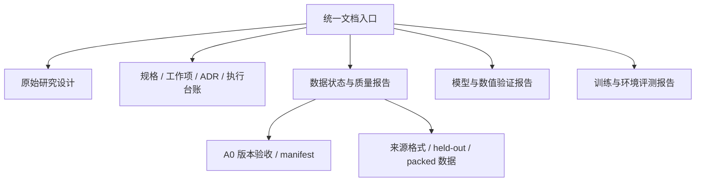

# RWKV-7 纯 Agent 数据生产与训练：统一文档入口

本页只维护导航与文档职责，不承载详细报告或重复执行日志。原始研究设计已完整移至 [研究设计正文](docs/research_design_zh.md)，研究内容不变。

## 从哪里开始

- 看数据是否准备完毕：[数据状态与质量报告](reports/data_status_report.md)。明确区分全量下载池、已审计候选和正式 A0，不把索引完成当作全量清洗完成。
- 看项目要做什么：[原始研究设计](docs/research_design_zh.md)。这是目标路线，不是完成证明。
- 看现在做到哪里、下一步做什么：[规格、工作项、阶段门与执行台账](SPEC.md)。最新计划和执行结果按 Step 编号查阅。
- 开始修改或实验前：[协作规范](AGENTS.md) → [SPEC](SPEC.md) → [原始研究设计](docs/research_design_zh.md)。

## 专题文档

| 主题 | 文档 | 职责 |
|---|---|---|
| 研究设计 | [完整研究正文](docs/research_design_zh.md) | 研究目标、数据策略、M0～M8 路线与停止条件；保持历史设计 |
| 治理与当前计划 | [协作规范](AGENTS.md)、[SPEC](SPEC.md) | 强制约束、工作项状态、ADR、验收门和执行日志 |
| 数据总览 | [数据状态与质量报告](reports/data_status_report.md) | 来源覆盖、验证/去重/格式完成度、未完成项与使用边界 |
| 数据版本 | [A0 验收报告](reports/a0_release_assessment.md)、[A0 manifest](reports/a0_v1_manifest.json) | 固定版本数量、长度、真实 overfit 输入与复现锚点 |
| 数据技术细节 | [来源格式评估](reports/data_format_assessment.md)、[held-out 分组报告](reports/heldout_assessment.md)、[packed 数据画像](reports/packed_data_profile.md) | adapter、schema、分组规则与 token 利用率；注意各报告日期及适用范围 |
| 模型结构 | [架构与源码图集](reports/rwkv7_architecture_assessment.md)、[state 接口](reports/rwkv7_stateful_assessment.md)、[V0](reports/rwkv7_latent_v0_assessment.md)、[readout](reports/rwkv7_readout_assessment.md) | 官方实现接入、slow/fast、latent 与读出层 |
| 数值与训练工程 | [BF16 原因与独立确认](reports/generation_parity_diagnosis.md)、[packed varlen 验证](reports/packed_varlen_assessment.md)、[优化器策略](reports/optimizer_policy_assessment.md)、[合成 overfit](reports/tiny_overfit_assessment.md) | 工程正确性、失败及限制；不代表真实 Agent 能力 |
| 可执行环境 | [环境 fixture 验证](reports/executable_environment_fixture.md) | sandbox、snapshot 与 buggy/gold verifier；不是模型任务成功率 |
| 真实训练预检 | [A0 两步训练与 GPU 恢复](reports/real_a0_training_preflight.md) | 真实8K输入、全参数更新、独立进程恢复与padded计时；不冒充32/128 overfit |
| 恢复独立确认 | [ADR-020 GPU恢复三层确认](reports/gpu_resume_confirmation.md) | 保存/加载exact、固定梯度重放、原生反向噪声预算；保留原strict失败 |
| 真实过拟合训练 | [A0容量与32/128 overfit](reports/real_a0_overfit.md) | 最长监督目标容量、padded计时、完整真实任务训练曲线与阶段门 |
| 资源与版本 | [硬件环境](reports/environment.md)、[上游版本盘点](reports/upstream_inventory.md)、[本机环境重建](README.md) | 固定模型/代码/依赖、资源与运行入口 |
| 项目审查 | [2026-09-05 进展审查](reports/project_progress_review_2026-09-05.md) | 当时的目标、亮点、风险与路线建议；后续状态以 SPEC 为准 |

## 维护约定

- 新报告按数据、模型、训练、评测分别放入 `reports/`，在此增加链接；大数据、模型和运行产物留在配置指定的 data root。
- 数据状态报告负责覆盖范围，A0 报告负责版本细节，SPEC 负责决策和简短证据索引；不要复制同一份长报告。
- 历史报告保留当时的失败与限制，必要时增加当前报告链接，不用后续成功改写旧结果。
